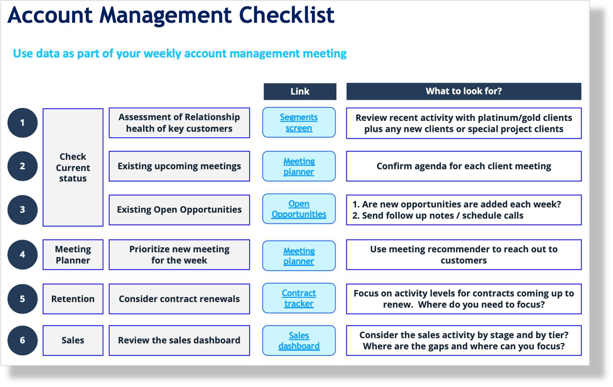
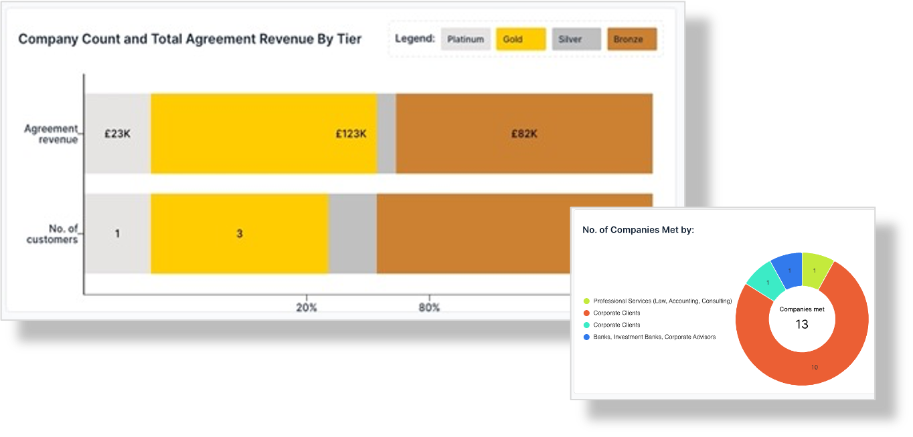
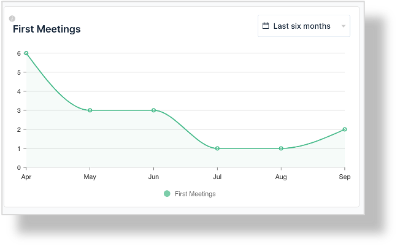
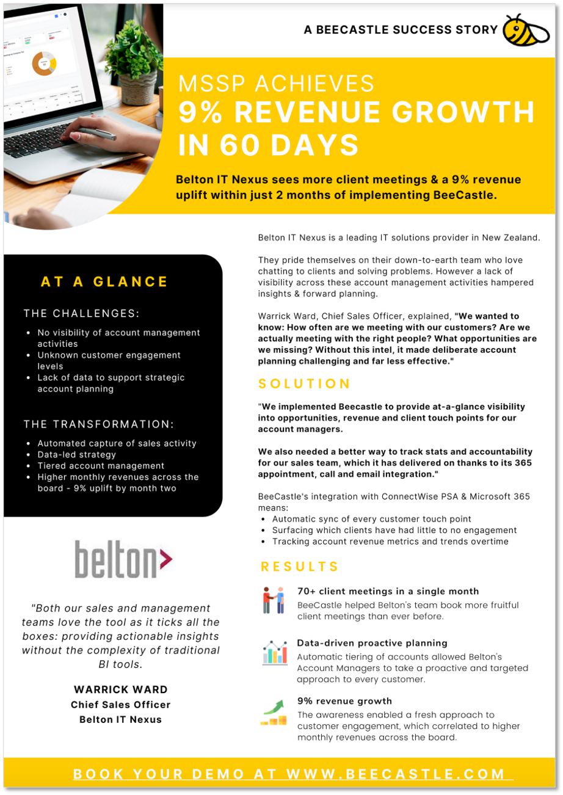

## *Create a profit center vs cost center with BeeCastle by focusing on customer profitability analysis*

**Key points:**

- A ten-point plan for Managed Service Providers (**MSPs**) to grow revenue by 10% per annum;
- Focus on data analytics to optimize profits for accounts; and
- Utilising BeeCastle data analytics dashboards and insights for MSPs.

10 steps to 10% growth in revenue for MSPs - A simple data and technology led plan for MSPs to grow revenue by 10%. But if it’s so simple, why isn’t everyone doing it? Well, there are two answers to this:

- Firstly, you need to have discipline to follow the entire plan through; and
- Secondly not everyone has access to the data or understands the data to make the right moves.

Set out below is our ten-point plan:

---

#### 1. Committing to data culture
We are all creatures of habit, but we need to make these GOOD habits. Habits that help us make great decisions, save time and empower our teams are worth cultivating. We also are more successful with data when we focus. To do this, we suggest a three-step plan:

(i) dissect your data discussions into your relevant groups (such as account management, profitability and stack formation);

(ii) then create a calendar invite for a weekly data review around each of these as a separate meeting. Add a link to the relevant section in [*BeeCastle.com*](http://BeeCastle.com) to enable these meetings; and

(iii) In each meeting, use an agenda similar to the meeting agenda below for a fast and effective 30 minute meeting.

The same way as you notice more in a Master’s painting when you stare at it - you will find that as you start looking at your own data each week, you will notice more information (including trends) and be able to react and plan in a more effective way.

---

### 2. Understanding of account tiering, importance, and priority
Now you have your data habits in good shape, let’s start understanding who is buttering our bread. Take a look at [*BeeCastle_Account_Tiering*](https://app.beecastle.com/customer-tiering/review-customer-tiering) here to view the following:

The importance of the above is you should be familiar with the names of your Platinum and Gold clients because they represent a whopping 80% of your annual income are the life blood of your firm.

Look at the names there and get familiar with the numbers. Not only are these people your important large clients, but they are also likely to be able to do more and are great candidates for cross-sell and up-sell opportunities.

---

#### 3. **Detailed review of account profitability**

It’s great to grow revenue, but what about profits?

If a client is spending more, but taking up oodles of time with multiple tickets, then you could be going backwards. They key is to look at [*BeeCastle_Profitability*](https://app.beecastle.com/profitability/customer) measures at least once a month.

[*BeeCastle_Profitability*](https://app.beecastle.com/profitability/customer) automatically generates a profitability assessment for each of your accounts via your unit costs and time data in ConnectWise Manage, Datto Autotask or HaloPSA. It can look a bit like this:

It’s important to understand where you are making profitable dollars and where are you are not. For example, we have seen many users who are losing as much as $30,000 a year on a customer and needed to take dramatic action to arrest this development.

Use [*BeeCastle_Profitability*](https://app.beecastle.com/profitability/customer) to transform your data into a [*profit center vs cost center*.](/)

---

#### 4. Setting targets for revenue growth for each account
Every great athlete needs a goal.

Goals help us focus on an important target and helps teams find a way to excel in their performance on a specific outcome that matters to the business. But a goal is useless without the proper planning, resources, and activities behind it. It’s like trying to run fast but without investing in training or diet.

Accordingly, we advocate breaking down your goals into appropriate steps that are linked. For example, for ensuring you are growing your prospects it could be the following goal each month:

10 *FIRST* client meetings (thus with new clients) each month.

If you want to focus on upsell and cross sell, you could set a goal of finding $10,000 of whitespace opportunities each month across your clients.

When you set these goals, we can track them in BeeCastle and help a user reach their targets.

#### 5. **Using Whitespace to grow revenue**

Finding whitespace opportunities is as much an art as it is science.

You may feel you need the stars to align so you can make that additional sale for your customer. However, this is where [*BeeCastle_WhiteSpace*](https://app.beecastle.com/whitespace-matrix/product-additions) comes in.

How does it work? BeeCastle reviews the data in your PSA (ConnectWise Manage, Datto Autotask, HAloPSA) and reviews your users spending patterns over the past 5 years. We then use our proprietary algorithms to find opportunities that are likely to fit well with your client’s current stack.

In terms of growing recurring revenue using Whitespace – BeeCastle has a simple 3 step process:

1. Enter your preferred technology stack and save it here – [(*BeeCastle_WhiteSpace*](https://app.beecastle.com/whitespace-matrix/product-additions));
2. Run our algorithms over your users; and
3. Create opportunities directly in your PSA and reach out to the high-probability targets to get the ball rolling.

---

#### Proofpoint

See out case study below:

---

Great! You have now completed 5 out of 10 steps.

Now see Part II of *10 steps to 10% growth in Revenue for MSPs* for steps 6 – 10.
