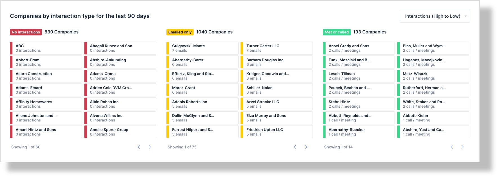
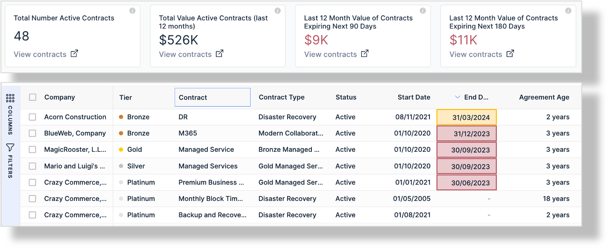
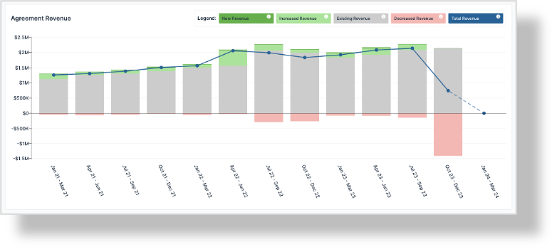
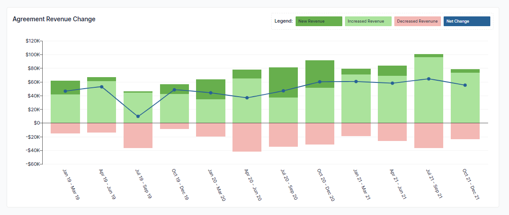
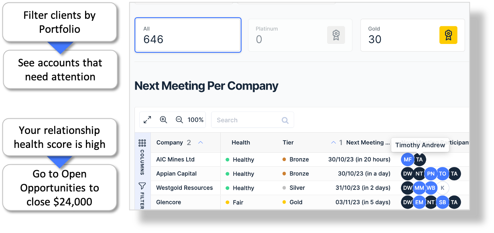
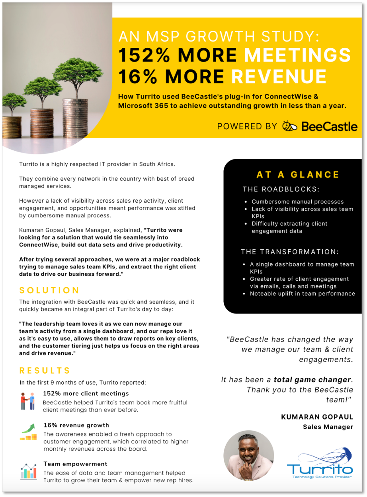

## Welcome back. 👋

If you have read this far and mastered steps 1 – 5, congratulations. You are well on your way to masting data to enhance your revenue. However, we are now going to turn up the heat on some very important tasks needed to grow your MRR and ARR consistently.

Reminder on Key Points:

- Create a profit center vs cost center with BeeCastle by focusing on customer profitability analysis;
- This is a ten-point plan for Managed Service Providers (**MSPs**) to grow revenue by 10% per annum;
- Focus on data analytics to optimize profits for accounts;
- Utilising BeeCastle data analytics dashboards and insights for MSPs; and
- 10 steps to 10% growth in revenue for MSPs is a simple data and technology led plan for MSPs to grow revenue by 10%.

---

## 6. Maintenance of Platinum and Gold accounts
In terms of gross revenue retention, we adopt the old 80:20 rule. Let’s make sure that you are locking in 80% of your revenue and are eliminated any risk of churn.

To do this, use *B[eeCastle_Segment_Analysis](https://app.beecastle.com/customer-engagement/segments-overview).* Create a data habit by putting a 20min calendar invite in your diary with the above link in it. When you click on the link:

1. Select your Platinum clients and review any in red as per below;
2. Select your Gold clients and review any in red as per below; and
3. Reach out to those Platinum or Gold clients in the red for a catch up.

****

Remember as you are reaching out, its always good to click on [*BeeCastle_Account Plan*](/products/account-insights/#company-history) to see what the status of that account is.

We suggest you set a goal of having ZERO Platinum and Gold clients in red!

---

## 7. Capturing new clients
Well, if only this was as easy to do as it is to say….

However, you can combine process with data analytics to dramatically improve your chances of winning. Based on our client discussions we outline the following broad sets that you can adapt to your own process:

1. (**Content**) Refresh you credentials and content pack to ensure it includes points of difference, value proposition and is contemporary for issues of the day (such as cyber, WFH, audit ready)
2. (**Calls**)Make a least 10 outboard calls to new prospects (track in [*BeeCastle_Team_Activity*](https://app.beecastle.com/activity-kpis/team-activity))
3. (**Meetings**) Have a least 3 face-to-face meetings, ideally over coffee, with new clients (track in [*BeeCastle_Team_Activity*](https://app.beecastle.com/activity-kpis/team-activity))
4. (**Qualification**) Qualify all prospects post face-to-face meetings;
5. (**Content follow up**) For qualified leads, ensure follow up with 2 pieces of content to prospects over a 60 day period;
6. (**Reach out**) Make a phone call and offer a send a proposal;
7. (**Reminder**): if not immediately successful, set a reminder in BeeCastle to reach out in a few week’s time.

Remember that is all starts with your outboard calls with new clients that you can track in [*BeeCastle_Team_Activity*](https://app.beecastle.com/activity-kpis/team-activity)***.***

---

## 8. Seamlessly Renew Contracts
What? That contract is renewing today, and no one has called the client?

It’s too late to call the client anywhere near close to when the contract is to be renewed because either you are fine, or your goose is cooked…. But it doesn’t have to be this way, there is a much simpler and fast way to ensure that your contracts seamlessly roll over.

Use [*BeeCastle_Contract_Tracker*](https://app.beecastle.com/prospecting/contract-tracker) to track your contracts as they are leading up to renewal and see the strength and quality of your team’s engagement with that contract.

[*BeeCastle_Contract_Tracker*](https://app.beecastle.com/prospecting/contract-tracker) allows you to proactively manage your contract renewals including pricing increases (you may have seen a loss-making account in [*BeeCastle_Profitability*](https://app.beecastle.com/prospecting/contract-tracker)) that you want to increase pricing. If so, you need to start this process at least 3 months out from contract renewal to properly educate and convince your customer of the value in the new pricing.

---

## 9. Results review
There are several key results you can monitor in BeeCastle to check on your monthly performance. For example, you can see which products and services are selling and are profitable (and which ones are not).

When we think about reviewing results, we advocate you review the following 5 key results to check on the health of your business and look for areas to grow.

**Sales growth**

Monitor your progress on a monthly, quarterly, or yearly basis. See when you are growing with new revenue or suffering with usual churn that needs to be addressed.

A powerful tool for management that is always up-date and automatically generated.

**Review your revenue growth by product**

Deep dive on your data to understand what products your customers are growing in, reducing in and those products that are the mainstay of your revenue.

 
With product growth analysis you can:

- Compare spending patterns across accounts
- Deep dive by Product Sub-Category
- See trends in product growth

**Revenue changes**

Focus exclusively on the changes, drivers and the rate of change over time to identify trends in growth or churn that need to be addressed.

With changes in revenue growth analysis you can:

- Strategically plan the allocation of resources to facilitate your objectives
- Understand drivers for churn
- See where growth is acceleration
- Focus on the greatest areas for opportunities

---

## 10. Plan next meetings with your priority accounts
If you only do one thing with BeeCastle, make it a Monday morning meeting with [*BeeCastle_Meeting_Planner*](https://app.beecastle.com/meeting-planner).

This amazing tool allows you to see into the future and consider your team’s upcoming meetings.

The fantastic thing about this tool is that you can collectively discuss:

1. Who you are booked to see, what can you raise with that client and any cross sell or upsell opportunities.
2. Any clients in red on [*BeeCastle_Segmented_Analysis*](https://app.beecastle.com/customer-engagement/segments-overview) who need to be added to the meeting list; and
3. Review the recommended meeting list in [*BeeCastle_Meeting_Planner*](https://app.beecastle.com/meeting-planner) to see if the list prompts any thoughts from your team.

---

That’s it!

If you can master the above 10 steps, you are well on your way to increasing your revenue by 10%.

But wait? Is this really true?

Check out our references below to see the proof from successful [BeeCastle](/) customers.

