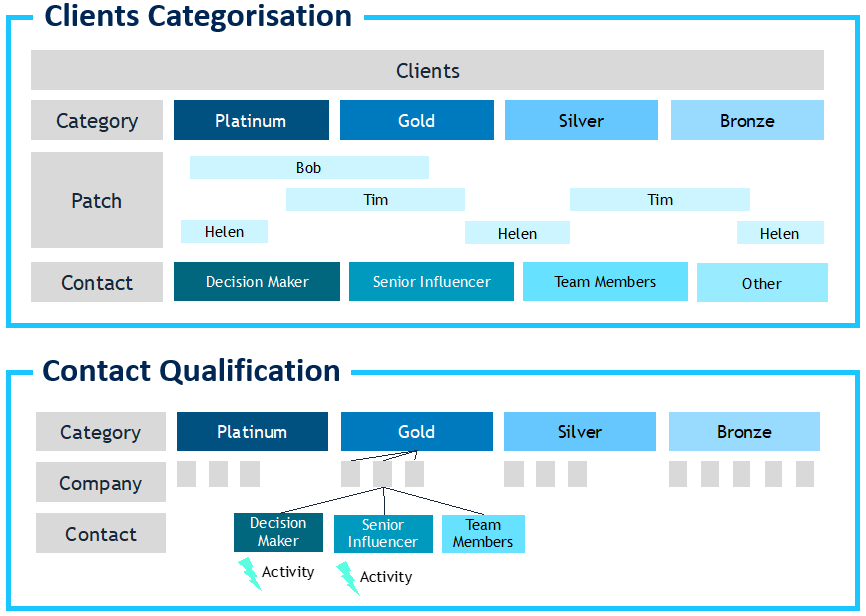
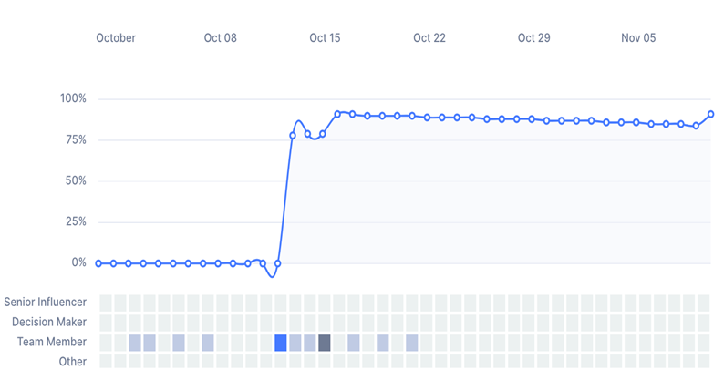
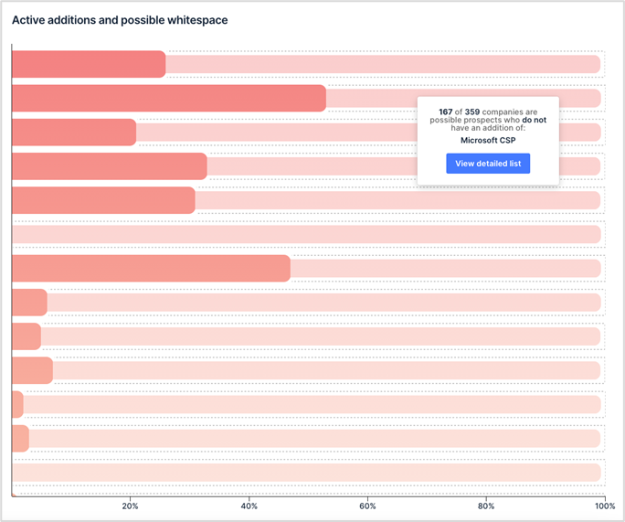
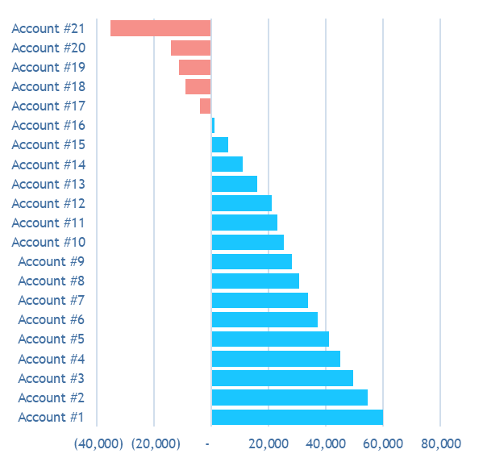

The key to sustaining growth and profitability of your MSP lies not just in acquiring new clients, but in effectively managing and maximizing the potential of existing ones. BeeCastle stands at the forefront of this ideology, presenting a revolutionary approach to client management that transcends traditional methods.

In this post we delve into the core of BeeCastle’s innovative strategies, guiding you through the critical steps of client categorization, relationship nurturing, and whitespace opportunity identification. With a blend of advanced AI technology and a deep understanding of human dynamics, we offer insights into creating a robust framework that not only identifies your most valuable clients but also fosters meaningful connections that drive business success.

Join us as we explore the intricacies of BeeCastle’s methodology, designed to elevate your client relationships and ensure that every interaction adds value to your bottom line.

## Step #1 – Setting up records of your client category and human qualification

We consider clients in terms of both the company and its spending patterns as well as the people within that organisation that make the decisions on purchasing and implementation. Think of it in terms of two streams:

1. The Client qualification is in terms of current and future spend. We observe that 80% of income tends to come from 20-30% of your clients. We determine these as Platinum and Gold. We then tier the remaining clients by percentage of spend.
2. The human element in terms of assigning your contacts as a Decision Maker or Senior Influencer which are important to nurture a warm andtop-of-mind relationship with.

**Relationships**

It is human nature to reward those who reward us. To bestow favour or advantage to those who have made an effort to deliver value or show care to us. This [notion of reciprocity](/blog/the-theory-of-reciprocity/ "The Theory of Reciprocity") has been a core part of global trade and commerce for centuries.

We are now looking to democratise and harness the power of this notion in an organised and programmatic way. For example, good relationships are not only about driving revenue, they also assist in problem resolution, finding win win opportunities and ensuring clients remain sticky notwithstanding any issues that arise.

We are looking to help users focus on the most important clients and the most important users within that client.

## Step #2 – Tracking progress to nurture relationships

With the focus now determined, the next steps is to ensure there is appropriate activity and engagement to build relationship equity. We measure objectively based on automated data ingestion the level of relationship equity. We consider all activity with your client, in terms of emails, calls, meetings, social engagements, cadence and the seniority of the contact engaged with. We keep a full track of all interactions including who from your organisation emailed, called or attended a meeting. It may seem simple to reach out to a client and build relationship equity. However the challenge arises when there are multiple clients at scale– you need a process.

**Objective measurements**

By [automatically tracking all engagements](/products/enhanced-account-management/#engagement-summary), BeeCastle provides both a bird’s-eye view of groups of accounts (a segment of your accounts) or zoom in to an individual account (see graph to right) on the exact status of that account and precisely who.

It is our experience that users require both a holistic view to set strategy and resource allocation as well a detailed ‘coal face’ view of the account to take relevant action on that account. We advocate a regular reach out via teams or zoom with key decision makers and (if possible) some face to face given the significant bump in relationship equity this provides. Further, we screen for key words such as ‘coffee’, ‘lunch’, ‘drinks’ or ‘dinner’ because we track social engagements and consider them to material enhance relationship equity.

## Step #3 – Finding whitespace opportunities

With relationship equity in the tank, we recognise you have made an investment in your clients. Now is the time to seek a return on that investment and consider additional best fit solutions for your clients as they look to build their business. BeeCastle uses its proprietary whitespace technology to find [up-sell and cross-sell](/products/whitespace-prospecting/) opportunities for your clients.

**How it works?**

We have been training our algorithms with the help of our clients for years.

BeeCastle uses collaborative filtering AI models to determine fair, good and excellent fit of an up-sell or cross-sell opportunity. When you find those opportunities you can create a record and then push the opportunity back into your PSA to quote and close.

BeeCastle now estimates the value of a specific opportunity in our whitespace tool and helps account managers to prioritise which opportunities are both a good fit and can move the dial to be worthy of attention.

## Step #4 – Review the profitability of an account

Not all revenue is good revenue. Some revenue has significant costs associated with it that erodes the ultimate contribution to the business. It is important to continue to monitor which of your accounts are the most profitable and what successful playbooks can be transposed across your portfolio. Reviewing your loss making accounts is arguably more urgent requiring immediate action.

**How does profit tracker work?**

Profit tracker assesses the gross revenue of an account against the profitability of each product and the time you have logged against the account in your PSA. We then apply a cost charge to this activity time and calculate the gross profitability.

The report provides a relative perspective of your accounts from a contribution point of view.

Users can adjust the time perspective then filter by Territory, Account Manager or Tier (Platinum, Silver, Gold and Bronze) to narrow the data set for review. You can consider a single point in time or trends over multiple periods.

For loss making accounts, users are empowered to take appropriate action including considering up-sell or cross-sell opportunities to increase the revenue, increase the pricing on the managed agreement or take other action.

