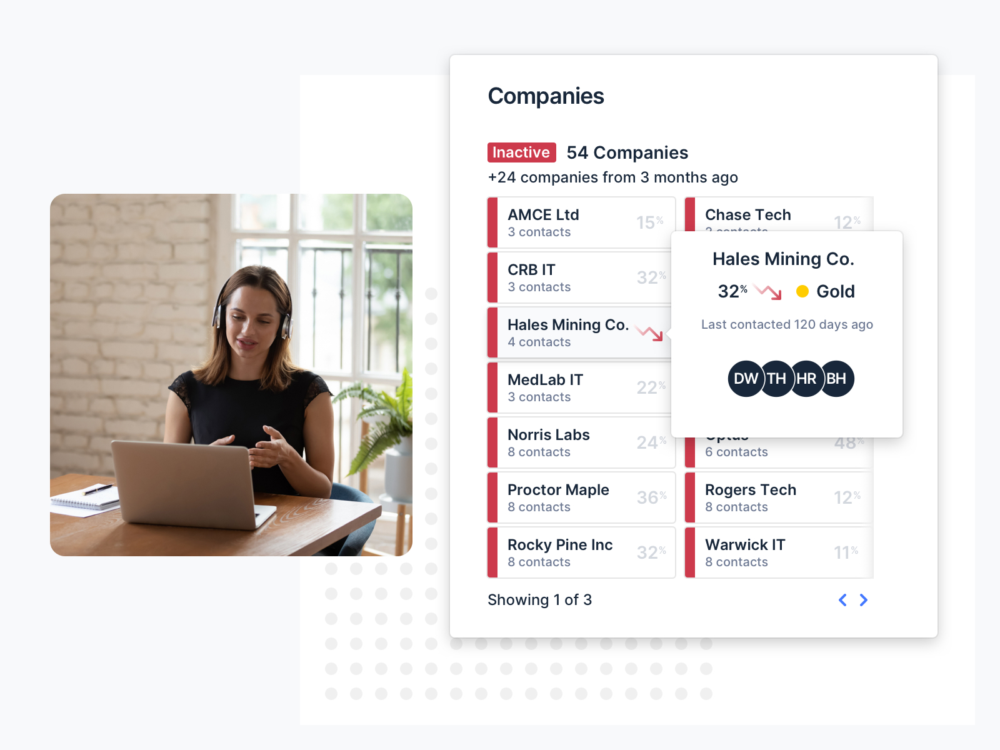
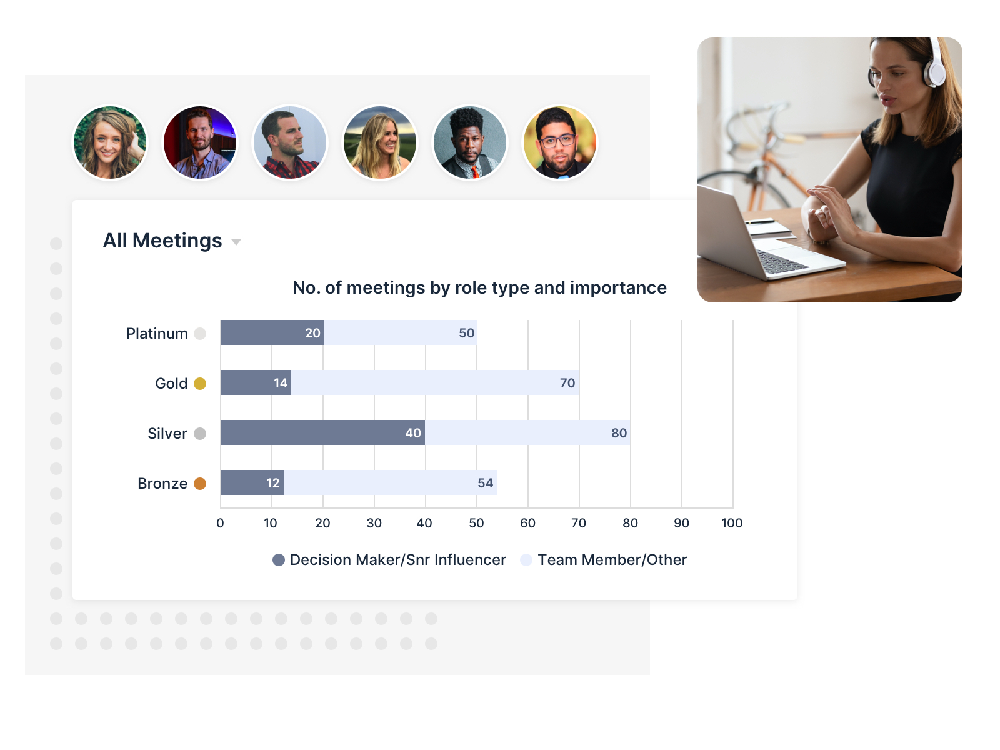
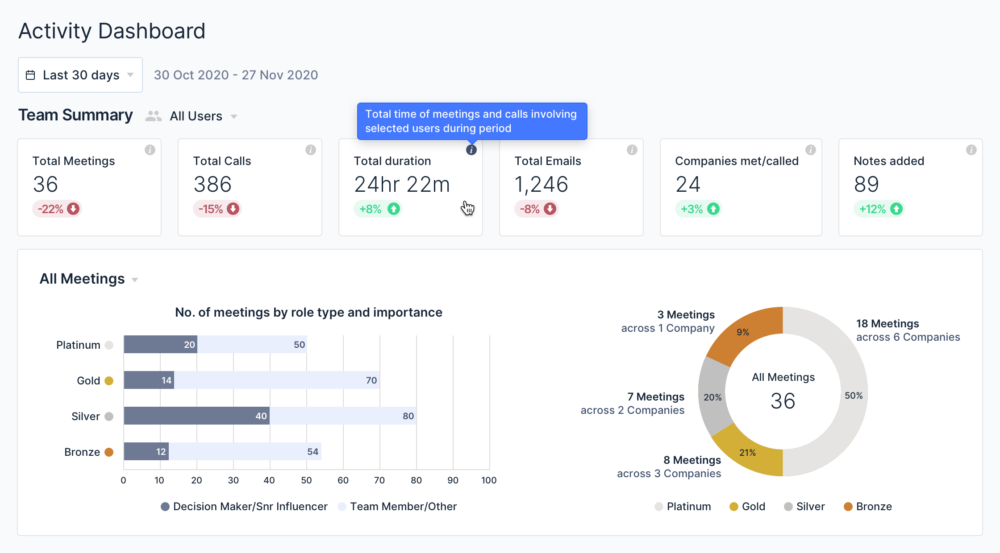

As an MSP, you understand that most opportunities come from your existing customer base. Staying top of mind is crucial to uncovering those opportunities but reaching out is often lead by intuition.

By structuring your client engagement with data, analytics and setting achievable goals, you can improve you and your team’s results.

Here is how we suggest structuring your client engagement:

## 1. Determine importance

By defining your clients based on their importance to your business, you can prioritise who you spend time with. A clear way to do this is by the current revenue they generate for your business, but their *potential* revenue may be equally important.

## 2. Track and measure your interactions

Knowing not only the number of interactions you and your team have with clients, but also the *value* of those interactions is an important first step in knowing when to check in with a customer.

By automating this reporting process, you can use data to determine who is engaged, and which of your key accounts are inactive or slipping.

## 3. Build an engagement plan

With data around your most important clients you can then set goals around who you and your team will connect with.

Allocate portfolios of your top clients to different team members, set specific engagement goals for each and apply a deadline to review the progress.

## 4. Set-up 1-1s with your BDMs

Once you have a plan in place, relationship data can be used to create a culture of accountability. By generating weekly reports around your team’s activity, you can have more productive conversations with your team around customer engagement and quickly identify at-risk accounts.

## How BeeCastle can help

We understand better data equals better relationships. BeeCastle integrates with Microsoft 365, automatically maps activity as its performed against your contacts, and generates analytics and an intelligent relationship score.

This makes it easy to stay on top of your relationship data - all you have to do is glance at a dashboard to find the information you’re looking for.

Having this data in one place means everyone is on the same page, and you can monitor your team’s progress toward their goals. You can spend less time manually entering and analysing data, and more time on revenue-generating activities.

