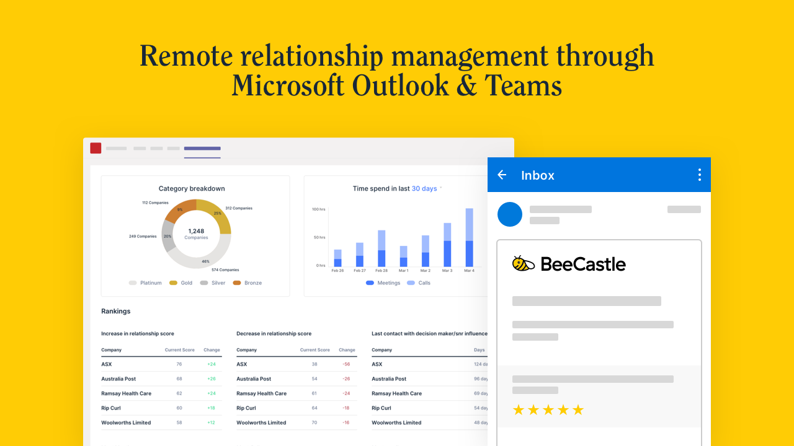

Whether it’s a global issue like COVID-19 or a statewide emergency, businesses need to have a crisis communication plan in place for their customers, shareholders and stakeholders. This goes beyond minor tweaks to email marketing – it extends customer engagement strategies, engagement cadence, working from home, your website, social channels, customer-facing staff and more.

You can’t control the market, the business environment or a crisis – but you can control how you react to it.

You can also control your priorities. Making sure you prioritise certain clients and stakeholders in your business can ensure that you actually improve your relationships with important clients and stakeholders through a crisis.

Remember stakeholders include shareholders, financiers, board members, partners, advisors, back office and of course – your customers.

Here are six steps to help you manage the impact of a crisis on your important relationships and next steps to your customers.

## 1. Be present, connect

People seek out other people, views and connections during times of rapid change or uncertainty. You can play a key role in providing information and views to your network. Consider a programme to reach out to key stakeholders and important customers to let them know you’re aware of the issues, and to offer some views. Look at using Microsoft Teams or other video conferencing technology to connect and to show a human face on calls. Be ready to offer insights and be helpful through providing your ideas and views on the new-normal environment and don’t forget to ask your network how they are going and what issues they are facing.

## 2. Communicate proactively

Your stakeholders and customers often count on partners like you during a crisis even more than you think. This is an opportunity for you to be that reliable partner. Try to proactively announce changes or impacts to your business and to reach out to your stakeholders to find out about their changes. Don’t make it hard for customers understand what the new working arrangements are for you or to find information they need – send it to them. Stakeholders also greatly appreciate a proactive communication strategy because it allows them to easily and quickly digest the new information without having to chase it.

## 3. Select the right channels

How to communicate to your stakeholders? Phone call, emails, social media, SMS etc etc. The reality is you need to think carefully about “which message” belongs in “which channel”. For broadcast messages, try to create communication that is appropriate across a variety of channels, including dedicated web landing pages.

Then think about which stakeholders need bespoke communications. Consider using [BeeCastle](/) to understand which of your clients would most appreciate a bespoke video call on [Microsoft Teams](https://www.microsoft.com/en-au/microsoft-365/microsoft-teams/group-chat-software) (for example) and try using the [BeeCastle](/) client portfolio analysis to determine where you will get the most benefit from reaching out to your stakeholders.

## 4. Be generous, give and empathise

Show your human side in a crisis and speak with a genuine, thoughtful and sensitive voice in your communications. Ask questions of your stakeholders and listed carefully. Offer whatever you can in terms of free information, connections and other things that are small for you to do but can make a big difference to your customers and stakeholders.

For example, some companies have collated a list of free resources on the web and sent these to clients to help with working from home and also to help with home schooling. Try to make your offerings as helpful as possible and don’t ask for anything in return – people will remember your generosity.

## 5. Keep calm in the face of a crisis

In times of crisis, those who can “step-back” and take a more holistic view are often able to better help others by providing interesting view points that can be a longer term view. If you can remain calm and philosophical about whatever issues are going on (even if you are suffering) you are better placed to think about helping yourself and others. If you are a strong and solid rock for others to speak to, you can become a magnet for those seeking help. Remember you can only worry about the things you can change, and not the things that are beyond your control.

We suggest do you do as much as you can to help other – including:

- Communicate you ideas to help clients
- Think about long term implications for your sector and communicate these
- Share a donor portal
- Communicate your philanthropic position
- Donate products, services, money or time
- Communicate how your brand’s community can get involved

## 6. Coordinate and plan together

Planning stakeholder engagement should be a full team effort. Think about who is best placed to call which stakeholder and ensure that you cover all basis. Consider using [BeeCastle](/) to map all your stakeholders and to develop a full team engagement plan and consider using all parts of your organisation to do this. Specifically consider who in your team will use which channel most effectively and what the messages are from each team. It is critical that all messages mesh together neatly and that you are consistent across your platform.

Try out your communication strategies on each other before you launch them out on your many stakeholders, its amazing what you can pick up. For those bespoke engagements, try using both [Microsoft Teams](https://www.microsoft.com/en-au/microsoft-365/microsoft-teams/group-chat-software) and [BeeCastle](/) integrated to track and monitor your relationships building activity.
