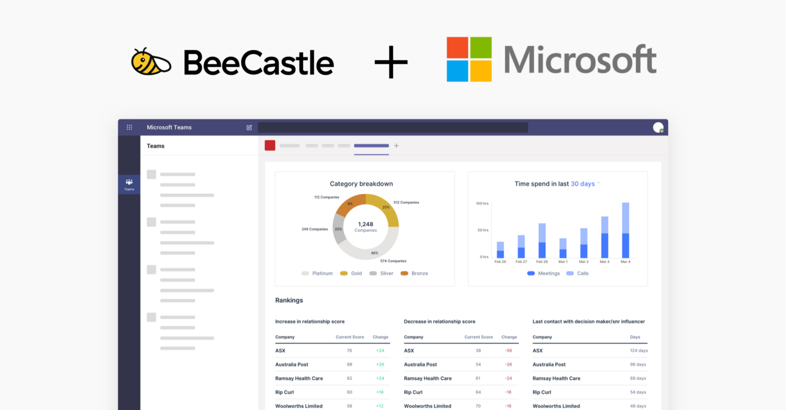
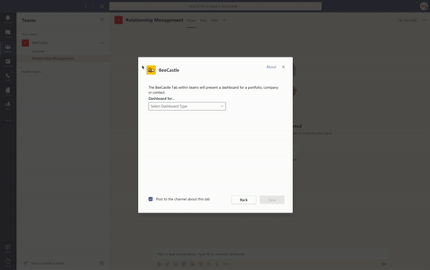
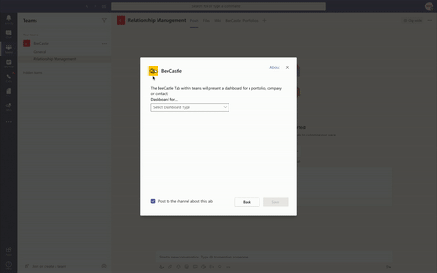
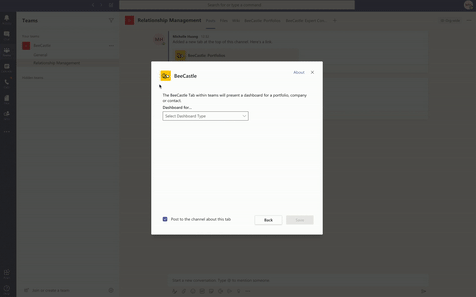

Today we are excited to announce our **Microsoft Teams** integration and app, which is currently in Beta and will be launched publicly in May!

Due to COVID-19, we are all increasingly moving remote. For many relationship managers this represents a significant departure, we all need to be more deliberate and collaborative in the way we connect with our clients and network. Businesses are increasingly using **Microsoft Teams** to facilitate that remote collaboration and we’ve had many requests to access BeeCastle’s insights directly within Teams.

You ask, we listen… and build! We’ve seen a tremendous amount of excitement when previewing this new app to our customers. We hope that in these times where being deliberately proactive with your clients has become important, you can use this new app to make smarter and faster decisions around relationships.

**How does BeeCastle in Teams work?**

With the BeeCastle app in Teams, you can easily add new **BeeCastle Tabs** to each of your channels so that our powerful dashboards are always at hand. For example:

1. If your channel is focused on a specific vertical or portfolio (e.g. a practice area for a legal firm), you can add a tab that shows a **pre-filtered portfolio overview**. See the status of your team’s relationships with all of the clients within that portfolio.

   
2. If you have channels centered around important accounts, you can add a **company dashboard** to get all of your relationship history and relationship scoring with each contact in one view.

   
3. Finally, if you have a channel centered around a specific decision maker, you can add a **contact dashboard** to have full team visibility of your relationship history with that contact.

   

**This is just the start of BeeCastle + Microsoft**

**BeeCastle** is a certified Microsoft Partner and we believe our product works best for teams who work within **Office 365** and **Teams**.

In the spirit of making remote relationship management work, we are building more integrations with **Outlook**, **Teams** and other **Office 365** apps over the coming months. This will include:

- Providing meeting feedback and ratings within your **Outlook** emails or through **Teams** itself.
- Being able to share specific cards within **Teams** to prompt conversation.
- A personal home within **Teams** where you can see smart suggestions, suggested contacts and other information that will help you proactively build better connections with clients.

**Want to know more?**

Great! If you want to understand how **BeeCastle** can help remote companies build better external relationships please get in touch with Tom at [tom@beecastle.com](mailto:tom@beecastle.com) and he’d be happy to discuss.

If you are an existing customer using **Teams,** let us know and we will invite you to our Beta program.
