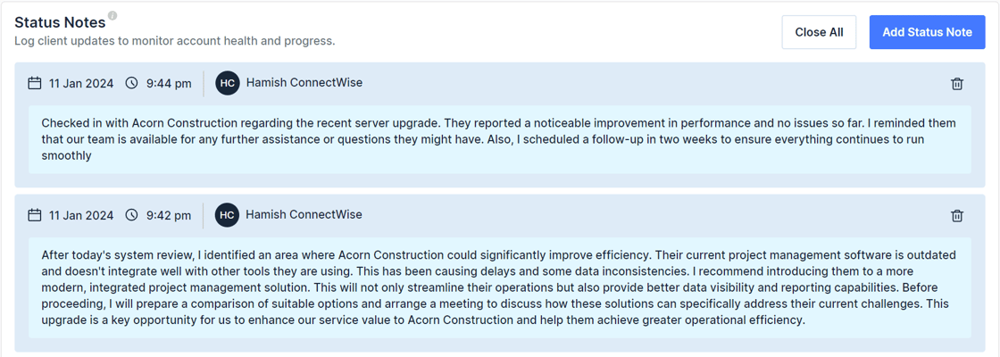
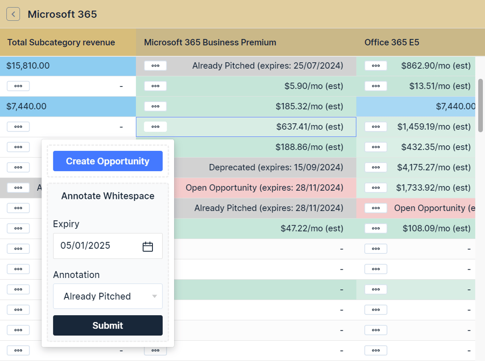
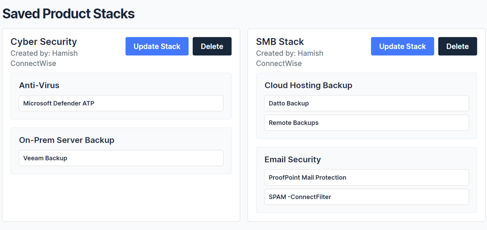
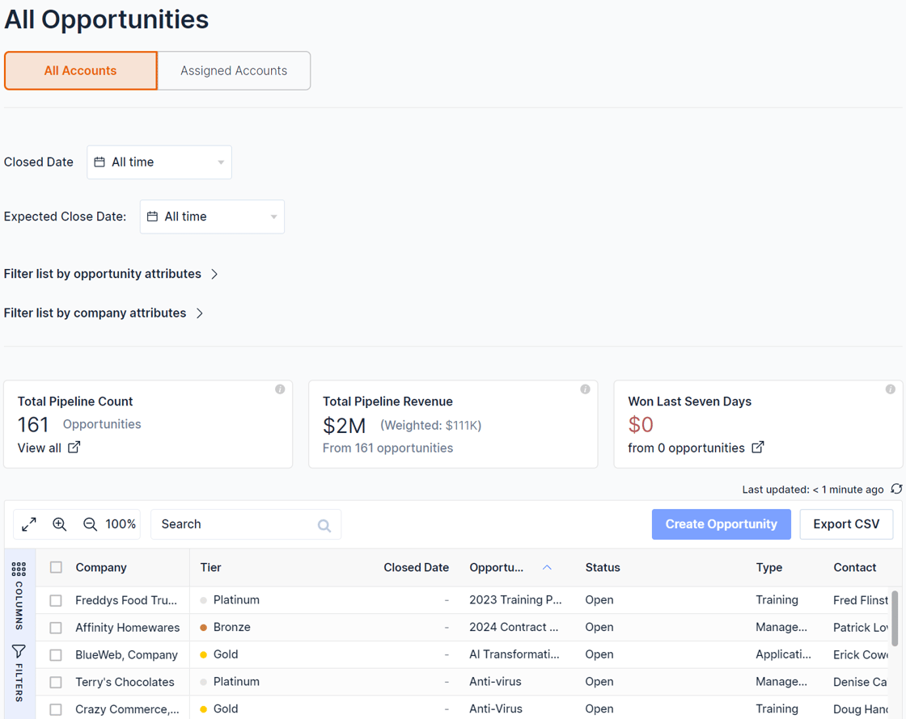
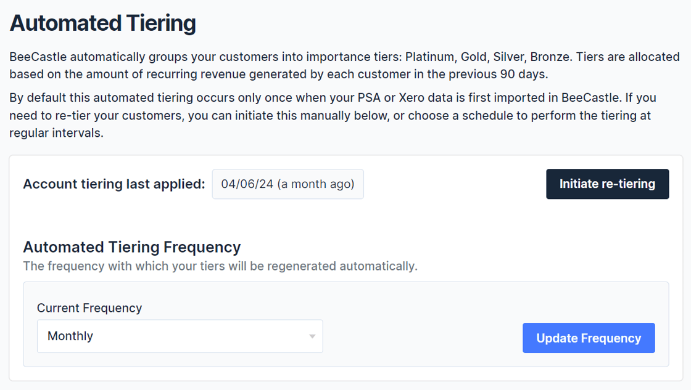
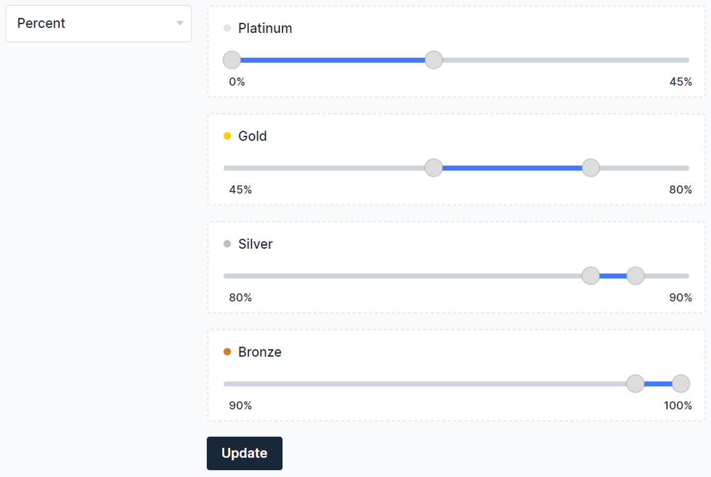
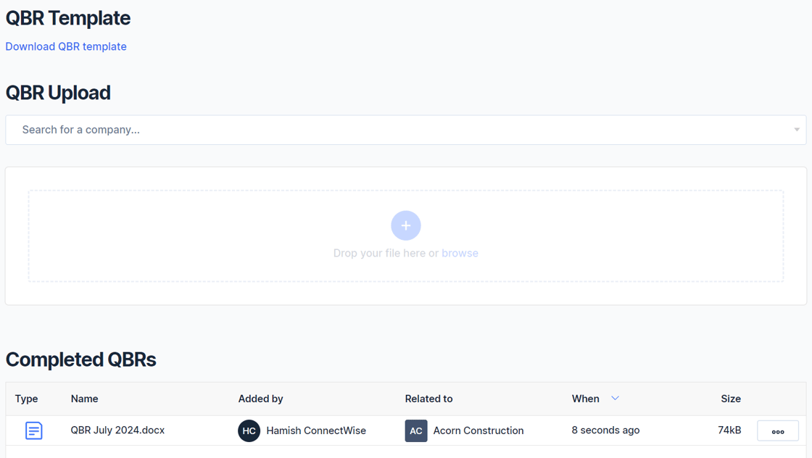
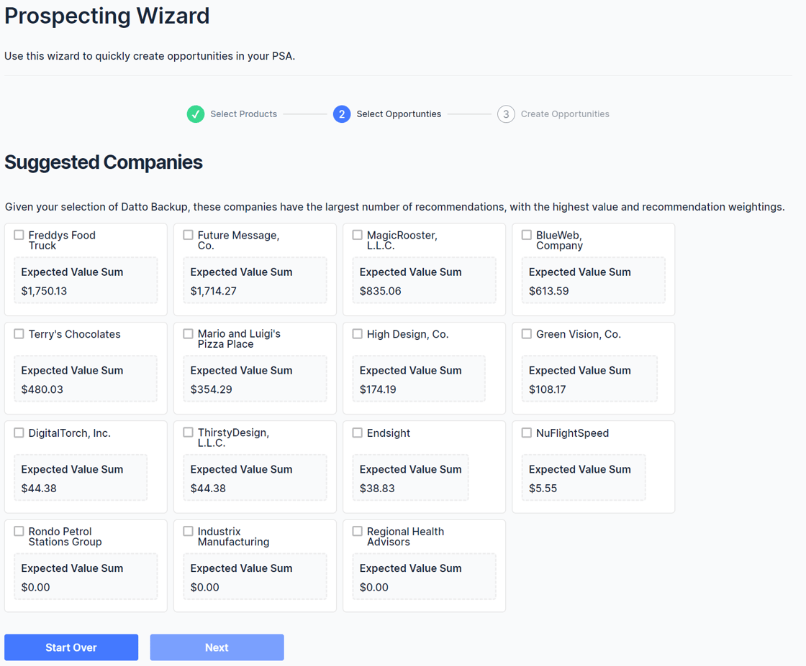

This platform update introduces several new features included in existing subscription prices, reinforcing BeeCastle's commitment to delivering continuous value to its clients.

The most significant aspect to the platform update relates to our Generation 2 AI driven BeeCastle Whitespace intelligent opportunity finder that leverages MSP data and our collective database to reveal best-fit sales opportunities that MSPs can action for their clients.

“*I think in totality, this is one our most comprehensive upgrades to our platform yet.*” said BeeCastle CTO Hamish Rickerby. “*Our ability to act as a Tier 1, independent, non-biased helper for MSPs to provide genuine sales opportunities and out-of-the-box business intelligence continues to improve rapidly*.” He said speaking from Christchurch in New Zealand.

## \*\*\* Webinar Alert \*\*\*

BeeCastle invites you to explore these new features and participate in our upcoming webinar for a live demo:

- Session One, **North America** (USA, Canada) - 4pm CT, Wed 31 July 24
- Session Two, **APAC/UK** (AUS, London) - 5pm AEST/8am UK, Thurs 1 Aug 24

| |
| --- |
| [**Book your webinar place**](https://beecastle-22313812.hubspotpagebuilder.com/hive24?utm_source=hs_email&utm_medium=email&_hsenc=p2ANqtz-_skzkovoAyVSVJ_eXGfrrb2qlxK-JQIhynqf3ch-orCtZfEtohn3MRiSIonc9U6g5b__XJ) |

## \*\*\*\*\*\*\*\*\*

Key updates include:

- **Whitespace Generation 2**: Let BeeCastle automate your sales process by creating best-fit upsell and cross-sell opportunities, then let our systems learn from your comments to enhance our recommendation engine for future suggestions. New Bespoke Product Stacks: VCIO’s can create 3 core stacks, and free up sales to focus on core products to streamline opportunity identification. A major simplification in ease of use, with enhanced AI.
- **Company Status Notes:** Enhance account management by highlighting the status and current issues at the top of the account management page, ensuring seamless client relationship continuity.
- **All Opportunities Dashboard**: A comprehensive view of the entire sales pipeline, perfect for sales experts, account managers, and team leaders.
- **Tiering Updates**: Automatically re-tier customers based on recurring revenue to reflect their evolving importance. Tiering Weights Configuration: Customize tiering weight defaults to meet specific organizational needs.
- **QBR Management**: Centralized storage for QBR documents, with easy drag-and-drop functionality and downloadable templates for streamlined customer engagement.
- **Prospecting Wizard**: An new feature to simplify new opportunity identification, enhancing sales enablement capabilities for MSPs.

## 1. Enhance your account management with "Company Status Notes". 📝

Before a meeting with an important client, it's important to understand status and any current issues to be resolved. You asked for this to be highlighted at the top of the account management page and we have delivered. At a glance anyone can pick up where the relationship last left off, see the history of your engagement and see any outstanding tasks or issues.

To use this feature, simply add in the notes of your last meeting in the Status Notes area for other users to see when they are active on that account. 👀

## 2. Whitespace Updates

We know how important sales enablement is for you, and so we have several new updates to our generation 2 Whitespace. A huge thank you to our **Product advisory Committee** for your assistance on this critical feature.

Whitespace analysis is the process of examining sales data to find opportunity for cross sell and upsell in your existing customer base. ⛅️

### 2.1 Annotations

We have created an annotations feature to our Whitespace matrix. Annotations allow you to update your Whitespace as you go so you can track the opportunities you have already created. Your annotations also help train our recommendation engine, providing you with better and better recommendations over time. 🧠

As you can see below, annotations allow a user to have a more refined and comprehensive view of what is working well with your customers.

### 2.2 Product Stacks

You have chosen your top 2 or 3 product stack (software combinations) for a good reason. But with so many products to choose from, whitespace can seem unwieldy when really you only want to focus on your core stack. You can now create a bespoke product stack that you are comfortable with to give you a focus when looking for opportunities.

This is arguably one of our most sought after updates! 🧐

## 3. All Opportunities Dashboard

We know you need to keep a close eye on future sales and how you are progressing. See your entire pipeline with our new All Opportunities Dashboard. Perfect for sales experts, account managers and team leaders. 🗒

## 4. Tiering Updates

### 4.1 Automated Tiering

At BeeCastle we tier your customers into Platinum, Gold, Silver and Bronze based on a set criteria. We do this out-of-the-box to save you time.

But times change, and customers change too. A small client yesterday might be your most important client tomorrow. To reflect this, BeeCastle now can automatically re-tier your customers based on their recurring revenue. 👏

### 4.2 Tiering Weights Configuration

Different organisations have different needs. You can now change the tiering weighting defaults. A weighting is how much of your revenue you expect from that tier of client. For example, you may expect Platinum clients to contribute 50% of your total revenue.

Choose between the percentage or raw recurring revenue weighting types as set out below.

## 5. QBR Management

Your QBRs now all in one place. We have creates a safe, central space to store your QBR documents. Just drag and drop them into BeeCastle and your can refer to them at the same time as you are speaking to your client. 🗂

In addition, (if you have already have a QBR template) download our convenient easy to get stated template, complete it with your customer and upload it back to BeeCastle for easy retrieval.

## 6 Prospecting Wizard 🧙‍♂️

We have a new prospecting wizard releasing soon that makes it super simple to identify new opportunities as suggested by our recommendation engine.

Our prospecting wizard further enhances our sales enablement capability for MSPs and is part of our mission to simplify your life and save you time. ⏰

If you would like to be given a personal walk-through of these new and upcoming feature we encourage you to get in touch and [book a demo here.](https://meetings.hubspot.com/hamish-rickerby?utm_source=hs_email&utm_medium=email&_hsenc=p2ANqtz-_skzkovoAyVSVJ_eXGfrrb2qlxK-JQIhynqf3ch-orCtZfEtohn3MRiSIonc9U6g5b__XJ)
