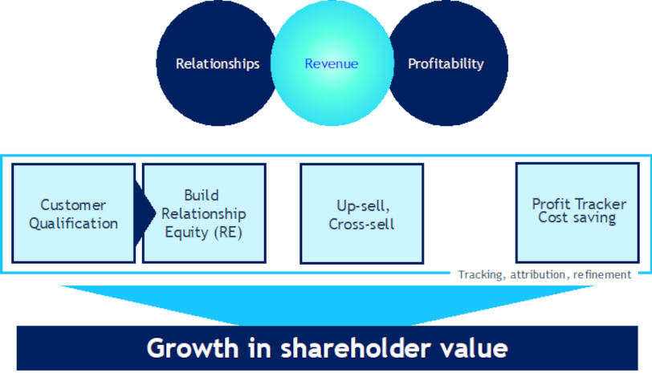

## Harnessing the BeeCastle Value-Add Methodology for Enhanced Account Management
This is the second post in a series on Enhanced Account Managemnent.  Check out part one on [Data Transformation](/blog/embracing-data-transformation-a-strategic-imperative-for-msps/ "Embracing Data Transformation").

Enhanced Account Management© is a broad term that is built on a methodology that has evolved over 30 years. The concept is proprietary to BeeCastle and encompasses several facets that ultimately result in a sustainable increase in shareholder value.

Fundamentally, the core thesis of BeeCastle is that the true value of an MSP is the value of its clients. Essentially, if your clients are increasing their spend every year, paying an appropriate margin, and undertaking significant volumes in IT spend, then its likely you have a valuable MSP. Our methodology is built on the concepts and foundation rocks described below

In the quest for sustainable business growth, BeeCastle’s value-add methodology offers a strategic roadmap, broken down into four critical components: Customer Qualification, Relationship Equity, Up-sell/Cross-sell, and Profit Tracking for cost savings.

**Customer Qualification: Start with the Right Clients**

The journey begins with identifying the right clients – those who have the potential to grow and contribute meaningfully to your MSP’s bottom line. Customer qualification is about understanding the current and future value of your clients and categorizing them accordingly. It’s the art of discerning not just who your clients are today, but who they have the potential to become.

**Building Relationship Equity (RE): The Cornerstone of Value**

The strength of client relationships is fundamental to unlocking growth. By investing time and resources into nurturing these relationships, MSPs create ‘relationship equity’. This intangible asset becomes a catalyst for opportunities, acting as a bridge to revenue generation through trust and loyalty.

**Up-sell and Cross-sell: Capitalizing on Established Trust**

With a robust foundation of relationship equity, up-selling and cross-selling become natural next steps. This phase is about strategically offering additional value to clients through services and products that complement their existing purchases. It’s not a hard sell, but a service to clients who already trust your MSP to understand their needs and help them grow.

**Profit Tracking: Ensuring Value for Both Parties**

To ensure these efforts contribute positively to the bottom line, BeeCastle emphasizes profit tracking and cost saving. This step goes beyond revenue and looks at the profitability of each account, ensuring that growth in revenue also means growth in profit.

**The Result: Growth in Shareholder Value**

These steps, when executed effectively, lead to a tangible increase in shareholder value. The visual encapsulates this journey in a way that highlights the interconnectedness of relationships, revenue, and profitability – with the client always at the core.

**Implementing the Methodology**

To adopt this methodology, MSPs need to integrate a series of data-driven tools and processes that allow for the dynamic tracking of each component. This includes CRM systems that can segment clients based on their potential, analytics to track relationship interactions, sales strategies for up-selling and cross-selling, and financial tools to monitor profit margins.

**Conclusion**

By embracing BeeCastle’s value-add methodology, MSPs can achieve a harmonious balance between client satisfaction and business profitability. This strategic approach not only enhances the client experience but also ensures a sustainable growth trajectory for the MSP.
