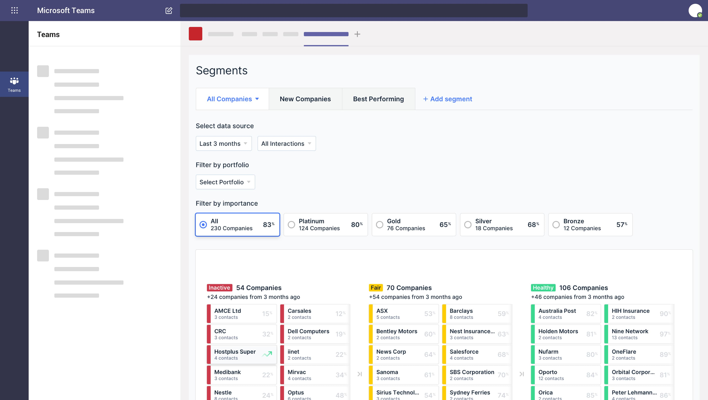

## About the RIX Group

The [RIX Group](https://rixrewards.com/) is a global leader in the sales promotion space. It specializes on travel and experience-based rewards, such as free flights, free hotel nights and free sights for a large portfolio of international brands. The core team consists of 30 regional directors based in over 20 countries – all working remotely to build relationships with their clients so they can create market leading solutions for them.

RIX wanted to ensure their team had the fundamental tools to maintain business continuity and strengthen connections in the transition to remote work. They were early adopters of Microsoft Teams at the start of 2020 and turned to BeeCastle to manage customer relationships through its Microsoft Outlook and Teams integrations.

## What were they looking for?

RIX’s goal for the workplace is to simplify how employees get their work done. They wanted their employees to be able to focus on providing solutions for their clients and creating opportunities for the company – not managing complicated systems.

As a team of relationships managers, RIX wanted to validate the efforts of their employees, and also diagnose where improvements could be made through a relationship management platform. They are strong Microsoft Teams users – they run all business operations through it. As a result, when they were looking for a platform to manage their business relationships, Microsoft integration and ease of use were the most important criteria. They also needed data driven and automated relationship tracking – rather than relying on manual logging and call reporting.

## The problem

RIX had implemented CRM’s in the past, however, lack of automation and in particular Microsoft integration, created significant barriers to effective teamwork, adoption and accuracy. Without being able to collaborate around a single source of data, it was difficult for people to contribute more broadly to the company.

“*It’s because of BeeCastle’s integration with Teams in particular*,” says Pascal Haider, Chief Executive Officer at RIX Group, “*that everyone can now work together on one platform to improve our relationships with our clients*.”

## How did BeeCastle actually solve the problem?

### Ease of use

BeeCastle’s deep integration with the systems RIX live in, Microsoft 365 and Teams, helped RIX ensure business continuity and ease of adoption for a team who works remotely. Not only do they no longer manually log interactions, the Outlook Add-in and Teams integration means the team can access BeeCastle’s powerful analytics in the systems they have already mastered. *“BeeCastle’s Microsoft integrations allow us to keep our contacts up to date and visualise who’s been interacting with who,*” says Pascal.

### Unique and powerful relationship analytics

BeeCastle relationship scoring gives RIX unique and accurate insights into how each region was engaged with their customer base.

“*The automated, accurate data and clean dashboards make it easier to visualise which clients need re-engaging and which relationships are healthy,”* says Pascal, *“we can then refocus our time to prioritise meaningful interactions with our most valuable clients.”*

As a large international team, RIX spends a majority of the working day in Teams – coordinating campaigns and updating each other on activity. Surfacing dashboards in Teams allows the group to highlight the best performing regional directors. As a team they can collaborate around a single source of analytics, and plan how to drive results across the rest of the company.

“*Because of BeeCastle insights, we can be more proactive and interactive, as opposed to reactive*, *with our clients*” says Pascal. “*As our team’s data syncs automatically, we can surface an account’s dashboard in our Teams channel and show each other the real-time status of a relationship with a client.”*

“*We use the number of meetings we have with our clients as a key data point of client engagement. We aim to reach a certain number of meetings with our key accounts. Having visibility across the company of progress on this ‘meeting push’ assists us in our day-to-day work as well as in operational meetings*”
