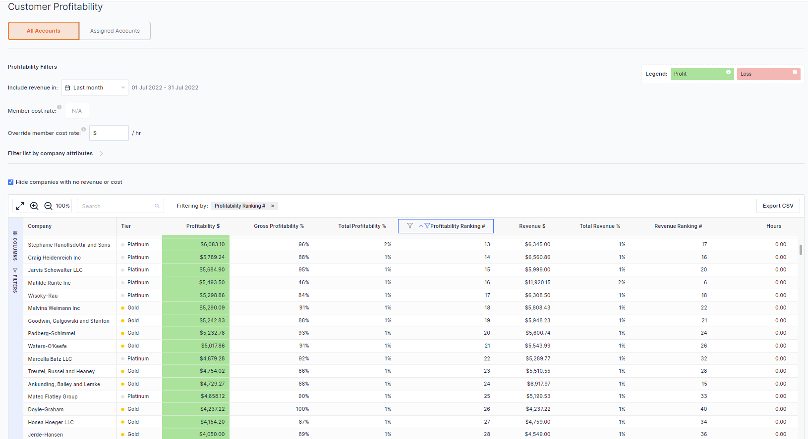
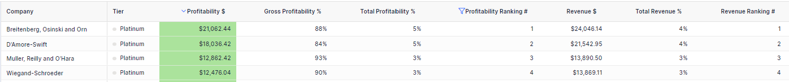
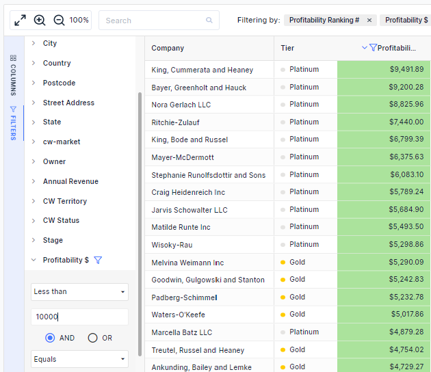
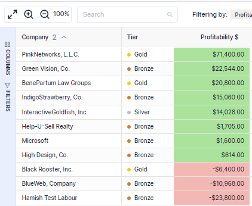
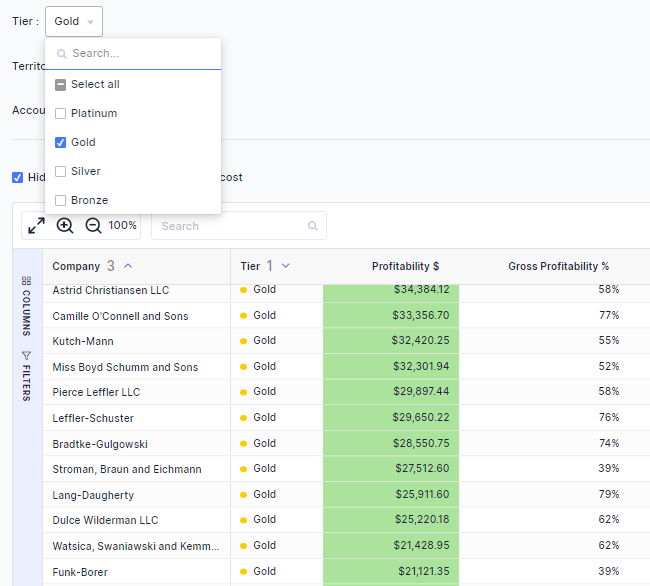

## High-level customer profitability insights with low-level effort.

We know how both important and long it can take to calculate customer profitability. Compiling data from multiple systems and then trying to stitch it together to make sense of it. It can take many hours. Not anymore. ​

Now you can now gain a view right across all of your accounts with out any data headaches.

### Get the insights you need for your business. Filter and slice the data your way to personalise your insights

Profitability is a common critical metric for all business. However, we know that every business is different. Sort and filter the data columns in way that makes sense for you.

You can also refine this further by using any of the data using your BeeCastle and ConnetWise fields… For example, you only want to see accounts that have profitability less then $10,000. No problem.

### Important decisions are hard enough, the data should help make it easier.

You need the data to help you make tough decisions. Profitability is a key indicator for account management. We help you easily see if an account is either profitable or running at a loss, so that, you can include this in your account management and business decision making.

### Review Your Customer Profitability in Tiers to Gain Quicker Insights.

Drill-down on each segment to analyse the profitability health of each tier.

### Want to know more?

[Check out](https://help.beecastle.com/en/articles/6490632-customer-profitability-set-up-data) this article to learn more about how to set up permissions and data sync required for Profitability.

If you have any questions at all, please don’t hesitate to email [help@beecastle.com](mailto:help@beecastle.com) and we will be happy to help.

Log in to BeeCastle [here](https://app.beecastle.com/login?next=/?next=/?next) to get going!
