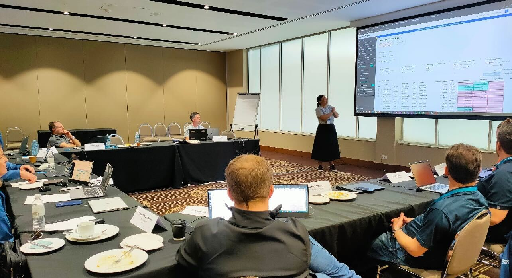
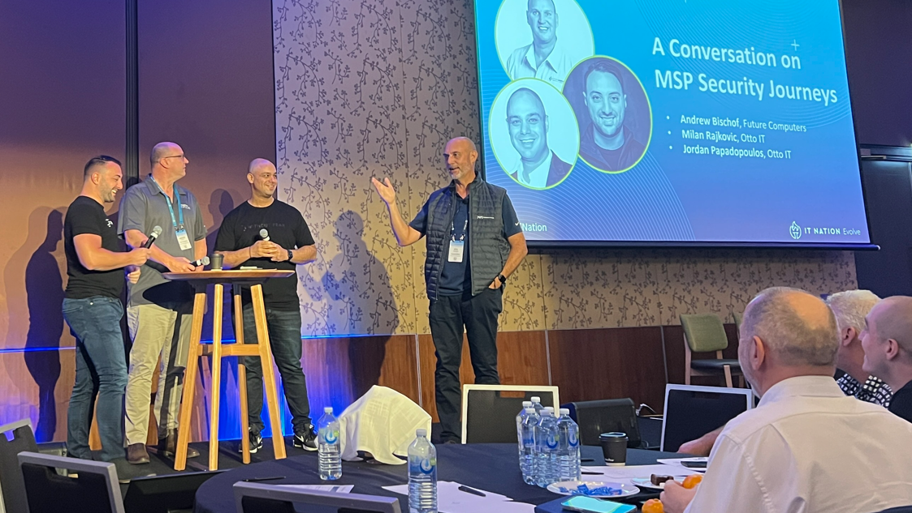

In case you missed it, last week the Beecastle team were lucky enough to fly up to sunny Cairns for Q3 Evolve Peer groups. Catch our favorite moments below of the great week.

## Lunch & learn
We thoroughly enjoy the chance to connect on a personal level with our fellow Managed Service Providers, especially amidst the bustling Evolve week. This quarter, our presentation zoomed in on the utilization of Beecastle for security stack analysis, coupled with the innovative whitespace feature designed to uncover promising opportunities.

## Security security security!!!

In recent years, cybersecurity has taken the spotlight in our industry, growing even more crucial as technology advances. We had the privilege of having Chief Security Fanatic Nick Espinosa from Security Fanatics share valuable insights about the upcoming cybersecurity landscape.

## Watch our customers SHINE!

At Beecastle, one of our central objectives is to witness the achievements of our customers. Q3 Evolve was no exception, as it surpassed our expectations. Stepping into the spotlight were Jordan Papadopoulos and Milan Rajkovic from Otto IT, joined by Andrew Bischof from Future Computers. Together, they shared their unique journeys through the realm of security, offering profound insights into their personal challenges and triumphs within the industry. Amidst these insightful discussions, there was no shortage of shared laughter.

## Solution Partner Networking

Following the theme of community one major highlight for us as vendors is the “Solution Partners Peer Group”. When we started participating in this new found peer group at the start of this year, we weren’t sure on what to expect. But Stu Applegate from Connectwise created a supportive, learning and constructive environment. Which has allowed us on both business and personal levels to create a great foundation of support from our fellow vendor peers.

We can’t wait to see all our partners, clients and fellow solution partners in Q4 Melbourne!
