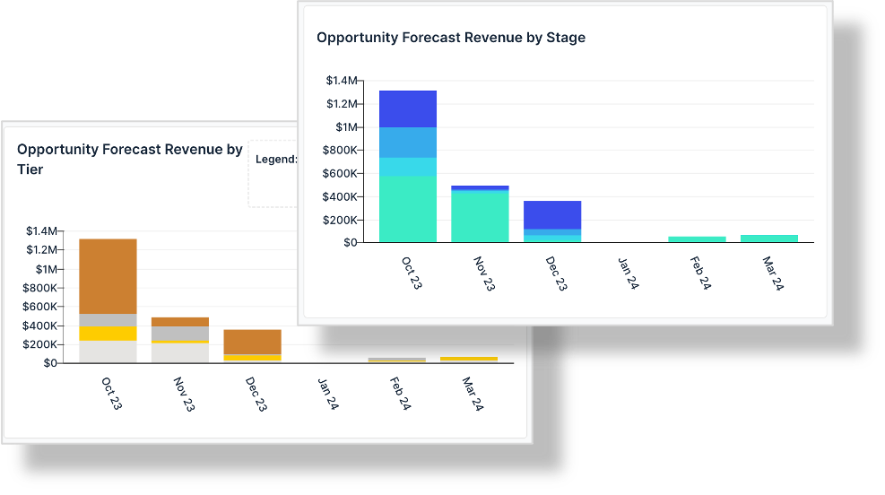
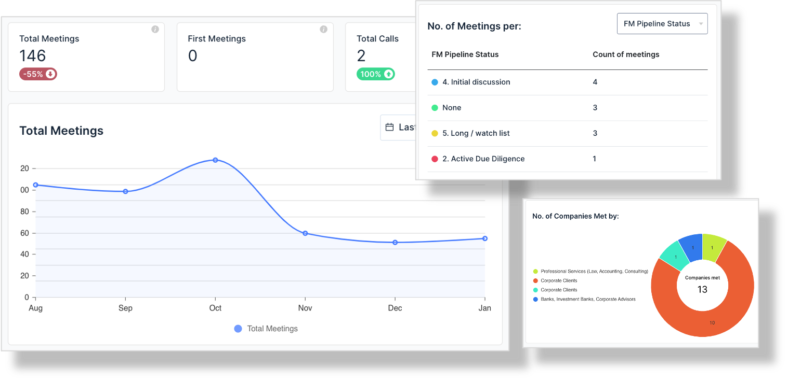
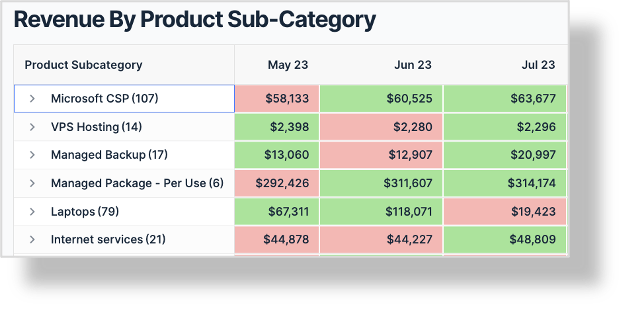
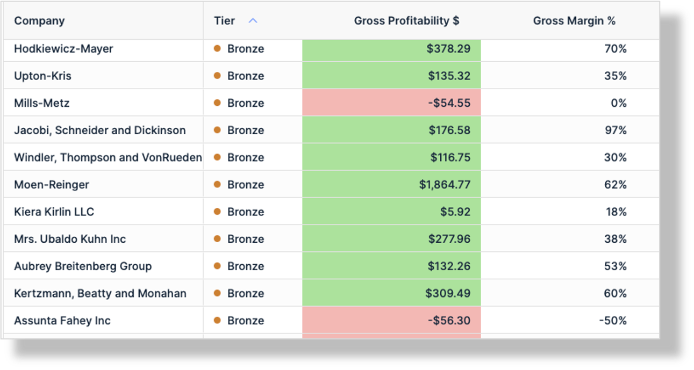
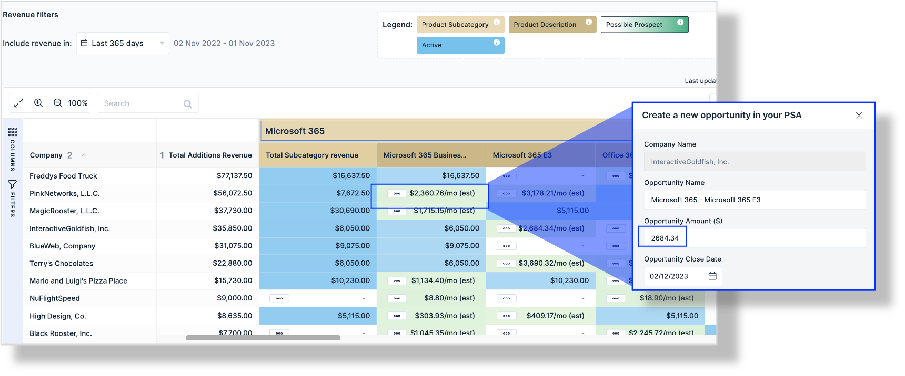
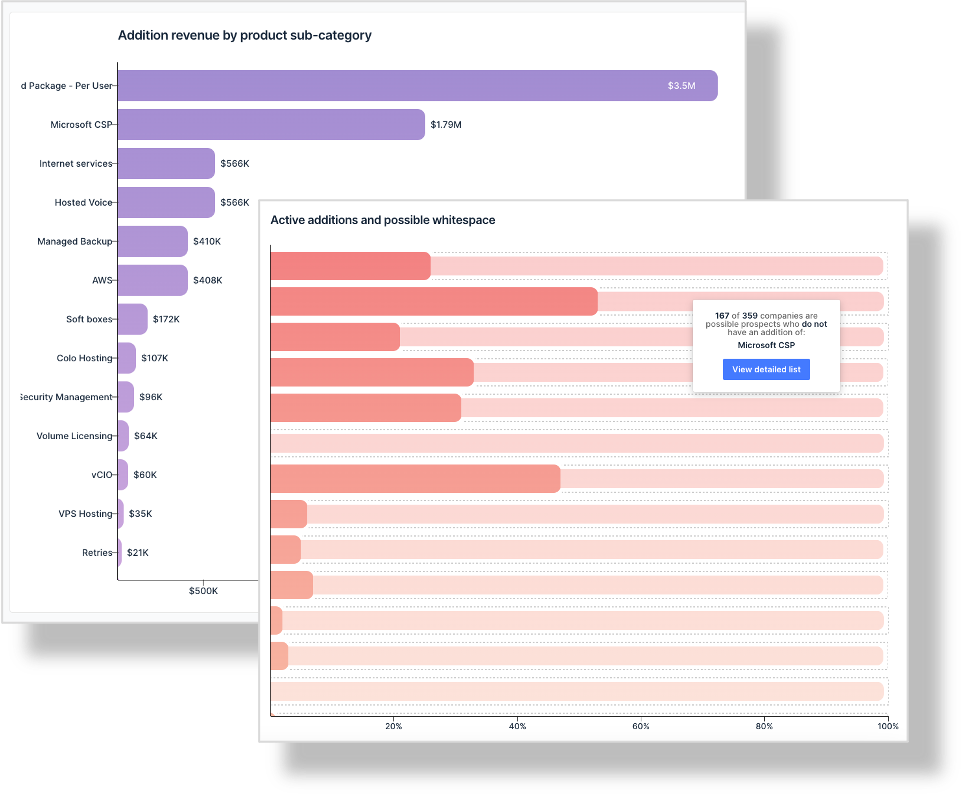

Key points:

- Looking for alternatives to BrightGauge?
- Looking for alternatives to Power BI?
- Need a solution that has no configuration
- BeeCastle provides a cost-effective solution for data analytics dashboards for sales, whitespace, team KPIs and works instantly out-of-the-Box.

---

## Introduction

This article provides a brief overview of out-of-the-box examples of alternatives to Power BI sales dashboards and BrightGauge dashboards from BeeCastle. BeeCastle is a data analytics platform that provides dashboards for managed service providers (**MPSs**) that requires no configuration.

Alternatives to Power BI can be difficult to find. Further it can be challenging to find an alternative that works seamlessly out of the box. Even further, it is almost impossible to find an alternative that works out of the box and is bespoke for MSPs. However this is where BeeCastle ticks all the boxes as a genuine alternative to Power BI and BrightGauge for MSP’s that works out of the box.

BeeCastle specialises in providing flexible data solutions to MSP’s. It hooks into your PSA, Connectwise Manage, Autotask, Halo PSA as well as your Microsoft 365 system and your teams calling and automatically ingests all your data. Once the data is matched and merged, BeeCastle automatically prepares a series of flexible dashboards that are ready to go and be used by you immediately out of the box.

The BeeCastle data is grouped into several buckets to be easily digested by yourself.

---

## Relationship analytics
The first bucket is relationship analytics or sometimes called enhanced account management. Here are some of the examples of data analytics that BeeCastle provides out of the box.

---

## Revenue analytics
The second bucket that BeeCastle provides in terms of automated data ingestion is revenue analytics. Under revenue analytics, BeeCastle provides a series of graphs and charts that you can manipulate to understand your revenue growth overtime, and what is driving that revenue including new accounts, existing MRR, or churn causing a reduction in your revenue.

You can also view which of your accounts are growing or reducing overtime.

****

And further you can view which products are growing in terms of sales volume over time and which are reducing.

****

BeeCastle also undertakes profitability analysis. BeeCastle helps MSP’s visualise how profitable each account is and which accounts are more profitable than other accounts on a relative basis.

****

This powerful information, which is always available in real time, allows MSP to make strategic moves in terms of resource allocation.

---

## Whitespace analysis
Another important group of data analytics that BeeCastle provides is Whitespace analysis. White space analysis is almost impossible to produce using Power BI or BrightGauge but can be produced at a point in time basis in excel.

However the problem with using Microsoft excel is that the information is out of date almost immediately and there are no smart data algorithms working on the data to identified trends or meaningful opportunities. Here are some examples of the BeeCastle whitespace analysis, that again, works out of the box.

---

## Stack analysis
The final banner which will discuss today is considering what your preferred stack is, and applying that stack to your customer base to search for relevant opportunities. For the uninitiated, a “stack” is your preferred combination or cocktail of software that you provide to your various clients on a regular basis.

****

BeeCastle runs this analysis for you because it remembers your preferred stack and then learns which parts of your stack are most likely to be saleable through upsell and cross sell opportunities to your customers using its advanced AI data analytics.

---

## Selling or merging your MSP?
If you use BeeCastle as an alternative to Power BI, BeeCastle can be quite helpful if you ever wish to sell your MSP, or raise finance even merge your MSP.

BeeCastle is a database that is live with your data and consistently updating itself – even when you are not there! This aspect of a living database is a very powerful tool and this BeeCastle can to be used to demonstrate the value of your MSP.

BeeCastle can highlight the value you have in your clients, your contracts, your profitability, your low churn as well as the growth potential that exists in your business.

---

## Final thoughts

In conclusion, BeeCastle as an alternative to Power BI or BrightGauge has several advantages for MSPs using ConnectWise Manage, Datto Autotask or HaloPSA.

To find out more please go to [beecastle.com](/) and open a free account to undertake a trial of powerful, yet out of the box, software.

**Team BeeCastle**
