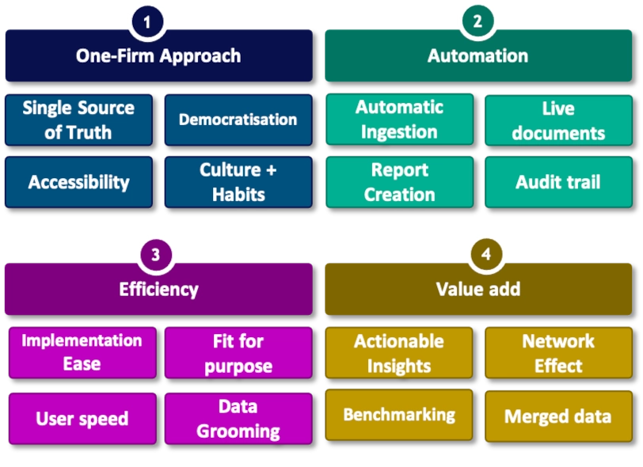
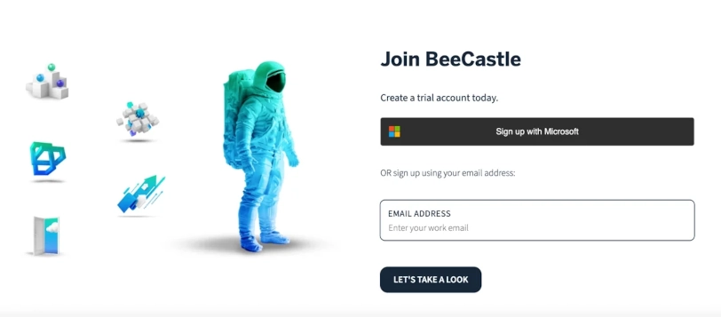
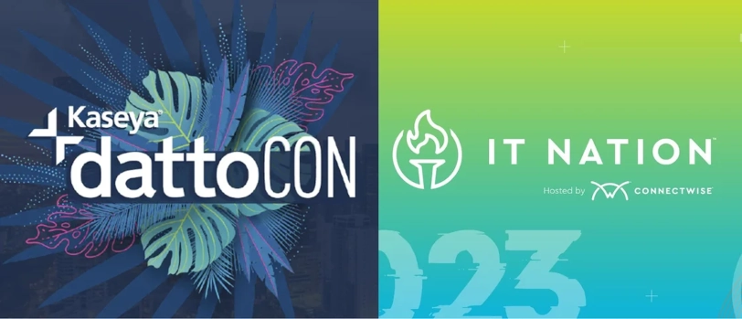

A strong foundation in stone or data architecture will always last the test of time and provide your firm with a competitive advantage. These guys got it right!

## BeeCastle Data Matrix

Introducing the BeeCastle data matrix based on our 4 foundation pillars defining how we think about data in our platform and setting your data strategy  up to last the test of time.

In summary:

- Our **One-Firm Approach** where we note it is critical that there is a single source of truth for the organisation with relevant data available to all appropriate users in real time on permissions basis.
- **Data Automation:** By continuing to eliminate almost all forms of data entry with automation we increase: accuracy, the volume of data entry and data objectivity (important for KPI discussions). Automation saves significant amounts of time and results in material cost savings
- **Efficiency** or lack thereof is a key barrier to data transformation.  The cost of implementation, data connection, configuration and customisation is often prohibitive.  BeeCastle builds simple and intuitive API connections that both increase the speed of set up and reduce costs in doing so.
- The cumulation of our matrix is the ability to use data insights to **add value** that is tangible, measurable and reportable.  The starting point is to create insights that are both immediately actionable and value adding

We will talk more about our methodology in future emails or request a copy of our free e-book “*The Art and Science of Enhanced Account Management*" [here](mailto:david@beecastle.com).

## BeeCastle consulting - Get the A-team helping you

Did you know that our product team and engineers are available for bespoke work for your organisation?  Reach out to us if you need some help with your data automation, APIs or would like to add a customised module to BeeCastle.

- Our team work fast
- We offer competitive rates
- Only senior engineers and product designers provided

Interested?  Reach out to us [here](mailto:hamish@beecastle.com) to chat.

Thank you for reading and we hope you join us to be part of the data revolution for MSPs!

---------------------

### BeeCastle Credentials

BeeCastle is a Platinum sponsor of ConnectWise’s Evolve program in APAC, a Silver Sponsor of IT Nation and a Silver Sponsor of DattoCon APAC.

Find this interesting? Please forward to other MSPs who might appreciate this.

### What is BeeCastle?

BeeCastle is a secure cloud-based data analytics software platform designed specifically for Managed Service Providers that operates in 7 countries and supports integrations with M365, ConnectWise, AutoTask, Xero and HaloPSA.  BeeCastle specialises in helping MSPs drive efficiency and revenue through its 6 key data analytics.
