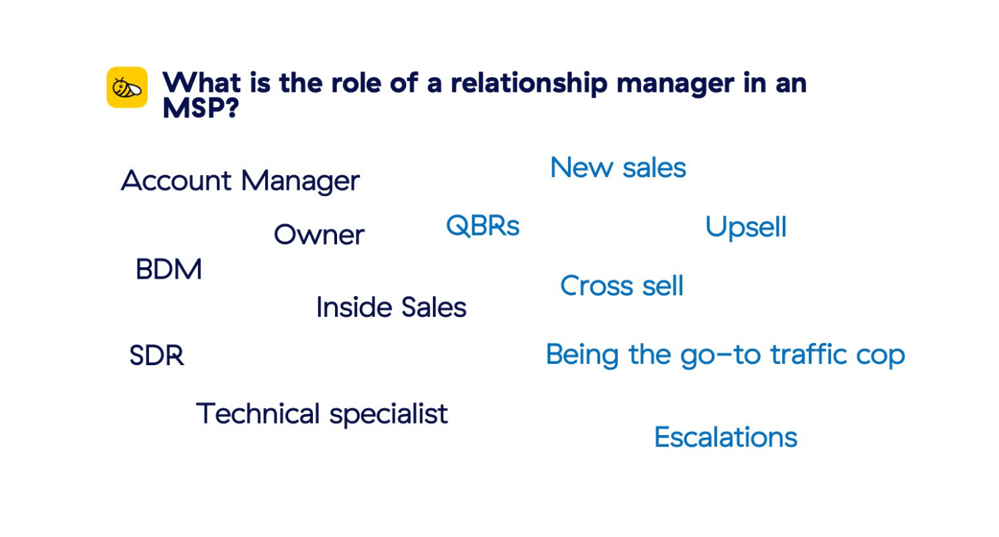
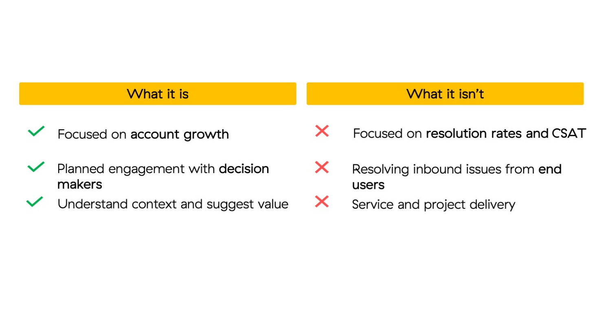
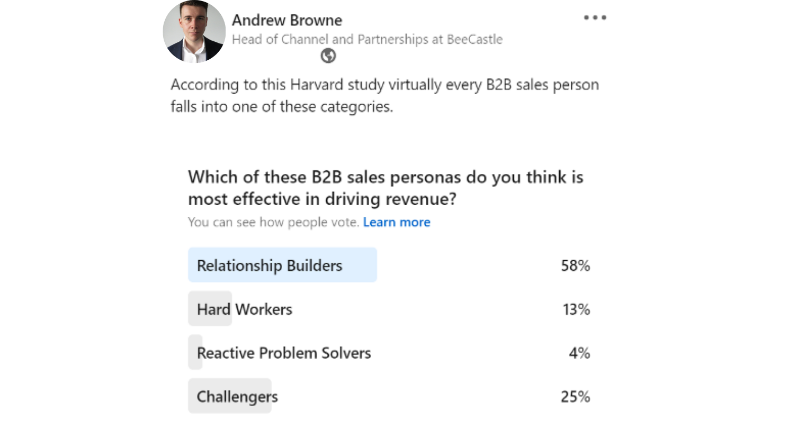
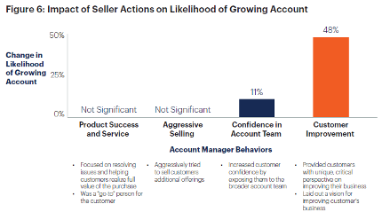
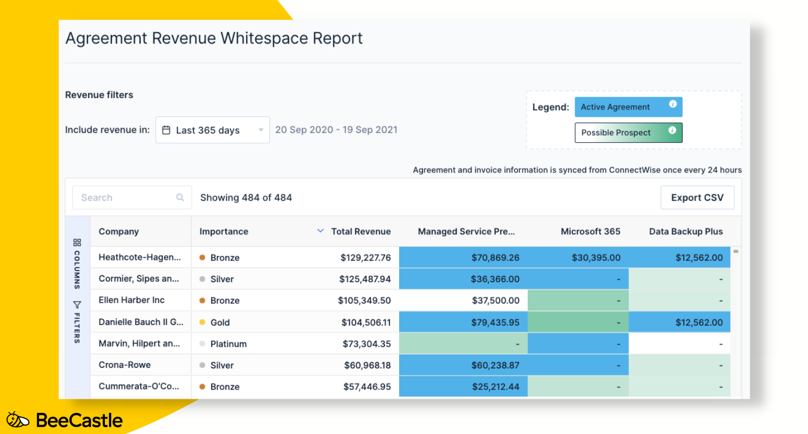

The ultimate goal for any MSP is to grow revenue. Often the focus is directed towards new logos through acquisition of clients. However, the cost of acquisition is evermore increasing as MSPs become more competitive in market and are differentiating with new services. Through working with MSPs across the globe we’ve found that a lot of money is being left on the table with existing accounts. We took that knowledge and distilled it into our [new e-book ***It Pays to be Proactive.***](/e-book/) By establishing a structured and proactive cross-sell / up-sell methodology you can reap the rewards by reducing churn to ultimately impact your bottom line.

In 2019 [Gartner put together a study](https://www.gartner.com/en/sales/insights/trending-topics/account-management-and-growth) on the impact that account managers had on retention and growth. Of 750 account managers in B2B relationships they found that high levels of customer service do, in fact increase the likelihood of customer retention but had no statistical or meaningful impact on growth.

### 

Image source: [Gartner for Sales Leaders: Why Accounts Aren’t Growing, and What to Do About It](https://www.gartner.com/en/sales/insights/trending-topics/account-management-and-growth)

## This story rings true across MSPs too and it is no fault of account managers

The expectation of account managers is inconsistent and hard to measure across multiple planes of activity. Even the role of ‘account manager’ is often paired with *BDM, Inside Sales, SDR,* and *Technology Specialist* and their roles and responsibilities can range from ticket escalation, driving adoption, new sales, QBRs and retention. The responsibilities are vast and unstructured which is often met with being reactive to inbound queries rather than being proactive in driving growth.

## Differentiating Service Delivery from Account Management

Delivering great service and driving growth are two very different things. Where service delivery offers great onboarding, service roll out and resolving inbound queries, account management should be focused on business growth, challenging with new solutions and building a roadmap with customers. Part time focus delivers part time results - differentiating the two and creating structure to encourage this behaviour is the key to a successful, profitable business.

## The community believes that relationship builders are most impactful to account growth, but is it really?

Well, according to the [Harvard Business Review](https://hbr.org/2011/09/selling-is-not-about-relatio), it is *challengers* that have the biggest impact.

***Challengers*** *- use their deep understanding of their customers’ business to push their thinking and take control of the sales conversation. They’re not afraid to share even potentially controversial views and are assertive, with both their customers and bosses.*

Why is this? Well, they put it down to 4 points:

1. Challengers teach their customers

2. Challengers tailor their sales message to the customer

3. Challengers take control of the sale

4. Challengers dominate the world of complex “solution selling”

If you’re interested more in this topic, I would highly suggest reading the study here: [Selling Is Not About Relationships (hbr.org)](https://hbr.org/2011/09/selling-is-not-about-relatio)

## The secret to greater retention and customer growth: Proactive Account Management

Growth is ultimately asking your customer to do something differently in the future that they have done in the past. The biggest impact that an account manager can do to drive growth within customers is being **proactive** with their customers and challenging them to change with new solutions. This requires a focus on the customer and creating a vision for the future of their business - not a particular vendor’s capabilities or justifying the value of an existing solution.

According to the Gartner study, being intentional in your efforts to drive this behaviour not only results in **growth** for your accounts but also impacts **retention** of accounts too. Acting as a trusted advisor for the future of their business creates a partnership that goes above and beyond any competitors’ lower rates and puts you in a privileged position to suggest change before they do.

### Image source: [Gartner for Sales Leaders: Why Accounts Aren’t Growing, and What to Do About It](https://www.gartner.com/en/sales/insights/trending-topics/account-management-and-growth)

## BeeCastle – Your secret weapon to Proactive Account Management

At BeeCastle we live and breathe structure and proactivity in sales and account management. We have been working with MSPs around the world to tackle this issue to make it simple and automated.

Our analytics platform provides insights into customer engagement, whitespace analysis and financial levers for growth allowing you to have a data-informed decision when engaging with accounts allowing you to spend time where it matters and focus your efforts.

If you are interested in finding out more get in touch today **[sales@beecastle.com](mailto:sales@beecastle.com)** or download our free ebook on how to implement a proactive account management program: [**Download *It Pays to be Proactive***](/e-book/)

