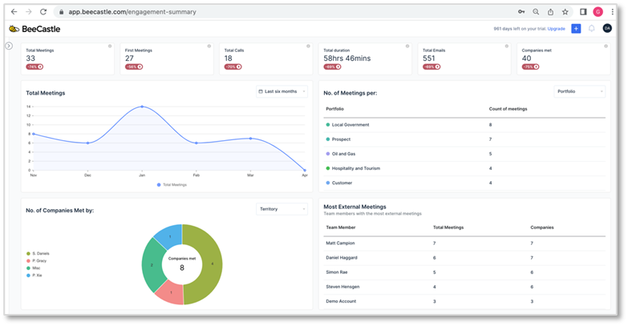
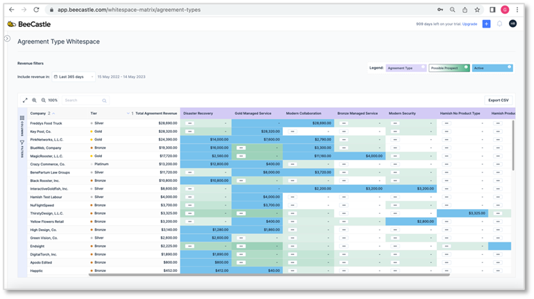

In today’s competitive business landscape, Managed Service Providers (“**MSPs**”), Cloud Service Providers (“**CSPs**”) or Technology Service Providers (“**TSPs**”) need to be data-driven in order to succeed. By collecting and analyzing data, MSPs can gain insights into their customers, their operations, and the market. This information can then be used to make better decisions about everything from pricing to marketing to upsell/cross-sell opportunities.

But what is success? We define success for MSPs as having a robust business model that encompasses a solid and diverse client base with low churn and steady (manageable) growth.

**Why do you need a data-driven approach?**

There are many benefits to adopting a data-driven approach. For example, data can help MSPs:

- Identify and address customer pain points
- Improve efficiency and productivity
- Reduce costs
- Increase sales and revenue
- Gain a competitive edge

MSPs can collect data from a variety of sources, including customer surveys, website analytics, social media, and their own internal systems. Once the data is collected, it needs to be analyzed in order to identify trends and patterns. This analysis can then be used to make informed decisions about how to improve the business.

Adopting a data-driven approach is not always easy. It requires a commitment to collecting and analyzing data, as well as the willingness to change course based on the findings.

**How to transition from traditional to data-driven practices**

One such tool to help MSP owners, operators & sales teams with this is BeeCastle -specializing in automated data ingestion. Once integrated to your PSA and M365 system, the data flows in real time to be analysed. There is no configuration required with BeeCastle as all dashboards are out-of-the-box and bespoke for MSPs. The plug and play design saves hours of time and products are constantly improved by feedback from MSPs.

The benefits of data-driven decision-making are significant. By using data to guide their decisions, MSPs can create sustainable growth and success.

Here are the **four key steps** to developing a data-driven strategy for your MSP:

1. **Define your goals.** What do you want to achieve with your data-driven strategy? Do you want to improve customer satisfaction, increase sales, or reduce costs? Once you know your goals and your prioriteis, you can start to identify the data you need to collect.
2. **Analyze the data.** Once you have collected the data, you need to analyze it to identify trends and patterns. This can be done using BeeCastle – either the free tools or the paid version. The goal of data analysis is to gain insights that can be used to make better decisions.

BeeCastle is a deep product with a huge amount of data available. Focus on the goals that you have written down or discussed with your coach and look at what graphs or dashboards in BeeCastle can help you track this progress and adjust your strategy to succeed,

1. **Make decisions based on data.** The final step is to make decisions based on the data you have analyzed. This may require you to change the way you do things. However, the benefits of data-driven decision-making are significant. By using data to guide your decisions, you can create sustainable growth and success.

BeeCastle has thousands of users, and we have noticed some key trends emerging amongst our users:

1. Where the goals is to enhance customer relationships, many MSPs use BeeCastle’s Relationship Keeper module to monitor customer engagement and to use data to view the health of the relationship. Healthier client relationships lead to better cross-sell opportunities, better problem solving and most importantly client retention.

1. Where the goal is to increase revenue: MSPs are using the AI driven WhiteSpace module in BeeCastle to look for opportunities with existing clients to sell into. Where the colour of the square is a darker green, it means the AI algorithms have detected a stronger chance of that client wanting that product – hence your sales call has a much higher chance of success.

1. **Continuously improve.** Data is constantly changing. As a result, you need to continuously improve your data-driven strategy. This means regularly collecting new data, analyzing it, and making changes to your decisions as needed. By continuously improving your data-driven strategy, you can ensure that your MSP is always on the cutting edge.

A number of our customers set a weekly planning meeting that incorporates data from BeeCastle so that the team can see objective data that has been automatically generated.

By following these steps, you can develop a data-driven strategy that will help your MSP achieve its goals and create sustainable growth.

**About BeeCastle**

BeeCastle is a cloud-based software platform that helps MSPs to manage their customer relationships, track revenue, and close more deals. The platform provides a number of features that can help MSPs to improve their efficiency and effectiveness, including:

- **Whitespace & prospecting**: BeeCastle helps MSPs to identify opportunities for new services and products, and to target their marketing efforts more effectively.
- **Revenue tracking dashboards**: BeeCastle provides MSPs with real-time insights into their revenue performance, so that they can identify trends and take corrective action as needed.
- **Customer tiering**: BeeCastle helps MSPs to segment their customers based on their revenue contribution, so that they can tailor their service offerings and marketing messages more effectively.
- **Automated CRM logging**: BeeCastle automatically logs activities from Microsoft 365 and Teams, so that they can keep track of their interactions with customers and prospects.

BeeCastle is a powerful tool that can help MSPs to improve their relationships with their customers, increase their revenue, and close more deals. The platform is easy to use and can be integrated with existing systems, making it a valuable addition to any MSP’s toolkit. BeeCastle is:

- Easy to use
- No configurate required
- Can be integrated with existing PSA systems like ConnectWise, AutoTask and HaloPSA
- Free starter plan is available
- Competitive pricing for paid versions

Wishing you safe and happy data analytics,

**The BeeCastle Team**
