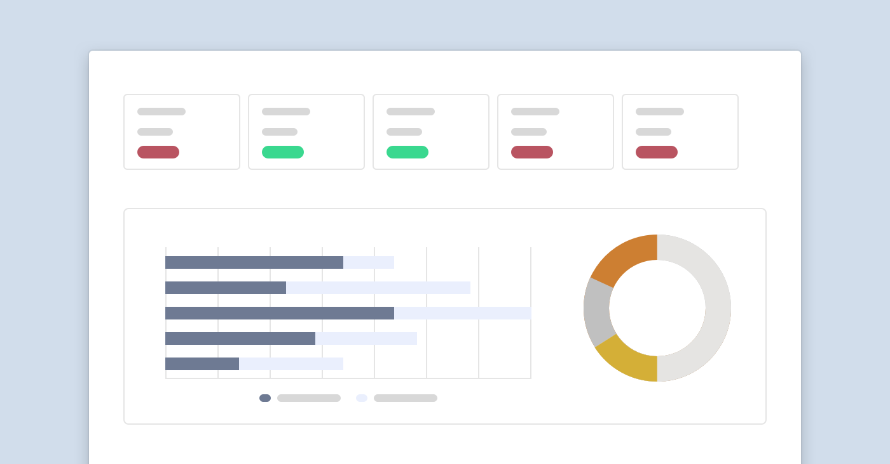

**ConnectWise data analytics in a nutshell**

The data within ConnectWise can be incredibly valuable, it contains every bit of information about your customers and business that when utilized correctly can help you achieve more.

However, getting data out of ConnectWise can be difficult to say the least and becoming a data scientist in your spare time while trying to run a business is not exactly ideal. So you turn to one of the many reporting tools on the ConnectWise Marketplace, including [BrightGauge](https://www.brightgauge.com/), [MSPCFO](https://www.mspcfo.com/)and of course, **BeeCastle**.

But with many tools offering ConnectWise reporting and business intelligence, how do you know which one to choose and how do they compare to one another?

In this article we’ll help you understand why there is no one solution that fits all and how you can approach picking the right one for you.

**First up – What are you trying to achieve?**

Data analytics can benefit your business by helping it reduce risks, improve its bottom line and make informed decisions.

However, it doesn’t matter what data or insights you have if it doesn’t help you reach your goal. As they say, *“Strategy without numbers is poetry. Numbers without strategy is accounting. Strategy without execution is irrelevant.”*

Starting with your strategy can help define what insights you require and what tool best fits the job.

Ask yourself, what do you want to achieve in your business?

- Increase customer base?

- Increase customer satisfaction?

- Increase margin?

- Expand your business?

Once you have your strategy locked in, you can ask yourself the next question…

**What data do you need to support that?**

There are two ways that analytics can support your strategy

*Operationally*

These are typically your dashboards that you use to check how things are going.

What information are you looking at on a regular basis that supports your strategy. What KPIs should your team be hitting or metrics do you have up on the big screen?

*Ad-hoc*

Ad-hoc reports is the process of actively discovering an insight to help you make a decision.

For example, if you are looking to expand a product set you may want to generate a report that shows you the opportunity within your customers before you allocate a budget and focus towards it.

Another example is digging deep into your accounts and understanding why there has been a dip in revenue in the last quarter.

**Make it actionable - Strategy without execution is irrelevant**

Once you have agreed on a strategy and you understand what data you need to support it you can start to think about which solution will help. But before you start spinning up trials you need to consider one last thing.

How are you going to be accountable for the insights?

Strategy without execution is irrelevant and so you must ensure you are meeting on a regular cadence to review and assess the data. Depending on the type of data you may choose to review it daily or quarterly in a executive meeting or a wider team meeting…

Typically, dashboards and KPIs (operational data) is reviewed weekly. These are typically short term metrics that can be easily influenced day by day.

Larger projects and decisions may need to be reviewed at the end of quarter, for example a sales or marketing result.

Finally, consider the accessibility of these insights and how you want to view them. There are certainly some executive insights you may want to keep private however perhaps you want to enable your team with insights specific to them?

Rather than generating all reports on-demand, consider a platform where anyone can access them in real-time to get that insights they need to make a decision.

**How do I pick the right tool for me?**

To summarise, there are three main things you should consider when selecting a reporting tool.

1. Define your strategy. – Your strategy will infer what data you require

2. What insights do you need? – Do you need them on-demand or a quarterly snapshot?

3. How am I going to use it within my business? – Who is reviewing this data and how often?

When comparing solutions using these methods we see that the different solutions are used by different people in the business for different strategies/purposes. Typically:

- [BrightGauge](https://www.brightgauge.com/)is your flexible reporting tool used often in Service Delivery
- [MSPCFO](https://www.mspcfo.com/)is all in the name - it does a great job providing finance teams the data they need for accounting and financial reviews.

**At BeeCastle, our focus is about facilitating sales processes and helping you grow MRR by revealing what *hasn’t* happened**

BeeCastle, unlike many other reporting tools, is built explicity for the sales and account management teams. We have discovered over time what insights drive action when you grow your sales/account management team.

Our main differentiator is not only understanding what HAS happened but understand what HASN’T. Through this insight you can drive action. Examples include:

- Using WhiteSpace reports to understand gaps/opportunities in each of your customers stack s
- Using proactive & activity KPI’s to see which customers are being under-serviced so one of your reps can reach out
- Measure and manage solution campaigns to ensure you are finding, talking to and potentially cross selling to right-fit customers.

**Best of all, we have a free product to get started**

To discover your insights today, signup to our free ProfitTrack product at [beecastle.com/sign-up](/sign-up/). 10 minutes to setup, a day to sync the data and you will be able to visualise your product opportunity.
