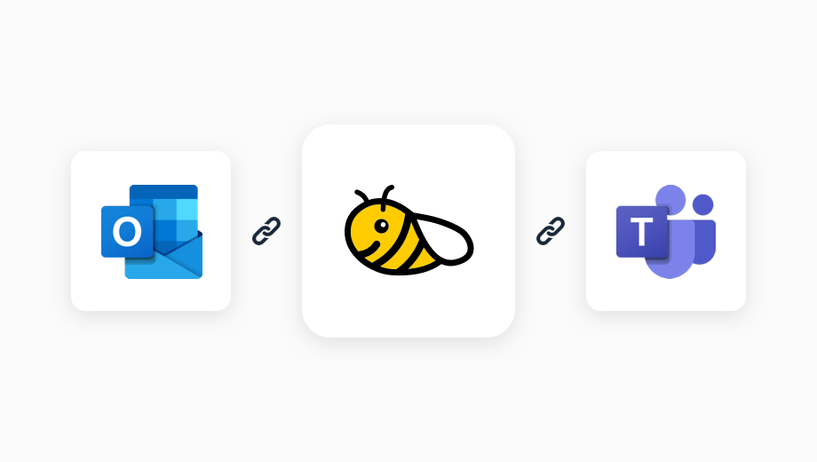
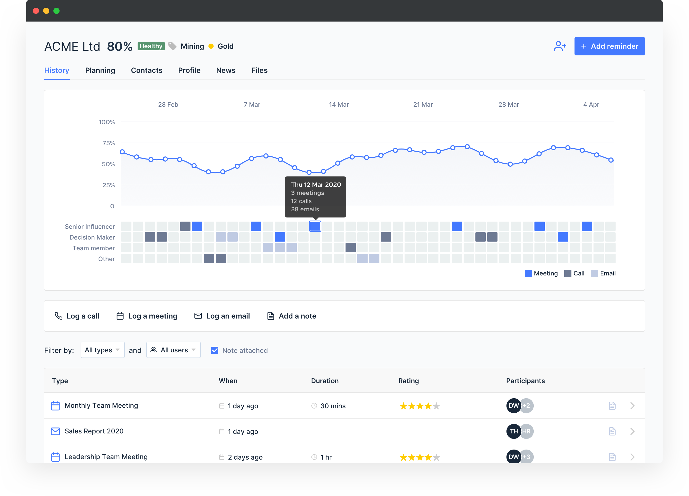

More and more we’re seeing technology becoming a commodity for MSPs in an ever-growing channel. Margins are growing thinner by the day and rebates are becoming less valuable for businesses. Many MSPs are now having to adapt from simply being “IT Resellers” who resell a technology and put a small margin on it, to becoming a “Technology Partner” and an extension of their customers’ businesses through deeper relationships.

MSPs are now developing new offerings based on business outcomes and creating their own IP to differentiate.

These new solutions include:

- Platforms for cross Team Collaboration
- Intranet consulting
- Business application development
- Security awareness training
- Data Analytics dashboards
- Technology roadmap consulting

## Finding new business in your customer base with your new offerings

According to a recent study by Datto, 63% of MSPs consider “recommendations and word of mouth” as their top source of new clients and opportunities.

This may be obvious to some however, very few are using an effective engagement strategy to find new business, retain slipping customers and win more deals out of existing customers. We find ourselves paying attention to the loudest customer or relying too much on that “gut feeling” for when to reach out to someone.

Creating structure around your engagements is key to promoting a new product or service. Check out our guide on [4 steps to improve your client engagement as an MSP](/blog/4-steps-to-improve-your-client-engagement-as-an-msp/)

## The power of Microsoft 365 and BeeCastle

Every single interaction you and your team have had with your customers is logged within Microsoft 365. Every Email, Meeting, Phone call and Microsoft Teams call can be accessed with Graph API and leveraged to provide you analytical data.

BeeCastle presents this data in a way that makes sense. It’s easy to track the overall relationships your business has with your customers.

To take it a step further, BeeCastle scores your relationships by looking at things like the type and *value* of interaction you had, the importance of the person it was with and how often you’re talking to them. In fact, we have over 20 different factors that play into a relationship score.

## How MSPs leverage this information

MSPs are using this information to stay on top of their key customers. Engaging them in a decisive manner with the clear intention of providing a better service. They are no longer relying on mass marketing to engage with their customer base as they understand their reputation and relationships are their strongest selling points.

Here are a few examples:

- Segmenting their customers into different groups to prioritise their time
- Using interaction history to create an engagement strategy for slipping accounts
- Promoting cross team transparency for cross selling
- Automating the process of maintaining consistent contact with top clients
- Keeping a tight feedback loop for existing customers
- Proactively offering new solutions to customers

## Want to know more?

[Sign up to BeeCastle.](/sign-up/)

To find out more get in touch with us at [sales@beecastle.com](mailto:sales@beecastle.com).
