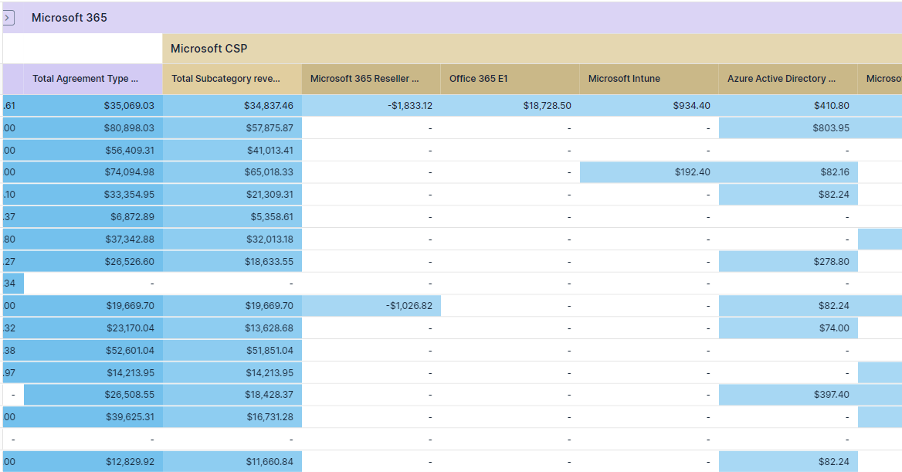
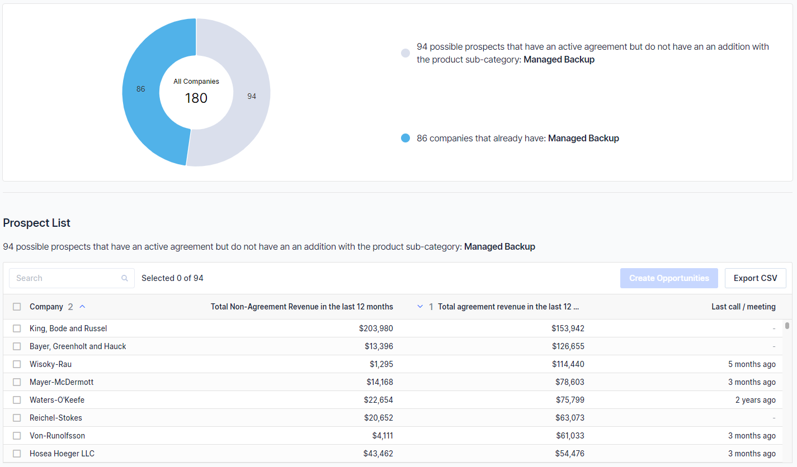
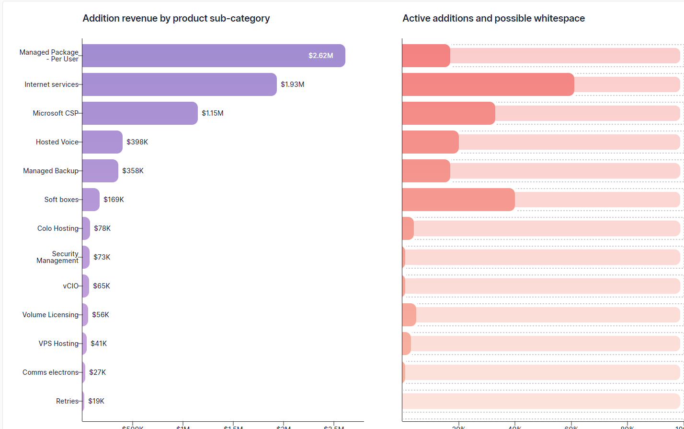
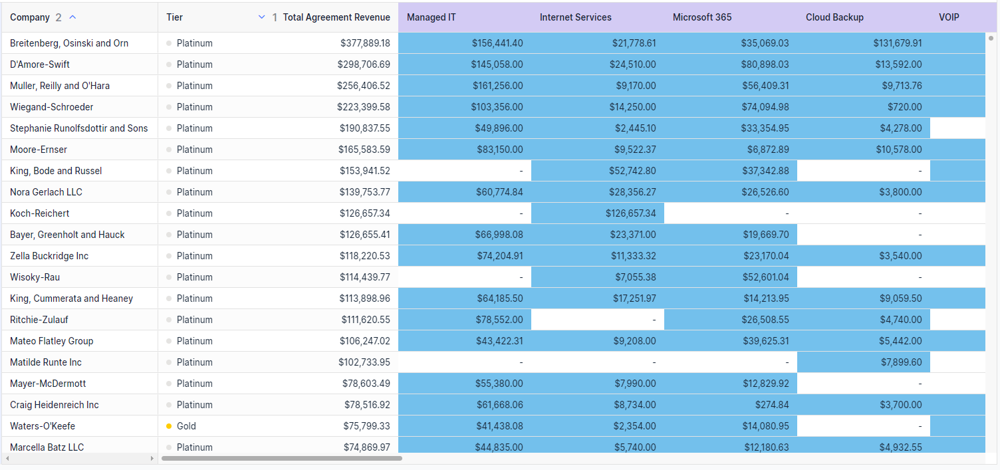

To be strategic in how you approach your customer base you must let your data guide you rather than using your intuition. You’d be surprised at the gaps in your customers whitespace when it’s laid out in front of you however it’s important to get your data right.

There’s a common concern that if you’ve got bad data going into BeeCastle then you’ll get bad data out. Often, this concern is misguided however we’ll breakdown some of the key ways you can set up your product catalogue to get the most value out of your data.

Often when MSPs reach a certain level of maturity they will discover that they don’t have enough information to be able to answer questions like:

· For each of my managed agreements, do I understand the true cost/margin of my services? Am I making money on the labour or the product or the hardware?

· Of my X core offerings, how many have each of my customers purchased? How much am I making on each of those services?

· I want to grow my existing accounts. Can my account managers quickly understand where the upsell or cross sell opportunities are in my accounts?

· As a leader can I understand how we are going with upselling/cross selling?

If this is you - you are asking the right questions! Often, people think of their data purely in terms of financial reporting for leadership.

It is our strong belief, that understanding your agreement, sales & financial data can make you more effective in sales & account management. By answering the above questions it means you can:

1. **Understand why you are growing** **your revenue and margin**

2. **Use the data to proactively grow accounts through upsell & cross sell**

**Okay great. But how do i get the data to answer those questions?**

The good news is that if you invoice through ConnectWise, much of the raw data around what you have sold, what it cost and what you made exists. However, there isn’t enough structure to make it meaningful.

That is why we suggest the magic comes from thinking a bit more thoughtfully about 3 relatively simple ‘Setup Tables’ in ConnectWise:

· Agreement Type

· Product Category

· Product Sub Category

Each of these setup tables, when structured thoughtfully and applied properly, allow you to classify your data and report on those classifications.

· Instead of a sea of 250 different agreements, I can interrogate the 8 different ‘types’ of agreements we have

· Instead of 12,000 individual products and1,200 products in my product catalog, I can analyse the 6 **‘Categories’** of products and their financial contribution to my business

· Instead of 12,000 individual products and1,200 products in my product catalog, I can review what customers have what **‘Sub-Categories’** to understand our ‘share of wallet’ and whitespace

**Agreement Types - First step of maturity**

Agreement types are customer facing so you may want to set these up in a way that are aligned to the solutions you’re selling. These are typically done at the high-level and don’t typically explain the products that you’re selling

**Aligns to…**

Your high level service offerings including managed service, labour & solutions

**When designing the criteria…**

Have you separated your agreement types between labour & non-labour services? *This is critical to really understand Gross Profit.*

**What it could look like…**

- Managed IT / MSA

**What is doesn’t look like…**

A single managed service type with all services & products wrapped together

OR

Many different variations of ‘Managed Services Agreements’ that all include a variety of products under them (networking, security etc.)

When looking at analyzing the data, if can be useful to understand if a customer has one agreement or another however it’s often more useful at the sub-category level.

**How your account managers will ‘use’ it…**

Understanding how much revenue/margin you are making in each customer across your core offerings

Understand at a glance which customers have which ‘offerings’ (Customer X has an MSA with Cybersecurity)

**How you as the business leader will ‘use’ it…**

Understand profitability of different agreement types - e.g. benchmarking labour

Understanding how much revenue/margin you are making across your core offerings

**How your finance person will ‘use’ it…**

Being able to measure profitability in a meaningful way

**How it benefits your clients…**

Transparency for what I’m buying

**Agreement Types - Second step of maturity**

**Aligns to…**

What are the groups of ‘services’ you offer to customers? This can include things like managed support, solutions like cybersecurity, networking, or modern workplace.

Remember, you can always have more detailed agreement types and use child-agreements to wrap up all of your customers services into one bill.

**When designing the criteria is…**

Would you be able to understand from a customers agreements and sub agreements how much of your offerings they have signed up for?

**What it could look like…**

- Managed Service Platinum
- Managed Service Gold
- Block Time
- Modern Workplace
- CyberSecurity
- Connectivity

**Product category**

**Aligns to…**

The line items for COGS in your account package

**When designing the criteria…**

What revenue & cost breakdown would my accountant want to see?

Can I calculate labour, project, recurring & one off sales costs?

**What it could look like…**

- Product One Time Resale
- Product - Recurring Sale
- Managed Labour
- Labour
- Project

**What it doesn’t look like…**

Specific solutions that do not allow you to calculate the cost of labour or products in the aggregate (you shouldn’t have to combine these categories to get different types of COGS)

**How your account manager will ‘use’ it…**

Find where labour/project and product revenue is significantly different, as that often implies an opportunity

Understand what services really drive my margin targets

**How you as the business leader will ‘use’ it…**

Truly understand the margin for each of your key activities. For example, labour margin reducing? Might be time to investigate repricing.

**Product sub-category**

**Aligns to…**

The specific ‘solutions’ you sell

**When designing the criteria…**

Can I understand (at a high level) what i sold by just reading the sub-category?

**What it could look like…**

- Telephony - Teams Calling
- Telephony - PBX
- Microsoft 365
- Spam Filtering
- Managed Labour
- Data Backup
- Network hardware

**What it doesn’t look like…**

Generic terms like ‘Software’ or ‘Hardware’ that do not tell you what the ‘solution’

**How your account manager will ‘use’ it…**

Run campaigns where you can identify what customers DO NOT have a specific solution but are ripe for upsell

Understand quickly what % of your solutions does a set of customers have and identify where the ‘whitespace’ is

**How you as the business leader will ‘use’ it…**

Understand how successful your team have been in selling a specific new solution

Understand how much potential growth you could achieve through upsell and cross sell

**Product ID**

**Aligns to…**

The actual products your selling

**When designing the criteria…**

Consistent naming convention

Scope & description

**How your account manager will ‘use’ it…**

Repeatable quoting with existing products

**How you as the business leader will ‘use’ it…**

**How your finance person will ‘use’ it…**

Meaningful to match?

How many actual seats am I reselling?

**How it benefits your clients…**

What are we buying?

What does it look like when we do the above?

For the account manager:

Now my agreements and sub-categories are meaningful, I can understand who has what:

Now my agreements and sub-categories are meaningful, I can run outreach campaigns for new or existing products with customers who are real targets:

For the leader:

Now my agreements and sub-categories are meaningful, I can understand how much potential we have from upsell & cross sell of our existing/new products

Now my agreements and categories are meaningful, I can truly understand what customers are profitable and why that is so

**Do I need to clean up my data before using BeeCastle?**

The answer is no. We’ve built the platform in a way that is compatible with every instance of ConnectWise and with the ability to drill down to the product level of every customer it isn’t strictly necessary. Furthermore, the different features of the platform don’t rely on the product catalogue such as our revenue analytics, profitability and Activity Map.

However, if you structure your product catalogue in way that is aligned to your strategy, not only will you get better analysis on your customers and the penetration of your products but also better financial and growth reporting.

Are you more focused on cross-selling or up-selling?

Where cross-selling is about selling more solutions into your customer base, up-selling is about moving customers from a previous solution to a new one. The difference is small but significant when thinking about how to structure your product in your product catalogue.
