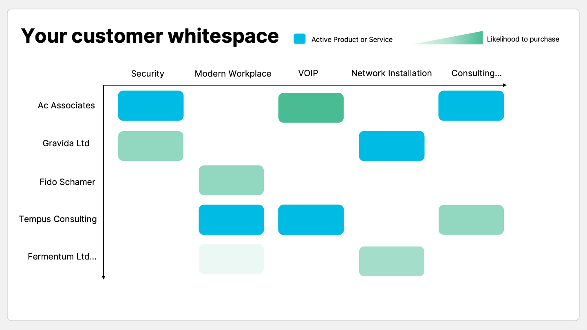
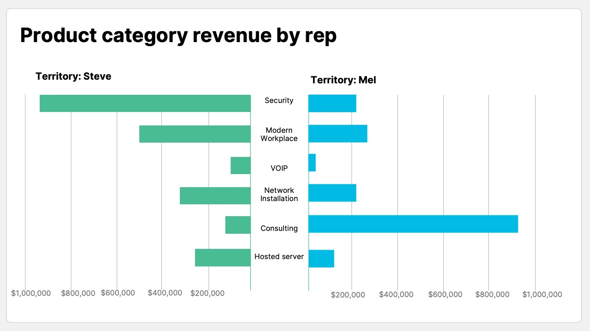

## What is whitespace analysis?

Whitespace analysis is the process of examining sales data to find opportunity for cross sell and upsell in your existing customer base. Whitespace simply refers to any gaps in a customer’s needs that you could fill with your products or services. White space analysis helps you to uncover areas to grow your accounts and focus your time by allowing you to identify where cross sell and upsell is possible.

## Why it’s important for MSPs

The nature of an MSP’s relationship with their clients is not stagnant. It often doesn’t make sense to offer your full range of services but to consult on their requirements and build a roadmap with them over a period of time. It’s key for you and your solutions to stay top of mind because as a client grows their requirements often change too.

Not only do your customers’ requirements change but your capabilities as an MSP broaden as you develop more skill sets and adapt new technologies. Making sure your customers are aware of your new capabilities is important for growing sales, reducing churn and finding new business.

Some of the best MSPs we work with understand that while new business is important, growing and expanding existing accounts is often a cheaper and more effective growth strategy.

Ultimately, it requires lot less effort to upsell and cross sell to an existing client than acquire a new client. In fact, it’s [5-25 times more expensive](https://hbr.org/2014/10/the-value-of-keeping-the-right-customers) to acquire a new customer than retain an existing one. When you do retain the customer, they are much [easier to sell to](https://hbr.org/2014/10/the-value-of-keeping-the-right-customers). In fact, you’re 60-70% likely to make a sale with that customer compared to the 5-20% chance of selling to a new prospect.

## How can you use it?

***1. Deeper understanding at an account level***

Help your account managers have data-driven conversations with clients. Whitespace analysis allows you to visualise at an account level how much of a customers’ share of wallet is with you and then focus the conversation on what the customer is actually likely to purchase next. Having this data not only saves your reps time by concentrating on real opportunities, but having personalised conversations also makes the customer feel more valued.

***2. Effective targeting for sales campaigns***

If your strategy focusses on selling a particular offering, whitespace analysis allows you to view which customers do not currently purchase that offering, but also which customers are most likely to purchase that offering. The ability to map areas for growth makes it easier to quickly and more effectively scale revenue.

***3. Measuring team’s effectiveness at upselling and cross selling***

Whitespace analysis is not only a useful tool for analysing your coverage at a customer level, it can also be used to measure your team’s sales behaviour. By comparing product category revenue for each of your sales reps, you can determine at a glance where their time is currently spent and use data to align behaviour to strategy.

In the comparison above, a manger can easily evaluate Steve’s potential to increase coverage for areas like consulting and VOIP services, whereas a majority of Mel’s revenue already comes from selling consulting services. Depending on active campaigns, and the strategy for that quarter, a manager can proactively coach behavioural change before the end of the sales cycle.

## How to do it

MSPs generally maintain a wide range of agreement and product data in ConnectWise. You can try to extract this data, map it to your customer data and analyse it. The problem is that this will only give you ‘one off’ data, or the data from a snapshot in time.

At [BeeCastle](/products/whitespace-prospecting/) we have built a **real-time** whitespace analyse tool. [Click here](https://suite.beecastle.com/signup) to sign up and get started today.

