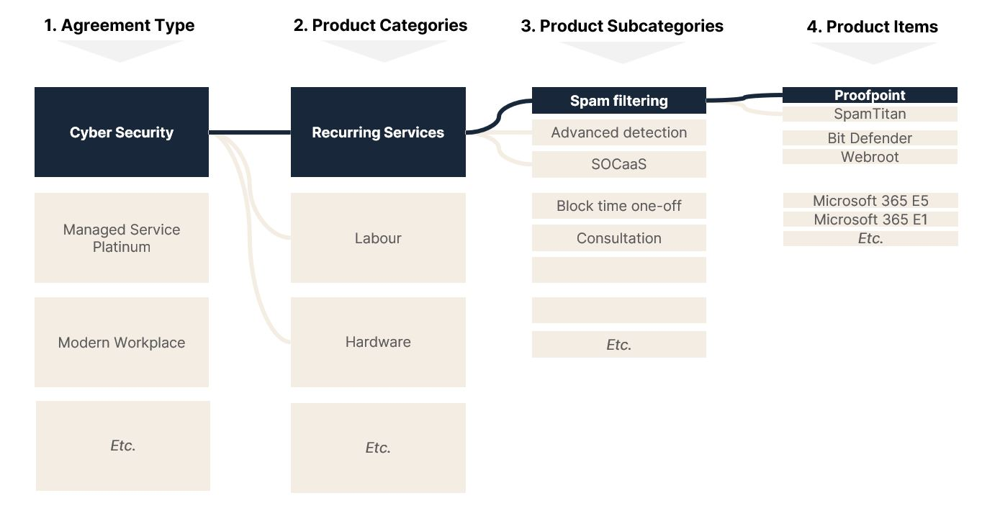
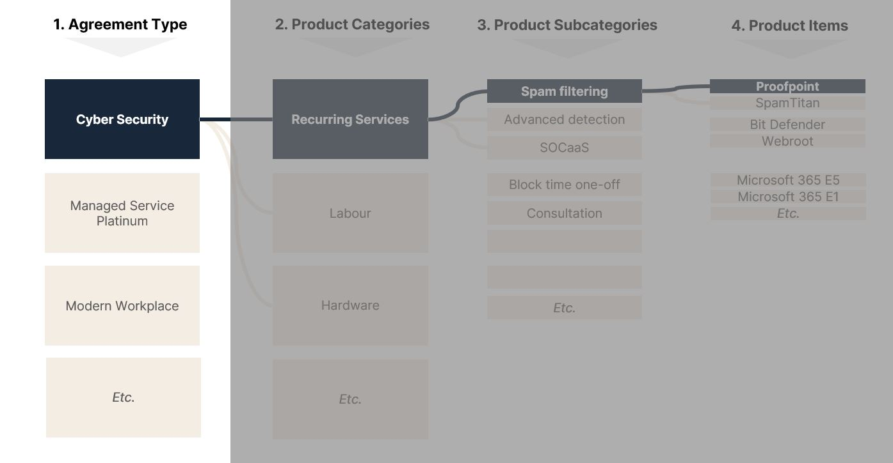
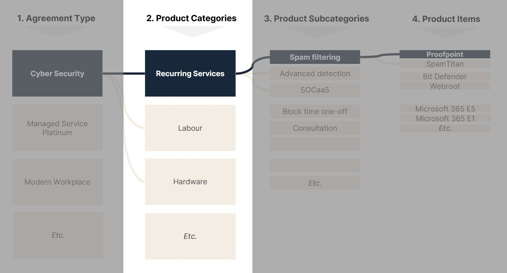
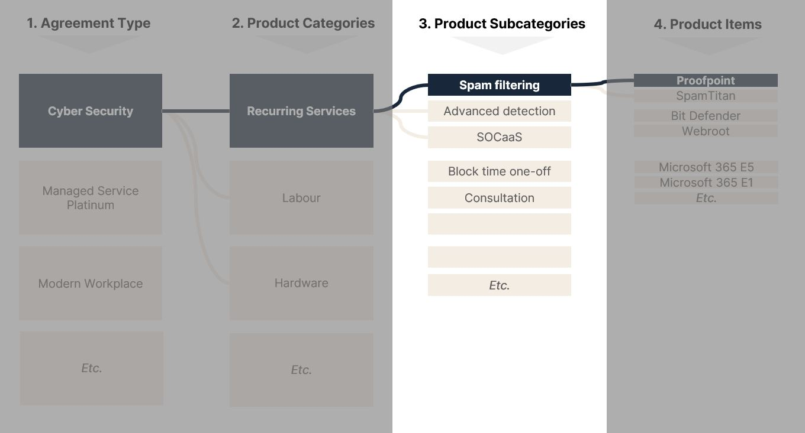
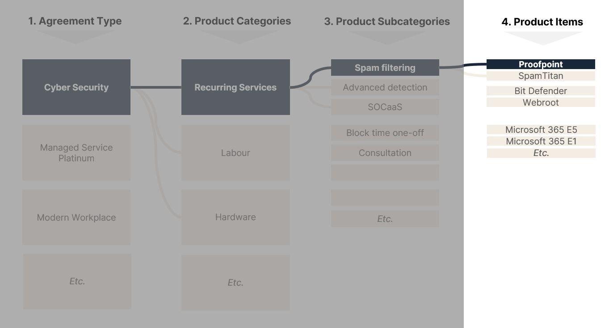
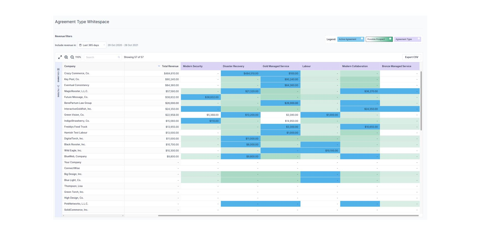
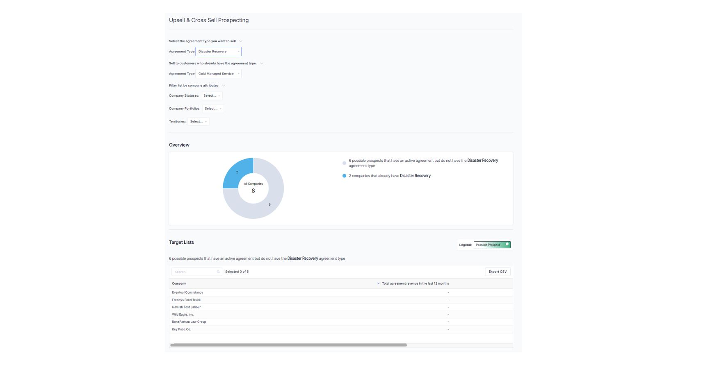

To be strategic in how you approach your customer base you must let your data guide you rather than using your intuition. You’d be surprised at the gaps in your customers whitespace when it’s laid out in front of you however it’s important to get your data right.

There’s a common concern that if you’ve got bad data going into BeeCastle then you’ll get bad data out. Often, this concern is misguided however we’ll breakdown some of the key ways you can set up your product catalogue to get the most value out of your data.

Often when MSPs reach a certain level of maturity they will discover that they don’t have enough information to be able to answer questions like:

- *For each of my managed agreements, do I understand the true cost/margin of my services? Am I making money on the labour, the product, or the hardware?*
- *Of my core offerings, how many have each of my customers purchased? How much am I making on each of those services?*
- *I want to grow my existing accounts. Can my account managers quickly understand where the upsell or cross sell opportunities are in my accounts?*
- *As a leader can I understand how we are going up selling/cross selling?*

If this is you - you are asking the right questions! Often, people think of their data purely in terms of financial reporting for leadership.

It is our strong belief that understanding your agreement, sales & financial data can make you more effective in sales & account management. By answering the above questions, it means you can:

- **Understand why you are growing your revenue and gross profit**
- **Use the data to proactively grow accounts through upsell & cross sell**

## Okay great. But how do i get the data to answer those questions?
The good news is that if you invoice through ConnectWise, much of the raw data around what you have sold, what it cost and what you made exists. However, there isn’t enough structure to make it meaningful.

That is why we suggest the magic comes from thinking a bit more thoughtfully about 4 relatively simple ‘Setup Tables’ in ConnectWise:

- Agreement Type
- Product Category
- Product Subcategory
- Product catalogue

Each of these setup tables, when structured thoughtfully and applied properly, allow you to classify your data and report on those classifications.

- *Instead of a sea of 250 different agreements, I can interrogate the 8 different ‘Agreement types’ of agreements we have*
- *Instead of 12,000 individual products and 1,200 products in my product catalog, I can analyse the 6 ‘Categories’ of products and their financial contribution to my business*
- *Instead of 12,000 individual products and1,200 products in my product catalog, I can review what customers have what ‘Sub-Categories’ to understand our ‘share of wallet’ and whitespace*
- *Finally, when you need to review detailed product information, having a structured ‘Product Catalogue’ naming convention means I can quickly understand what my customer has purchased.*

## How does Sea-Level Ops and BeeCastle propose MSPs approach setup to achieve these benefits?

Now let’s get into the detail by going through how we suggest you approach each setup table and the real benefits for you & your team.

### 1) Agreement types

Each business is at different levels of operational maturity. The team at Sea Level Operations work with organisations to help progress through each of those maturity levels. The setup and use of agreement types is a good example of something that develops as you mature. As such, we will provide two stages of maturity depending on where you are in your journey:

- First, being able to understand agreement profitability
- Second, being able to use agreement types to understand your offerings and customer share of wallet.

#### First Stage of Maturity: Building Agreement Types to Understand Profitability
**This involves…** designing your agreement types to capture labour and non-labour services

**When designing the criteria…** does each agreement type clearly differentiate between labour and non-labour service? Can you truly understand the profitability of your managed service (labour) and the recurring services you provide (e.g. products)?

**What could this look like…** This could look like creating:

‘Managed Service’ agreement type which is the parent Managed Service agreement for your labour revenue and costs.

A block-time or break-fix agreement type for other labour related agreements

Then, create agreement types for your other product revenue like ‘Recurring Services’. This split does not mean you have to bill separately - use parent and child agreements so you can analyse them separately but bill as one.

**What this doesn’t look like…** Typically, a poor implementation is having a single agreement type that houses all labour, products & recurring services in one type. Often, we see companies have many different legacy ‘Master Service Agreements’ with both products & labour combined. This hurts you as you cannot truly understand the profitability of the service you provide - is my margin low because we our labour is out of whack or due to the agreement including many low margin products?

**If I move to this setup, the benefits will include…**

- **For the business leader -** Understand and benchmark each customer and whether you are pricing labour effectively
- **For the account manager -** Understand what accounts we need to improve labour profitability with, potentially repricing or upselling
- **For the finance leader -** Truly measure and report on the profitability.

#### Second Stage of Maturity: Building Agreement Types to Understand Profitability
**This involves…** designing your agreement types to align to your top-level offerings or ‘groups of services’ to customers

**When designing the criteria is…** Would you be able to understand from a customer’s agreements and sub agreements how much of your offerings they have signed up for?

**What could this look like…** This is further splitting your labour and product services into more descriptive & meaningful buckets like

- Managed Service Platinum (labour)
- Managed Service Gold (labour)
- Block Time (labour)
- Modern Workplace (products)
- CyberSecurity (products)
- Connectivity (products)
- Etc.

**What this doesn’t look like…** the trap many organisations fall into is creating these different agreement types but then using each as a ‘catch-all’ with labour, products & services sitting under each agreement type. For example, you start allocating Microsoft 365 licencing under your Managed Service Platinum agreements rather than adding a sub agreement of ‘Modern Workplace’ where those additions are captured.

**If I move to this setup, the benefits will include…**

- **For the customer -** I now know what I am being billed for and what value my MSP is providing
- **For the business leader -** True understanding of how each of my offerings is performing from a sales penetration and contribution perspective. Understand the upside or potential in Cyber Security.
- **For the account manager -** identify immediately where the customers ‘whitespace’ is. What existing accounts can you upsell a new offering like Connectivity to.
- **For the finance leader -** Provide more business insights and more informed forecasting

## 2) Product Categories

**This involves…** adjusting your product catalogue to group products in the way you want their revenue and costs showing up as line items in your Cost of Goods Sold in your General Ledger.

**When designing the criteria is…** What revenue & cost breakdown would my accountant want to see? Can I calculate labour, project, recurring & one-off sales costs?

**What could this looks like…** Typically at this level your product categories align to ‘financial’ concepts like:

- Managed Labour
- One-Off labour
- Projects
- Product - One Time
- Product - Recurring
- Etc.

**What this doesn’t look like…** product categories should not be too detailed. For example, don’t use categories to group specific products or vendors. Doing this prevents you from understanding your product profitability at the top level (e.g. recurring products).

**If I move to this setup, the benefits will include…**

- **For the business leader -** understanding what different functions in my business contribute to my bottom line and where I can improve profitability.
- **For the account manager -** I can quickly immediately look for outliers in terms of high spend in one category but low in another to uncover opportunity. For example, one off product sales but low managed labour might represent a great upsell to managed service opportunity.
- **For the finance leader -** I can benchmark our margin performance in a meaningful way and provide more meaningful recommendations to improve gross profit.

## 3) Product Sub Categories

**This involves…** grouping products and services into meaningful sets of ‘solutions’.

**When designing the criteria is…** by looking at the sub-categories a customer has products or additions in, I can understand what solutions they have purchased from us.

**What could this looks like…** In this case, you could look to split all of your ‘recurring’ products into relevant solutions like:

- Cloud Telephony
- Microsoft 365
- Spam Filtering
- Data Backup
- Managed Hosting
- Etc.

You would then do the same for each of the categories (e.g. one-off sales, labour etc.)

**What this doesn’t look like…** product sub-categories should be more detailed than product categories. Too often they are simply duplicated which misses the potential for further analysis. Similarly, too detailed sub-categories that represent a single product item often result in too many items to meaningfully analyse.

**If I move to this setup, the benefits will include…**

- **For the business leader –** Asses my performance in selling specific solutions to my customers. When I work with vendors, I can understand how I’m performing currently and what accounts we can target as part of campaigns.
- **For the account manager –** Along with understanding what agreements you sell, you can now understand in a single picture what products you have sold and manage for a customer. This allows you to understand the upsell and cross sell potential of each customer.
- **For the finance leader –** I can report on the financial performance of particular product lines so our leaders can accurately forecast what products we can use to grow both revenue & gross profit.

## 4) Product Line Items

**This involves…** the specific product that you are billing for. This is what shows up on your customers invoice.

**When designing the criteria is…** that your users can easily understand what has specifically been sold and it can be reused across different accounts.

**What could this look like…** Lets take the case of the products under the Microsoft 365 sub-category. They would represent the different licences and options like:

- *Subcategory: Microsoft 365*
  - Office 365 E1
  - Office 365 E3
  - Office 365 E5
  - Microsoft 365 Business Standard
  - Microsoft 365 Business Premium

You would follow this sort of grouping for each sub-category.

**What this doesn’t look like…** Often product ID’s or descriptions are too generic to be meaningful for your account managers. ‘Microsoft 365’ doesn’t provide enough information to truly understand what the customer has.

Alternatively, some MSPs create individual product IDs for specific companies which reduces the ability to analyse. While it may be easier to create a new product for ACME LTDs networking plan ‘ACME 100GB Fibre’ it prevents you from being able to analyse the data across companies. A product ID should be something that can be sold across different companies.

**If I move to this setup, the benefits will include…**

- **For the business leader –** I can truly understand what specific products we are selling and whether that aligns to my ideal stack. For example, you may have a strategy to migrate users away from other backup vendors to Datto. Analysing your penetration within a specific sub-category across the different solutions allows you to track progress on this.
- **For the account manager –** firstly, a well named product ID or description allows an account manager to understand what a customer is being billed for. Then, when assessing whitespace, your account managers can quickly assess if there are any opportunities that match your leaders’ sales motions discussed above.

## Is it worth it? Yes!
When discussing this process with MSPs the biggest concerns are:

1. It feels like a lot of work
2. What tangibly will I get out of it

On the effort required, we feel that this is often over estimated. Generally, configuration requires two pieces of work:

- Getting a single person to recategorise the product catalogue. This doesn’t require a team and does not require you to go into any agreements to get the result you need.
- Redefining, setting up and then migrating your agreement types.
  - Most of the work here is agreeing with your team on what the agreement types should be. This will require a session.
  - However, once defined, a single person can setup those agreement type templates and individually remap existing agreements to these types. This does take some time but only requires a single person.

With some focus, it doesn’t require too much work.

The payoff is worth it. We touched on many of the benefits but to give you three immediate examples:

- You now have **meaningful data on your gross profit** across customers, agreements and products.
- Your account managers can use tools like BeeCastle to **meaningfully ‘farm’ your WhiteSpace** with existing accounts (see picture below for an example of a whitespace view within [BeeCastle](/))

- **Easily generate campaigns** targeting specific solutions or vendors. For example, within [BeeCastle](/)you can identify specific sales plays based on the product sub-categories a customer has, identify good prospects and push those opportunities into ConnectWise for your team to go after (see an below for an example from BeeCastle)

## Interested in getting this organized at your MSP?
Want to grow your revenue with existing clients through farming your whitespace? Want to understand what you sell and how your agreements and product data is currently organised? BeeCastle is offering a free ConnectWise data assessment to kickstart that journey and understand the opportunity at your MSP. [Find out more and signup for that free trial today.](/)
