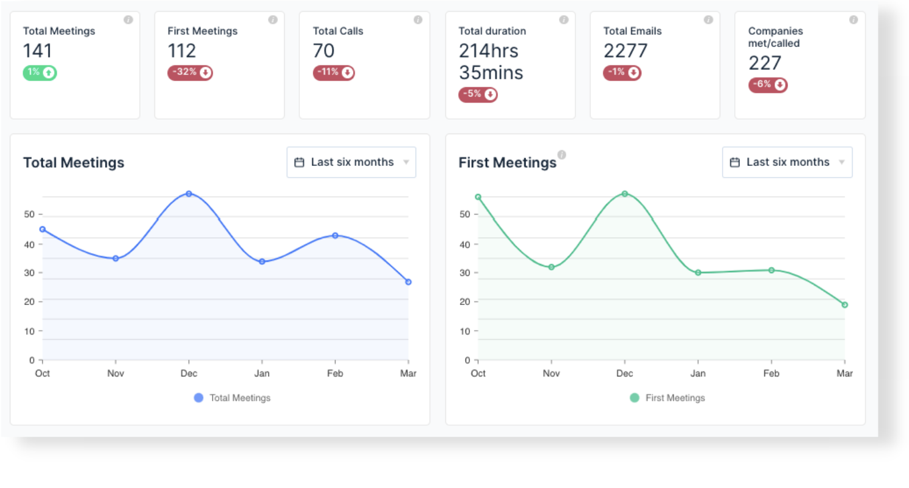
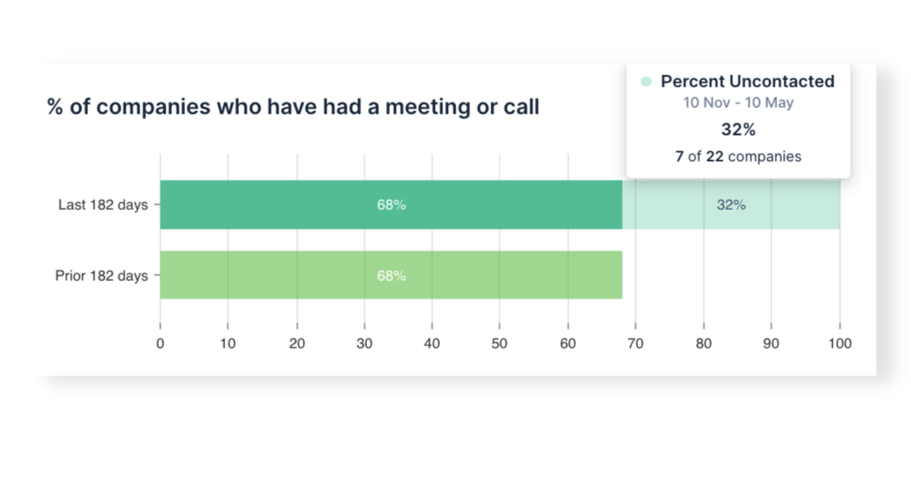
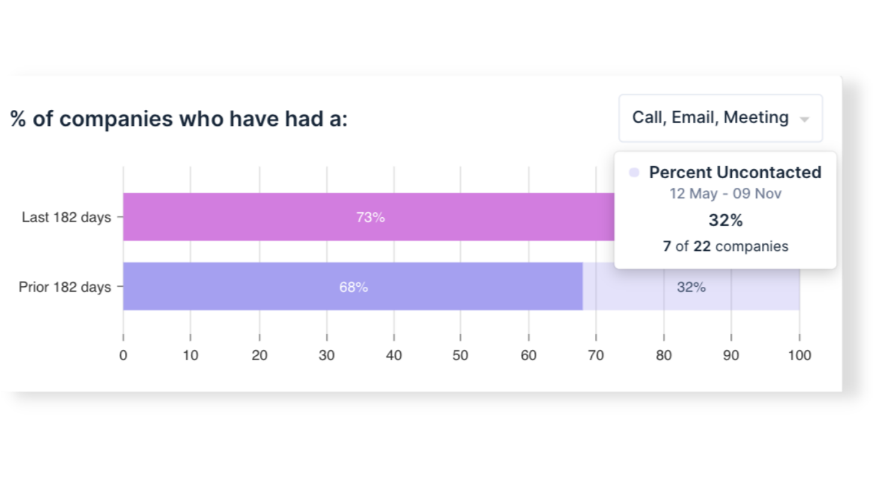

This month we’ve brought you updates to your dashboards to give you even more powerful analytics and the insights you want to see.

In case you missed it, here’s what we’ve been working on….

## Track trends in customer meetings and prospecting

With two new graphs on your [Team Activity](https://app.beecastle.com/reporting/activity/team-dashboard) and My Activity pages you can easily detect and track trends in total meetings and first meetings.

Designed to help you measure prospecting activity, ‘First Meetings’ shows you how often you’ve met with companies in BeeCastle for the first time.

Comparing these charts gives you the power to visualise at-a-glance whether your team is spending more time [‘hunting’ or ‘farming’](/blog/why-sales-activities-are-an-important-leading-indicator-for-msp-sales-teams/).

## Measure performance using % of engaged accounts

Understand how much of your network you and your team are covering with new percentage charts on your [Segments dashboard.](https://app.beecastle.com/segments)

 
For any of your segments, and for any given period, quickly analyse what percentage of your companies have had a meaningful interaction, or maybe more importantly - what percentage haven’t had a meaningful interaction. 

## Update and sanitise your contacts

Your [suggested contacts](https://app.beecastle.com/contacts/suggested) are now exportable. Your suggested contacts are based on your recent emails, meetings or Microsoft Teams calls with contacts who aren’t saved in BeeCastle.

Use this list to update BeeCastle directly or export it to update and sanitise another contact database or CRM you use.
