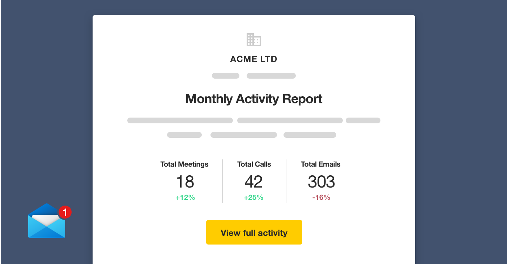
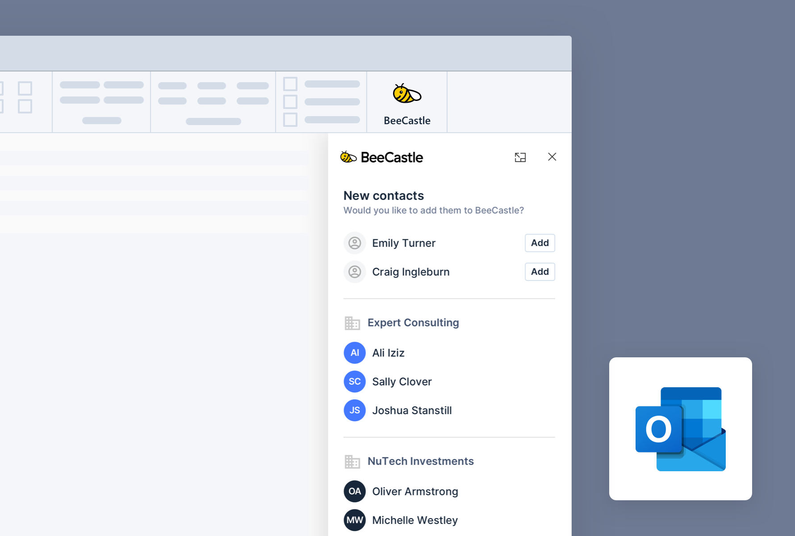

We’ve been hard at work building even more powerful dashboards and integrations to bring you the insights and analytics you want to see.

In case you missed it, here’s what we’ve been working on….

## New and Improved User Analytics Dashboard

Your new User Analytics dashboards have been updated. Now giving you both personal insights and an overview of your team, you can take a deeper look at where you’ve been engaged.

These dashboards are automatically generated and updated in real time. You can quickly identify at-risk accounts as well as track your team’s progress on engagement goals. Take a look at yours [here](https://app.beecastle.com/reporting/activity/team-dashboard).

## Monthly Activity Report E-mail

If you’re a manager, you’ll now get a monthly activity report from BeeCastle. Insights such as team members with the most and least meetings, as well as suggestions of who to focus your time on will now come straight to your inbox, every month.

## Outlook Add-In Updates

Our Outlook add-in is even handier! As well as default company and contact information you can now also fill out any custom fields you’ve added.

Save time and download our Outlook add-in to quickly add contacts and analyse dashboards directly from your inbox. Follow the download instructions [here](/blog/product-update-outlook-add-in/).

## Coming soon…ConnectWise Integration

Are you an MSP or TSP using ConnectWise? We’re building an integration that allows you to view BeeCastle’s advanced analytics on your team’s activity using customer data from ConnectWise. The sync is automated - giving you visibility on your business and team performance, without having to maintain another system.

## Want to know more?

If you would like to know more about any of these new features or what’s coming next, book in a time for a demo with our BeeCastle expert [here](https://meetings.hubspot.com/david4567) (it’s free!) or email [sales@beecastle.com](mailto:sales@beecastle.com).
