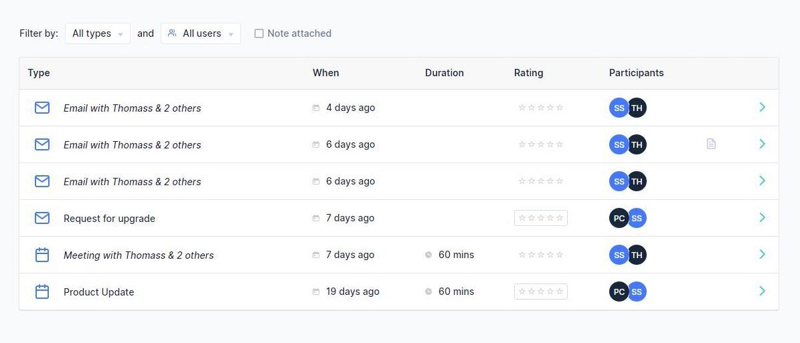

Our ConnectWise integration is here! In case you missed it find out more about the highly requested integration and what else we’ve been up to in the past month…

## ConnectWise Integration Launch

As well as *integration across the Microsoft 365, Teams and Outlook, BeeCastle now maps this activity data to your ConnectWise customer information. You can keep ConnectWise as the source of truth while getting* dashboards you need to understand the status of your business relationships, reduce churn and increase sales through BeeCastle insights.

[*Sign-up for a 14-day free trial*](/sign-up) *to set up the integration today in a few simple steps.*

With deeper integration on our roadmap - stay tuned for more updates…

## Manage visibility of email & meeting subjects

Account admins can now manage the visibility of the subject lines of emails and meetings. While email content is never displayed in BeeCastle, you may want to hide the subject lines or descriptions from non-admin users.

More details can be found [here](https://help.beecastle.com/en/articles/4945154-managing-visibility-of-email-and-calendar-subject-lines) or head to [Settings -> Interaction Descriptions](https://app.beecastle.com/settings/interaction/descriptions) to hide interaction descriptions.

## Coming soon…

More advanced measurement and analytics features are coming to your [Segments](https://app.beecastle.com/segments) and [Team Activity](https://app.beecastle.com/reporting/activity/team-dashboard) pages.

Soon you’ll be able to

- Identify trends in engagement activities
- Measure new key account management KPIs
- Track first meetings with new prospects
- Analyse the type of companies you meet with, based on your custom fields
