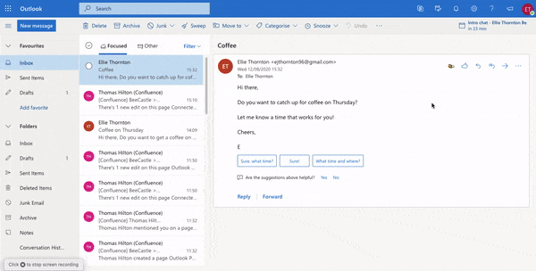
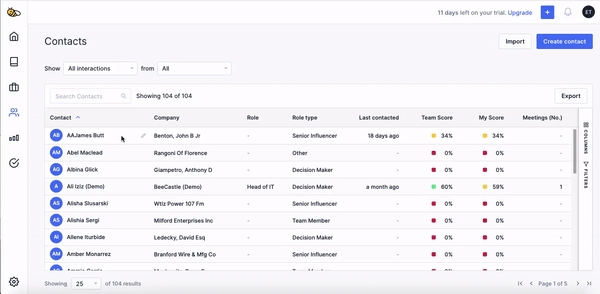
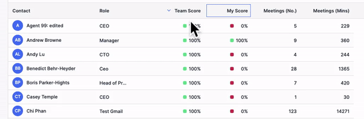
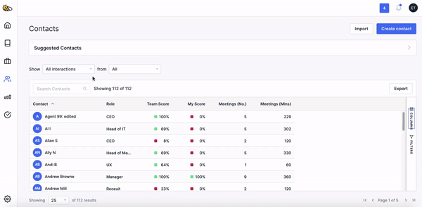
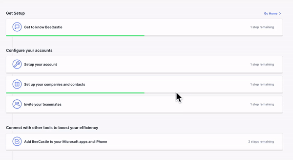

BeeCastle is a platform built for Microsoft 365. We’ve been working hard to make BeeCastle more powerful and easier to access for teams who work within **Office 365** and **Teams**.

Here’s what’s changed and improved in BeeCastle in the last two months…

## View and Manage BeeCastle from your Outlook inbox
Download the add-in to easily access your contacts’ BeeCastle profiles directly from your Microsoft Outlook inbox.

From an email, you can directly open up a contact’s BeeCastle profile and understand who from your team has been interacting with them.

The add-in automatically recognises all the attendees in an email, including saved and unsaved contacts, allowing you to seamlessly save new contacts to BeeCastle without leaving your inbox.

To download the add-in: go to the [Microsoft Marketplace listing](https://appsource.microsoft.com/en-us/product/office/WA200001954?src=KenSciblog22&tab=Overview) and select ‘Get it now’, or add it directly within Outlook using the instructions [here](https://help.beecastle.com/en/articles/4300376-beecastle-outlook-add-in/).

## Teams Calling Integration
We have extended our Microsoft Teams integration to sync your Microsoft Teams calls.

In addition to your email and calendar invite history, inbound and outbound Teams call history is automatically recorded. Giving you even more powerful relationship analytics, with little effort – gone are the days of manual call reports!

If you have set up Teams calling to make and receive calls on a public telephone network and would like to integrate Teams calling with your BeeCastle account, email us at: [eleanor@beecastle.com](mailto:eleanor@beecastle.com) and we can set you up for success!

## Easily Edit Contacts and Companies
At BeeCastle, we know that different businesses have different needs, so we have made it easy to customise and structure your information.

It is now even easier to manage your [Contacts](https://app.beecastle.com/contacts/) and [Companies](https://app.beecastle.com/companies/) pages. By double clicking or hovering your mouse over the information you want to change and selecting the pen icon, you can instantly make changes.

For more help editing, click [here](https://help.beecastle.com/en/articles/4373217-how-to-edit-your-companies-and-contacts/).

## Personal Score and Interaction Statistics
BeeCastle helps you focus on and prioritise the relationships that matter. To make that easier, you can view your personal score with your [contacts](https://app.beecastle.com/contacts/), and compare it to your team’s score.

You can also choose to view only the interactions you have had with your contacts, and view the timeframe you had those interactions in (e.g. how many meetings you’ve had with someone in the last 6 months compared to the last 3 months)

## On-boarding Checklist
Set yourself up for success! Our handy new [on-boarding checklist](https://app.beecastle.com/checklist/) is there to guide you through every step of the way. Come back to it at anytime to check you are getting the most out of BeeCastle.

## And a bunch of other things…

- End of day email where you can rate and review meetings directly within Outlook
- Bulk action pop-up so you know how your large 365 sync or contact import is going
- Made it simple to navigate in the app by selecting any contact or company badge to go to their dashboard
- New iOS app home page with ability to add suggested contacts and rate/review recent meetings in one place
