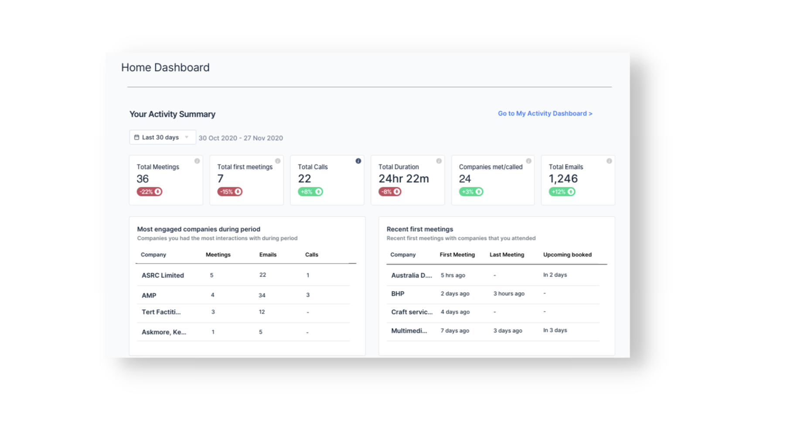
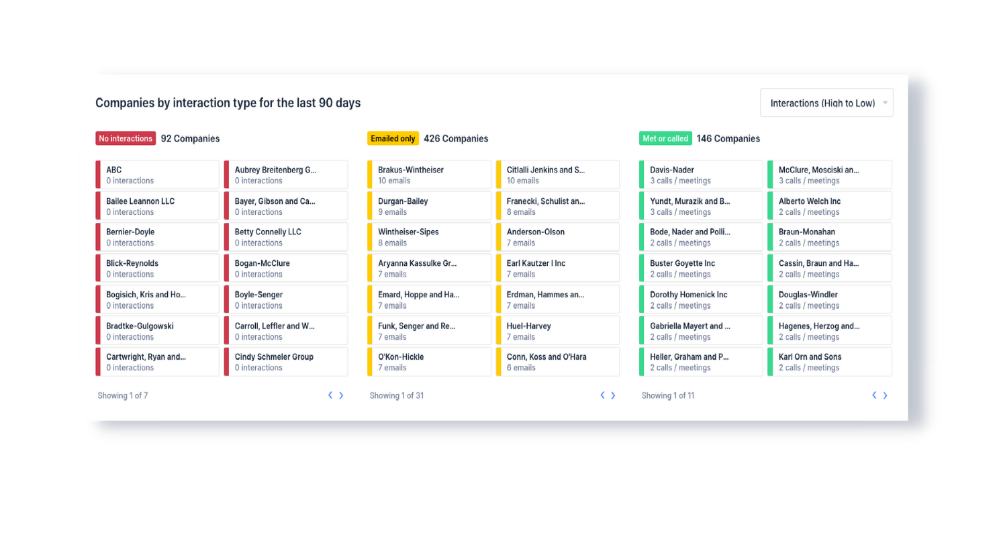

Throughout the month of June, the BeeCastle team have been making the platform more personalised, with the insights you care about most. In case you missed it, here’s a rundown of some of your new features…it’s a big one!

## New Manager Dashboard

Managers – you now have access to an exclusive dashboard on your [home page](https://app.beecastle.com/). With team insights from both your [Team Activity](https://app.beecastle.com/reporting/activity/team-dashboard) and [Segments](https://app.beecastle.com/segments) dashboards, as well as some new charts, you get a real-time view of your team’s performance at a glance.

## New User Home Dashboard

All users who aren’t mangers will now also get access to a personalised summary insights dashboard on their [home page](https://app.beecastle.com/). Designed specifically in response to feedback from some of the best relationship managers we work with, you can now review some interesting new metrics like most engaged accounts, and a chart for your First Meetings (a great way to keep on top of new business and prospects).

## Monthly Activity Report Email

We didn’t stop there…we’ve also launched a monthly activity report for all users, delivered straight to your inbox, every month. Understand where you’re engaged and where to focus your time, without having to leave Outlook.

## Dashboards got a Makeover

We made lots of changes across nearly all your dashboards, giving you the power to drill down on what’s really important, and making it easier to compare and review data between Segments…

**Saved Filters**

When you filter by users or time frame on your [Team Activity](https://app.beecastle.com/reporting/activity/team-dashboard) page or [new home page](https://app.beecastle.com/), we’ll save them for you! If you click between pages your filters will be saved when you come back, making it much easier to compare, measure and track activities of different teams - give it a try…

**Segments**

We listened to your feedback and made some changes to your [Segments page](https://app.beecastle.com/segments) - giving you the data points that matter most. This page now focusses on what *type of interaction*, if any, your team are having. We also introduced more filters on the chart below - making your dashboard more customisable than ever.

**First Meetings**

Power-up your segments with a new data point - first meetings. You can now view the date of your first meeting with all your relationships in your Companies list, giving you the visibility to sort, filter, segment and track your new relationships.

## New Settings

**Recurring Meetings**

Recurring meetings are coming to BeeCastle! We’ve built a feature to allow recurring meetings to automatically sync.

It’s going to be released over the coming week but if you’d like to be **one of the first to try it out** get int touch with [eleanor@beecastle.com](mailto:eleanor@beecastle.com). For more detail on recurring meetings sync [click here](https://help.beecastle.com/en/articles/5390151-syncing-recurring-meetings-from-microsoft-365).

**There’s more…**

We’ve also made it simpler to enable [Teams calling](https://help.beecastle.com/en/articles/5257263-how-to-integrate-teams-calling "Teams Calling Integration") integration and share files with your account manager.
