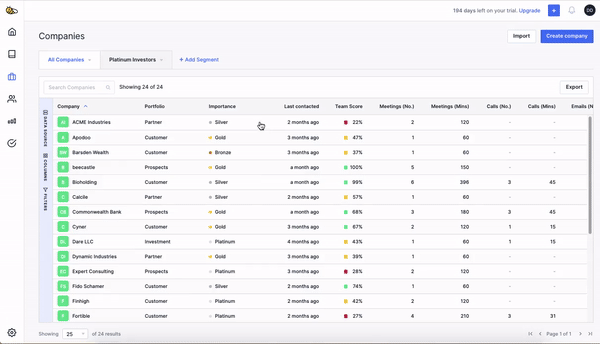
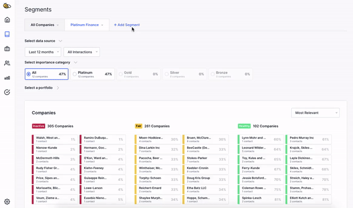
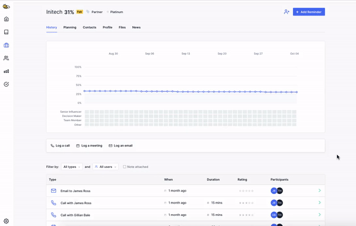

The BeeCastle team have been working hard to bring updates which make BeeCastle feel more personalised, more flexible and even faster.

Here’s what we’ve been up to in the past month…

## Create Saved Segments

Any filters you apply, or sorting you do on your [Companies](https://app.beecastle.com/companies)and [Contacts](https://app.beecastle.com/contacts) tables can be saved as a Segment. A Segment is a tab which appears at the top of those tables. Each time you open your Companies and Contacts tables you’ll be able to see the exact view you saved.

To save a Segment, apply your filters and sort your data in a way that’s meaningful to you, and click the ‘Save Segment’ button. Segments are editable and removable. You can also share these Segments with your team, or keep them private.

Learn more about how to filter your data and save a Segment [here](/)***.***

## Get powerful analytics for your Saved Segments

Once you’ve created your Segments, you can apply them to the new [Segments dashboard](https://app.beecastle.com/segments)***.*** This will display companies based on the same filters you used in your Segment and give you key analytics – making it simpler than ever to personalise BeeCastle and drill down on important data.

## Filter your interaction lists

It’s now even easier to find important meeting notes and view specific team members’ interactions. You can now filter interaction lists by User, Type (meeting, call and/or email) and if there is a note attached. You can find interaction lists on the dashboards of a specific contact or company.

## Greater flexibility and detail with new Custom Field types

Custom Fields are columns you can add to your [Companies](https://app.beecastle.com/companies) and [Contacts](https://app.beecastle.com/contacts) tables. You can now create 3 new types of Custom Fields: numeric, user and date.

- Numeric: users can only input numbers.
- User Field: select from a list of users in your BeeCastle account to assign Companies or Contacts to an owner
- Date: users can only input dates

Adding these fields to your Company and Contacts tables makes it easier to sort and filter those tables, and create more specific Segments. To learn more about adding Custom Fields and filtering, [click here](https://help.beecastle.com/en/articles/3820947-adding-custom-fields).

## Load your data 3 times faster

We have dramatically improved performance to make loading of your dashboards and lists over 3 times faster!

## Want to know more?
If you would like to know more about any of these new features or what’s coming next, please don’t hesitate to book in a time with our BeeCastle expert Ellie [here](https://meet.intercom.com/eleanor) (it’s free!) or send an email to [eleanor@beecastle.com](mailto:eleanor@beecastle.com).
