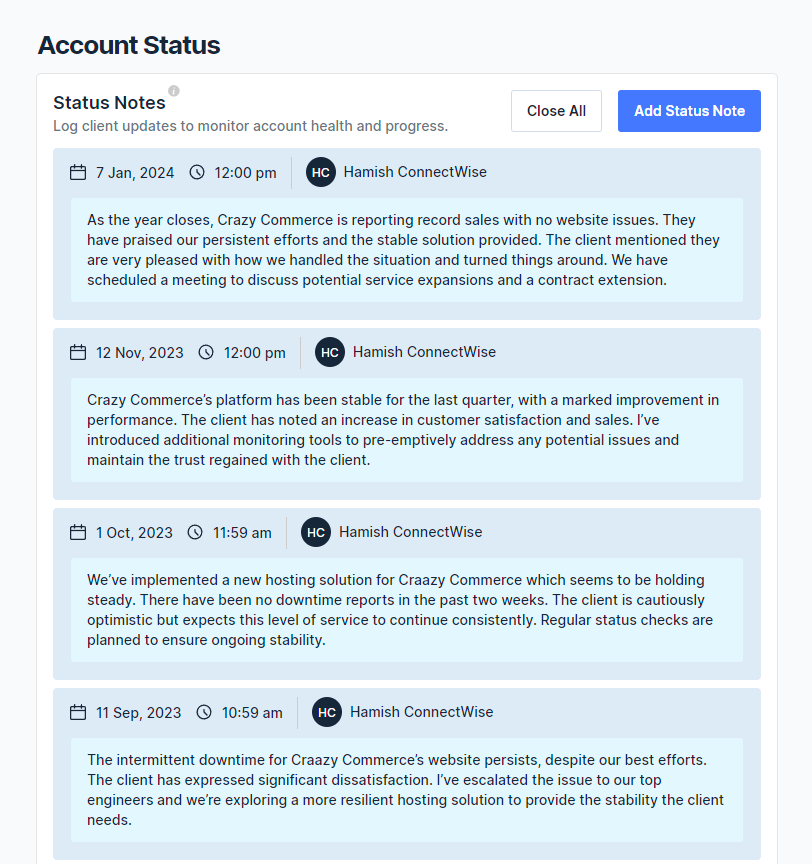
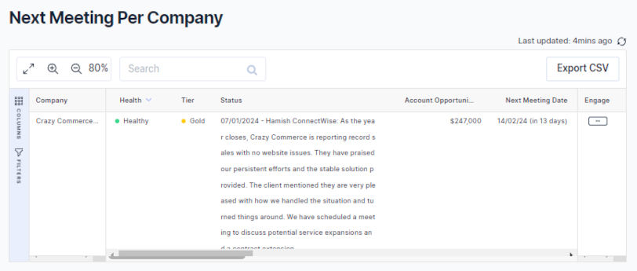

BeeCastle’s new Account Status Notes are set to enhance the way businesses manage and monitor client engagements. This feature equips teams with a straightforward method to log customer interactions, ensuring every account’s narrative is up-to-date and comprehensive.

## A Clear Perspective on Client History

The introduction of Account Status Notes is about giving teams the power to create a detailed and accessible log for each customer. This log acts as a living document, showcasing the trajectory of client interactions, solutions provided, and opportunities that arise. It’s about having a record that speaks to the quality and history of your client relationships.

## The Advantage of Informed Interactions

With the latest account updates directly integrated into the meeting planner, managers can enter discussions with a full understanding of what has transpired since the last interaction. This immediate context allows for more focused and productive meetings.

By having a centralized repository for account notes, managers not only carry the history of client conversations into each meeting but also leverage this information to build rapport and trust with clients. This continuity ensures that no detail is missed and every meeting picks up exactly where the last one left off, paving the way for discussions that are as strategic as they are informed. It transforms preparation from a task into an advantage, enabling a level of personalization in client interactions that can significantly strengthen business relationships.

## Benefits at a Glance:

- **Historical Clarity**: Keep a documented history of interactions accessible at all times.
- **Meeting Readiness**: Quick access to recent notes ensures meetings start on the right foot.
- **Cohesive Team Dynamics**: Share account histories across teams for uniform understanding.
- **Client-Centric Approach**: Quickly respond to and anticipate client needs effectively.
- **Efficient Account Management**: Reduce time spent searching for past account details.

## Elevating the Standard of Client Relations

Embrace BeeCastle’s Account Status Notes for a more organized approach to client management. See how these additions to your workflow can make a significant difference in the way you handle client relations. [Sign up](/sign-up) or [schedule your demo today!](https://meetings.hubspot.com/david4567)
