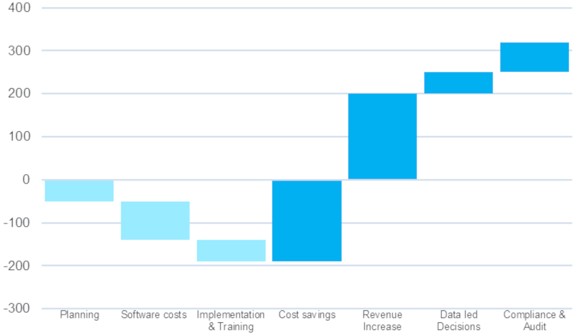

When Managed Service Providers (MSPs) consider advancing their data and analytics (D&A) strategies, the initial focus often lands on the potential costs involved. However, a detailed analysis reveals that the financial benefits of such investments can significantly outweigh the expenses over time, proving that the investment is not only justified but essential for growth.

**Understanding the Investment Journey**

Recent insights from BeeCastle underscore the journey of D&A investment through a revealing chart, which breaks down the various stages and their associated costs and benefits.

**Planning and Software Costs: The Initial Steps** The initial phase of any D&A strategy includes planning and acquiring the necessary software tools. While this phase is marked by expenditure without immediate financial return, it sets the foundation for future benefits. Think of it as planting seeds for a bountiful harvest.

**Implementation & Training: Building the Framework** Following the initial outlay, there’s the implementation and training stage. This investment in time and resources may appear as a cost on the balance sheet, but it’s a critical step toward ensuring that your team can harness the full power of D&A tools effectively.

**Cost Savings: The Turning Point** After overcoming the initial costs, MSPs begin to realize significant cost savings. These savings come from increased operational efficiencies, such as automation of manual tasks and better resource management, leading to a marked uptick in the cost/benefit analysis.

**Revenue Increase: Seeing the Returns** As the processes become embedded and optimized within the MSP’s operations, the tangible benefits start to materialize in the form of revenue increases. These are driven by improved decision-making, streamlined operations, and the ability to identify and capitalize on new opportunities.

BeeCastle specializes in visualising revenue increases of this sort with our [revenue analytics dashboards.](/products/revenue-analytics/ "Revene Analytics")

**Data-led Decisions: The Strategic Edge** The true power of a D&A investment is realized in its ability to drive decisions that are rooted in data. This strategic edge allows MSPs to outperform competitors by leveraging insights that drive efficiency, innovation, and customer satisfaction.

**Compliance & Audit: The Unseen Advantage** Lastly, a robust D&A strategy contributes to more effective compliance and auditing processes. While less tangible in immediate financial terms, the long-term benefits of minimizing risk and ensuring regulatory adherence are immeasurable.

**Concluding Thoughts** As illustrated by the BeeCastle model, investing in a D&A strategy is an investment in the future of any MSP. The initial costs, while not insignificant, pave the way for enduring benefits that extend far beyond the balance sheet. They equip MSPs to navigate the complexities of a digital economy with confidence and precision.

Through this strategic investment, MSPs are not just spending money; they’re building the very infrastructure that will allow them to thrive in a data-driven future. As such, BeeCastle’s approach to D&A is more than a methodology; it’s a blueprint for sustainable, data-empowered growth in the ever-evolving landscape of managed services.

If you want to learn more about how BeeCastle can help you in your D&A journey, [book a demo](https://meetings.hubspot.com/david4567) today and we will take you through it step by step.
