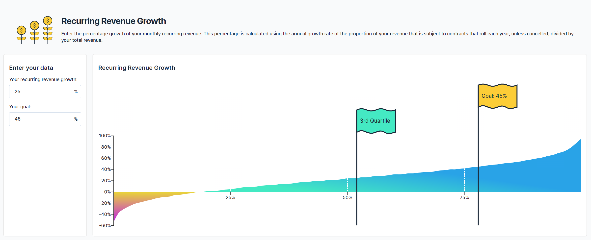

****MSP Benchmarking Enables Data Driven Growth****

We are very excited to announce our latest feature, MSP Benchmarking.

As part of the global MSP community, we look forward to continuing to support MSPs growth through data and insights.

With our latest feature, which is free and does not require integration with PSA data, MSPs can gain objective assessments of their performance against other MSPs.

This tracks metrics that matter and helps move the needle for business growth, and to inform sales and account management decisions.

**Compare, Prioritize, Action**

Currently we have six key account management metrics that are available:

- Recurring revenue growth
- Number of paying customers
- Recurring revenue percentage
- Yearly revenue
- Top five customers
- Average customer revenue

MSPs are able to submit their current data for each of these metrics, which shows which quartile they are positioned in. From here, MSPs can then set a goal (with quartile) that they want to achieve.

The screenshot below shows recurring revenue growth % currently at 25% (green flag in the 3rd quartile) with a goal of achieving 45% (orange flag in the 4th quartile).

By understanding this relative position, goals can be adjusted as need and in context of comparison with peers and relative overall business priority of the metric.

Compare, prioritize and then action the highest priority metrics for improvement.

**Anonymized Data, Personal Impact**

All data is anonymized and stored securely. You can read more [here](/privacy/) on our privacy statement.

The data can be updated by MSPs whenever they want, allowing them to track progress against goals.

**Track Performance Against Peers**

Most MSPs are good at tracking their own individual performance. However, many often question how their strategies and best-practices are converting into a competitive advantage in the market against their peers. Now, MSPs can monitor their key metrics and see the impact of any account management strategy or operational changes.

**Would like to learn more?**

Sign up [here](/sign-up/) for a BeeCastle account here which will provide you free access to benchmarking.
