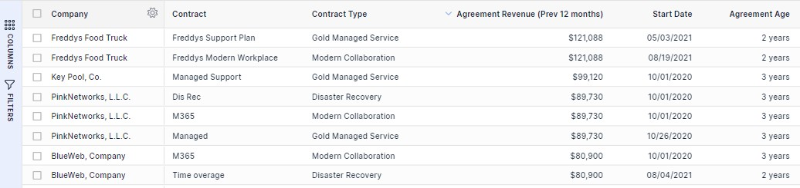
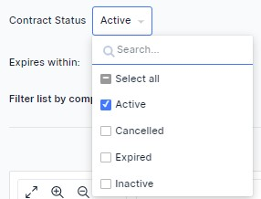
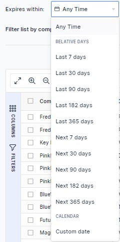

Growth is hard to achieve at the best of times, and even harder in tough economic climates. However, one area that Account Managers can look to optimise for growth within existing accounts is to ensure that contracts and pricing are up-to-date and planning for renewals is in place. Although this may sound easy, it is not always that way. At the heart of delivering returns for the business is managing contracts. This, for many Account Managers can be challenging as the data can be siloed across PSA and other systems.

Now, with our new feature, “Contract Tracker”, Account Managers have full visibility over their contracts, allowing them to forward plan and manage towards commercial outcomes. In one view, Account Managers can see all of their contracts (and filter by “status”), with details such as “agreement revenue previous 12 months” and “agreement age.”

Additionally, Account Managers can ensure that contracts are in the correct status.

By having visibility of this data, it enables the Account Managers to be proactive and plan ahead for contracts that are expiring, so that, they can work towards valuable commercial outcomes. This is easy to do now with the “expires within” filter.

No more having to search across seven different systems or review PDFs or paper contracts…. Account Managers can now be proactive in managing their contracts by including data and insights into their ongoing account management workflow.

If you’d like to learn more about Contract Tracker, please see our help article [here](https://help.beecastle.com/en/articles/7900966-track-your-contracts-in-beecastle/).

Need help or want a walk through? Contact us at [help@beecastle.com](mailto:help@beecastle.com) or book a demo with us from the “book a demo” button [here](/) from our website.
