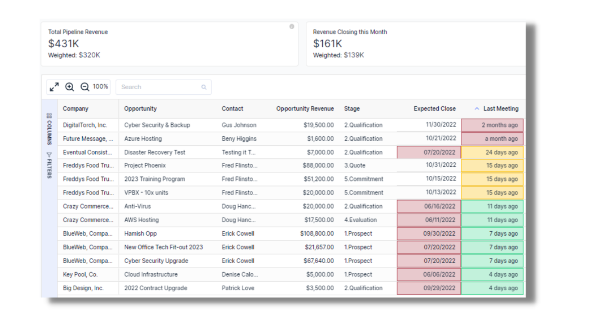
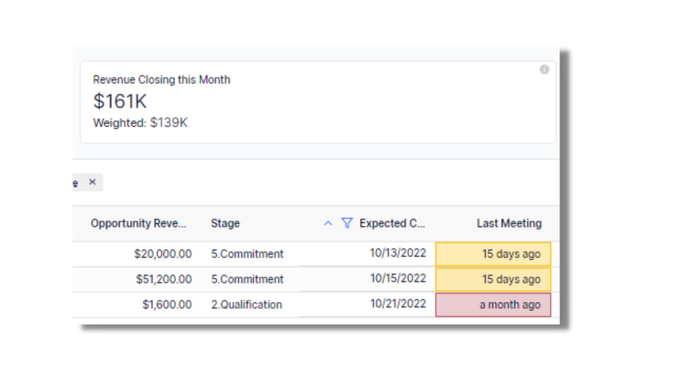
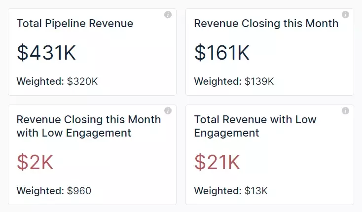

## Managing Your Pipeline Got a Whole Lot Easier…

It’s not uncommon for it to be a challenge for Sales Managers and Account Managers to mange their pipeline. There’s good reason for that too, not least the fact that it’s hard to “make sense of the data” and clearly see, “the opportunities I really need to focus on…”

To help overcome this challenge and to enable MSP execs and Account Managers to spend less time updating and sifting through endless spreadsheets, and more time talking with the right customers, we are excited to launch our new feature: “Open Opportunities.”

### Big Picture & Focused Pipeline in One View

It’s often difficult to quickly change context between “how’s the total pipeline looking?” and “which opportunities are we closing this month?” We’ve saved you time wrangling different spreadsheets, so now you can have visibility all in one view and you can focus on action rather than data admin.

### Crush Your Monthly Target!

It’s easy to get lost in your pipeline when you have lots of opportunities. Before you know it, you’re halfway through the month and you need to pick up the pace to hit your target. From our data analysis, we often find that the more often you are meeting with your customers, the greater the chance of closing the deal. So, if you have an opportunity closing this month, but you haven’t met with the contact for over a month, that could be a risk. In our new feature, we flag that for you so that it saves you time in focusing on the right opportunities at the right time.

### Save Those At-Risk Opportunities

When you are in account management, you are across so many different activities. It’s very easy for opportunities to slip through the cracks due to a lack of engagement. That’s why we have designed this feature to help you identify the total pipeline and those opportunities this month that are at risk due to lack recent meetings. From our data analysis, we find the more regular meetings MSPs have with their accounts, the more likely they are to close opportunities. Let us take the data work off your plate and let you focus on scheduling those meetings with the right customers to close deals!

### Want to know more?

If you’d like to learn more about Opportunities, please visit check out [here](https://help.beecastle.com/en/articles/6617808-open-opportunities-how-to-use-guide) our “how to use guide” which includes videos.

If you have any questions at all, please don’t hesitate to email [help@beecastle.com](mailto:help@beecastle.com) and we will be happy to help.

Log in to BeeCastle [here](https://app.beecastle.com/login?next=/?next=/?next) to get going!
