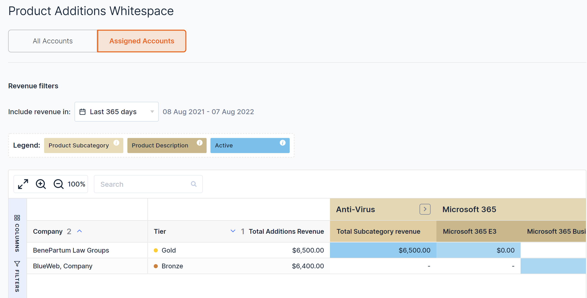
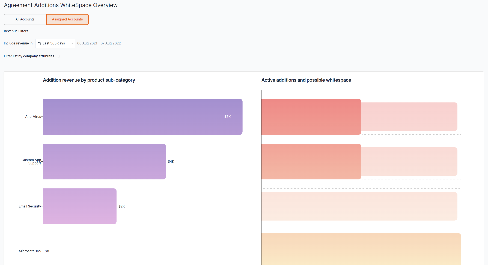
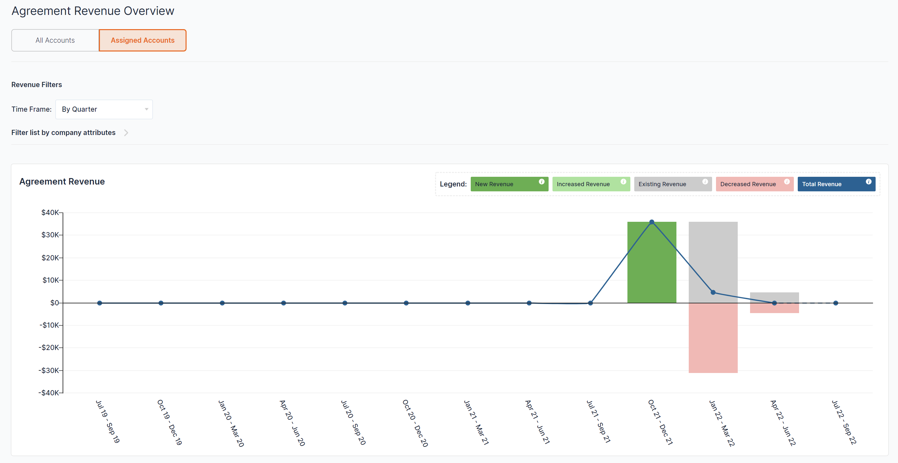
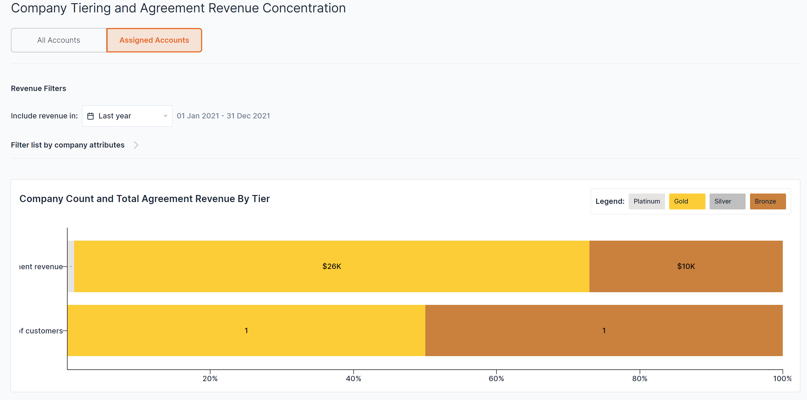

## Manage Your Own Accounts. Faster.

With the new “Assigned Accounts” feature, you will be able to easily toggle between “All Accounts” and your own “Assigned Accounts.” This will save you time and help you focus on just your accounts.

## Drill-down on Whitespace. Just For Your Accounts

Now, you can go from “30 thousand foot” view of all accounts to just focusing on your Assigned Accounts to identify Whitespace. In one-click. This is available on all 3 Whitespace pages:

- Product Additions
- Agreement Mapping
- Agreement and Additions Mapping

## Find Your Account Product Penetration Opportunities in 1-click.

Context is key when you are account planning. Use Assigned Accounts in Prospecting to find new opportunities within your list of Accounts.

## Analyse Your Assigned Accounts Agreement Revenue

Assigned Accounts is now available on all of your favourite Analyse Agreement Revenue pages:

- Total Revenue Trend
- Revenue Changes
- Product Growth
- Customer Growth

This will allow you to make more informed decisions, quicker and in a clearer way.

## Cut to the Chase. Customer Tiering. Personalised for You.

Your time is precious. You are trying to manage your Accounts and focus on the important priorities.

With Assigned Accounts, you can now easily quickly get an understanding of the break-down of the customer tiers of your accounts.

## Want to know more?

[Check out this article](https://help.beecastle.com/en/articles/6447774-assigned-accounts-setup-how-to-use) to learn more about how to setup and use Assigned Accounts.

If you have any questions at all, please don’t hesitate to email [help@beecastle.com](mailto:help@beecastle.com) and we will be happy to help.

Log in to BeeCastle [here](https://app.beecastle.com/login?next=/?next=/?next) to get going!
