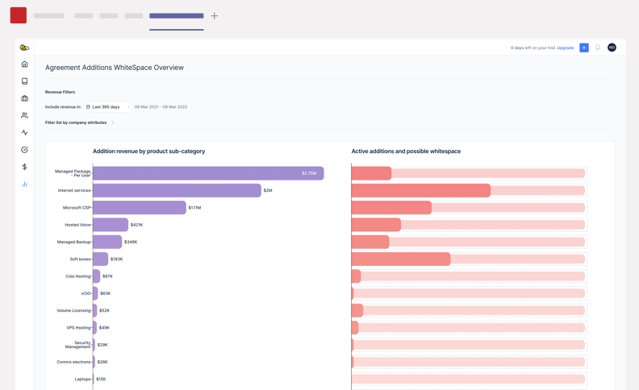
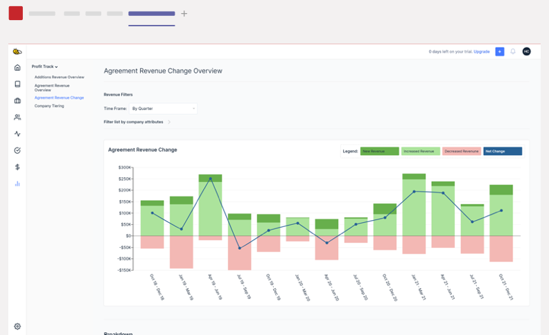
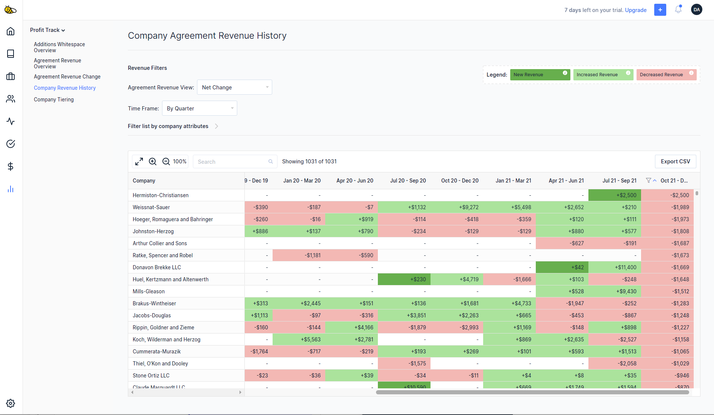
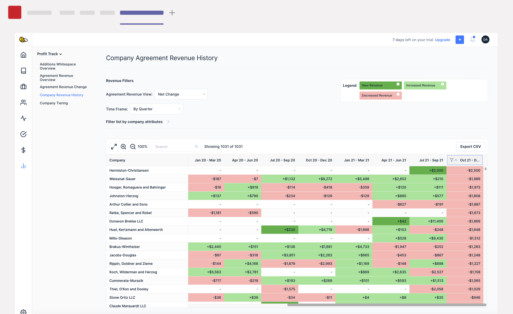
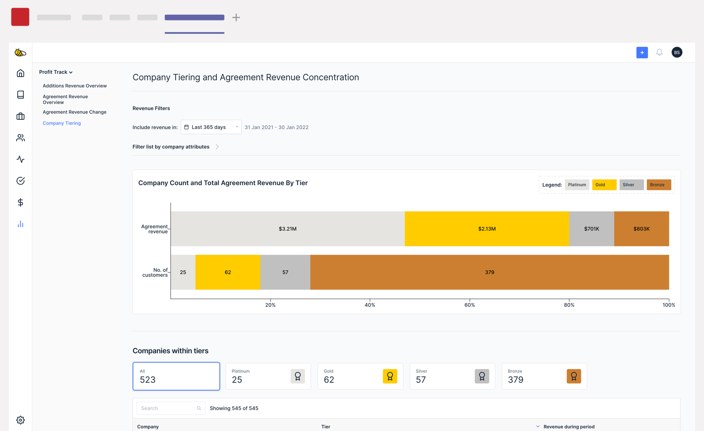

We are excited to formally launch our new addition to BeeCastle called **ProfitTrack**. **ProfitTrack** is a set of out-of-the-box strategic dashboards that give you more insight into:

- What is driving your MSPs growth? Of that, which companies require an intervention?
- Where can you achieve greater product growth?
- How can you tier your customers using revenue?

For a detailed demo of what new features have been added to your account, watch this video by Andrew, our head of channel:

<iframe src="https://www.youtube-nocookie.com/embed/Y0J42Xah1Bc" title="Product Update: Launch of BeeCastle ProfitTrack" loading="lazy" allow="accelerometer; encrypted-media; picture-in-picture" allowfullscreen></iframe>

## [**Additions whitespace overview**](https://app.beecastle.com/profit-track/additions-whitespace-overview)

This view of product penetration in your agreements lets you compare:

- The agreement revenue you generate
- The number of clients active
- The number of clients that are possible whitespace

For each solution. Use this to identify the potential in accounts that don’t have the solution and build and measure campaigns around those solutions.

## [**Agreement growth performance**](https://app.beecastle.com/profit-track/agreement-revenue) **and** [**it’s drivers**](https://app.beecastle.com/profit-track/agreement-revenue-change)

These two views show you how your agreement revenue is changing over time. Understand your top level growth number and what is driving it: was it new clients or exsting customers increasing and decreasing spend.

See a number that conerns you, select the number and deep dive to see the detail.

## [**Companies agreement revenue history**](https://app.beecastle.com/profit-track/company-agreement-revenue)

See how every companies agreement revenue has changed over time. Identify those accounts that have a troubling trend to prevent further churn and click on the cell to understand the cause.

## Individual company revenue deep-dive

Finally, see a full picture of the revenue history for each and every company by going to their company page and the ‘revenue history’ tab. Understand what additions are contributing to that accounts increase or decrease in revenue over time.

## [**Customer Tiering**](https://app.beecastle.com/profit-track/company-tiering)

Finally, our customer tiering page gives you a summary of your customer tiers. Understand how concentrated your revenue is and use this view to readjust your tiering.

## All of the above can be filtered by Account Manager/Territory
Finally, all of these views can be filtered by Account Manager and Territory so you can get these insights for each of your reps and their customers.

## Best of all - it’s free!
**ProfitTrack** is currently complimentary for all existing and new users. We think MSPs being able to see this data reveals the opportunity that exists in their customers stack.

So if you know an MSP who could benefit from seeing this data, introduce us via [sales@beecastle.com](mailto:sales@beecastle.com) and we’ll make sure you get some of our killer merch!

**Want to know more or get a demo of the functionality?** Get in contact with us at [help@beecastle.com](mailto:help@beecastle.com) or book a slot with a BeeCastle expert [here](https://outlook.office365.com/owa/calendar/BeeCastle1@beecastle.com/bookings/s/yG-hxQMkSUuT2XxlY1NZ7Q2).
