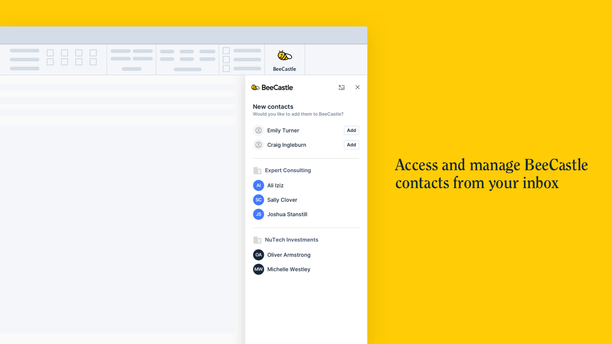
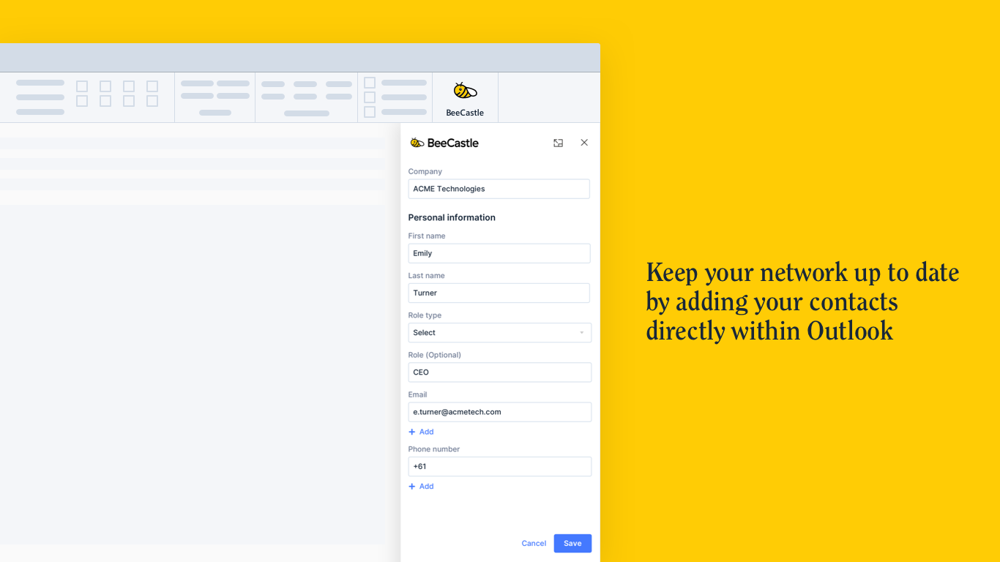

We are excited to announce the launch of the **BeeCastle Outlook Add-in!** You can now **easily access your contacts’ BeeCastle profiles** directly from your Microsoft Outlook inbox.

**What can I do with the add-in?**

Using the add-in provides context to your emails. From an email, you can directly open up a contact’s BeeCastle profile and understand who from your team has been interacting with them, how frequently and in what ways.

The BeeCastle add-in automatically recognises all the attendees in an email, including contacts you have saved within BeeCastle and contacts you don’t have saved. The add-in allows you to seamlessly save new contacts to BeeCastle without opening the app – helping you keep your network up to date.

**How do I get the add-in?**

To add BeeCastle to your Outlook, you can:

- Go to the [Microsoft Marketplace listing](https://appsource.microsoft.com/en-us/product/office/WA200001954?src=KenSciblog22&tab=Overview) and select ‘Get it now’
- Or add it directly within Outlook using the instructions [here](https://help.beecastle.com/en/articles/4300376-beecastle-outlook-add-in/)

**This is another example of how BeeCastle works best with Microsoft 365**

This launch is another key step to becoming the relationship platform that works best with Microsoft 365. Manage your relationships directly from the platforms you know and love, as you can now:

- Automatically sync all your Outlook emails and calendar events
- Analyse dashboards in Teams
- Manage your contacts within the Outlook plug-in
- Provide post meeting notes directly from our end of day email in Outlook

**Want to learn more?**

To book a demo with a BeeCastle expert to understand how your team can transform how your team manages their network, visit [beecastle.com](/)
