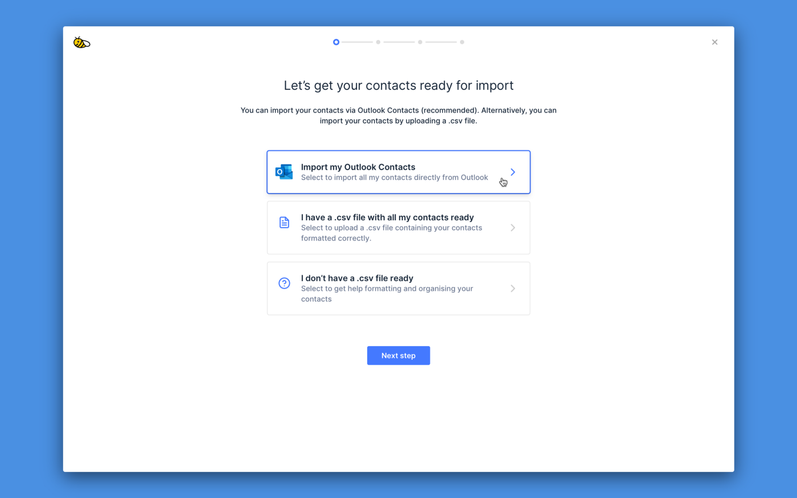
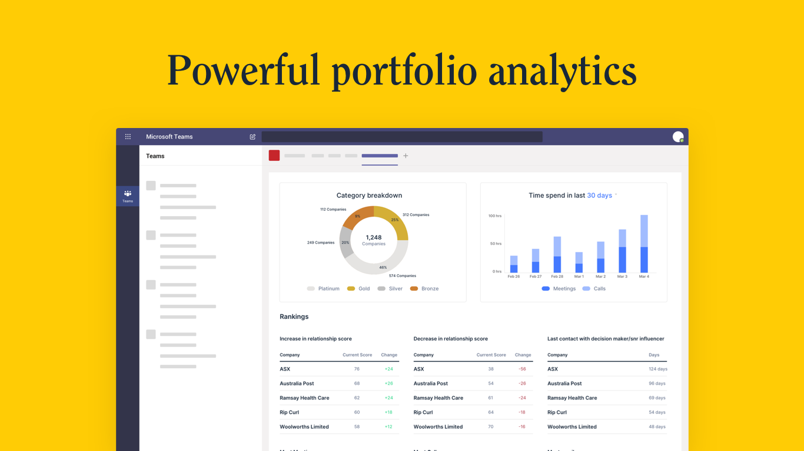

BeeCastle is excited to announce the launch of **Outlook Contacts integration**! This launch represents another example of our deepening integration with Microsoft 365, all with the express purpose of working where you work – in this case Outlook.

You can now **directly import contacts from their Outlook Contacts into BeeCastle.** If you do not use Outlook Contacts, you can export contact data from any other system into a CSV and upload it.

Not just a simple lift and drop, users can:

- Select which contacts to import
- Allocate relationships according to portfolios, importance and influence, adding structure and focus to your relationship map.

This curated experience makes getting your key network of contacts into your BeeCastle account simpler. Once your contacts are in and your 365 is integrated, you will automatically get an overall picture of your relationship health and history on the portfolio page (see below).

Our **Outlook Contacts integration** is the next step in our Microsoft 365 roadmap, and deeper Outlook and Teams integrations are coming soon.

**Want to learn more?**

To book a demo with a BeeCastle expert to understand how your team can transform how your team manages their network, visit [beecastle.com](/ "https://beecastle.com/")
