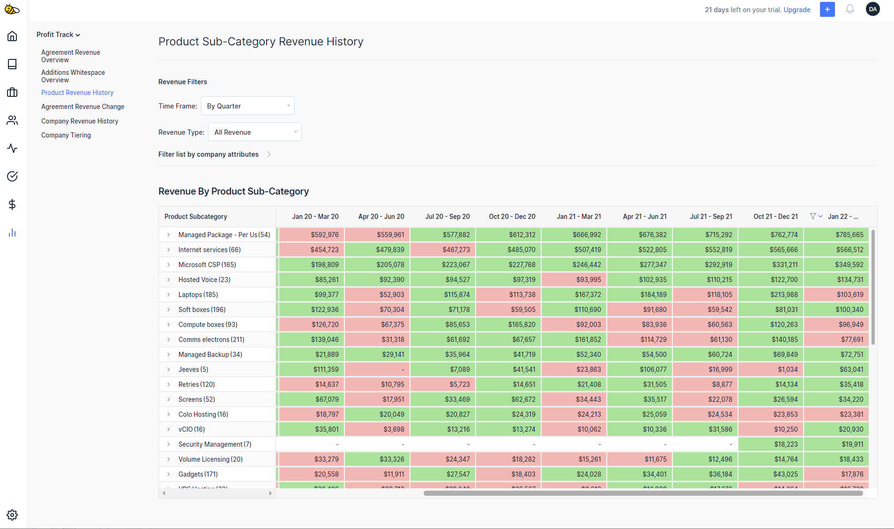
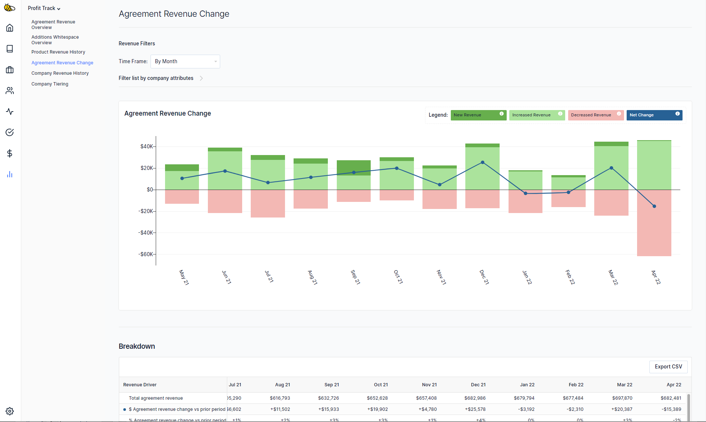

You asked, we answered! Three highly requested features have recently been released for BeeCastle ProfitTrack. Have a look and give them a go:

## Product Revenue History

Understand how your revenue has changed over time for each product or solution you sell using our new [‘Product History Dashboard’](https://app.beecastle.com/profit-track/product-subcategory-revenue). With this view you can:

- See the high level sub-category performance and then deep-dive into a specific product.
- Toggle between agreement and non-agreement views to understand how your recurring product revenue is performing
- Like every other ProfitTrack view, slice and dice the data to show a specific set of accounts like tiers or a specific account managers patch

## Yearly, quarterly and now MONTHLY views

We have added the ability to review monthly performance on all ProfitTrack views. Post month end, jump into [BeeCastle’s Company Revenue view](https://app.beecastle.com/profit-track/company-agreement-revenue) and select ‘monthly’ to understand what revenue movements have driven your results.

## Reduce & personalise visibility of financial data

If you’re an admin, you can visit the [‘Account Visibility’](https://app.beecastle.com/settings/account/visibility) settings page to limit visibility of financial data only to accounts that are ‘assigned’ to a user.

## Want to know more?

If you’re an existing customer and want to learn more about these features, [setup a time here](https://outlook.office365.com/owa/calendar/Bookings@beecastle.com/bookings/s/WJcei9CAIkClvq2cEjYcgg2) for a demo and discussion.

New to BeeCastle? If you’re interested in how feaures like these can help your business grow, [click here](https://suite.beecastle.com/signup) to sign up and as part of the process you’ll review the opportunity with our expert team.

