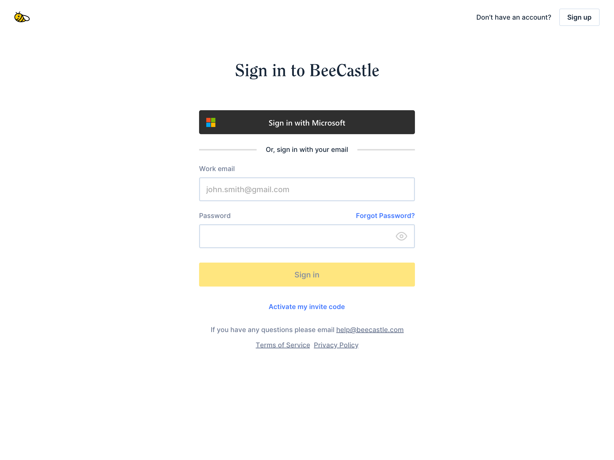

We’ve been hard at work implementing your suggestions - sign in via 365 is now available for all BeeCastle users. This is another example of BeeCastle’s deep integration with Microsoft.

## For users, it makes login simpler

Wherever you log in to BeeCastle, you can log in through Microsoft 365. This means you no longer have to manage multiple passwords or log in details, just use your Microsoft account details.

## For businesses, it provides you more control over security

We understand that security is super important and Microsoft do it well. With this launch you can now utilise the wide array of security policies managed by Microsoft.

As a business, all the security policies and processes in place in your Microsoft tenant automatically apply to logging into BeeCastle as well. For example, if you have set up multi factor authentication for your team it will apply in BeeCastle as it does with with your other Microsoft services.

## How can I set this up?

If you would like to create a BeeCastle account using your Microsoft 365 account, head to our [sign up page](/), select ‘Sign up with Microsoft’ and follow the prompts.

If you are an existing user, first sign out of your BeeCastle account, when signing in again simply select ‘Sign in with Microsoft’

