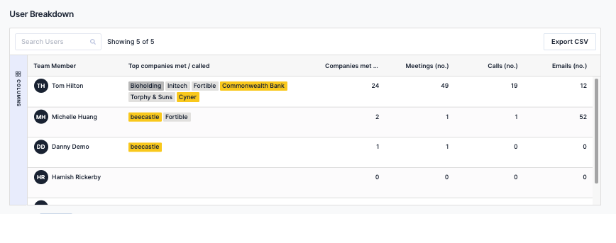

In response to your feedback we are excited to announce the new User Analytics dashboards as the first release of our People Analytics line of features. The Team Activity and My Activity dashboards are designed to make it easy for you to measure and reflect on you and your team’s key relationship management activities.

For existing users, [click here](https://app.beecastle.com/reporting/activity/team-dashboard) to view your **new dashboards.**

## See where you and your team have spent time…

Because BeeCastle integrates with Microsoft 365, including Outlook and Teams, data insights are automated for all users. Your new dashboards display metrics breaking down the meetings and calls you’ve had, who they were with, and the importance to your business.

Just some of the data now available includes…

- A count of meetings you or your team has had with senior influencers and decision makers
- A breakdown of what proportion of those meetings were with your most important companies
- A leaderboard for a user-by-user comparison of companies met, meetings had and emails sent
- A fully customisable date picker to create dashboards for different time periods

## For relationship managers, this can save you time…

Automatically generating these metrics means you can make data-driven decisions about where to focus your time in one glance. You can spend less time manually entering and analysing your activity, and more time re-engaging key contacts.

## For sales managers, you can stay on top of your team’s progress…

Reviewing activity regularly allows you to have more productive conversations with your team around engagement. BeeCastle dashboards sync your team’s activity in real time for you to use in your 1-1’s, quickly identify at risk accounts and reward your team’s progress toward their goals. By breaking down your relationship data by user, BeeCastle allows you to validate your team’s efforts and easily assess progress on KPI’s or your engagement goals.

