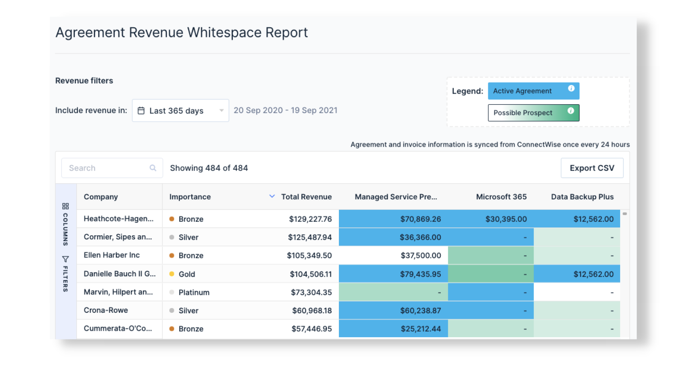
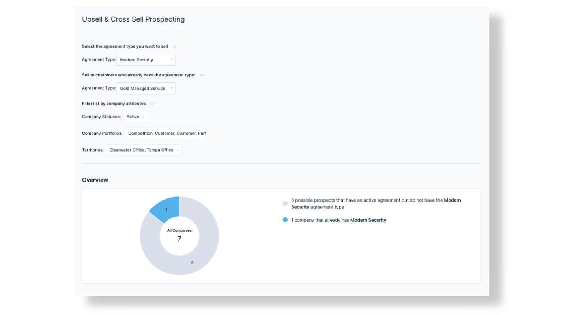
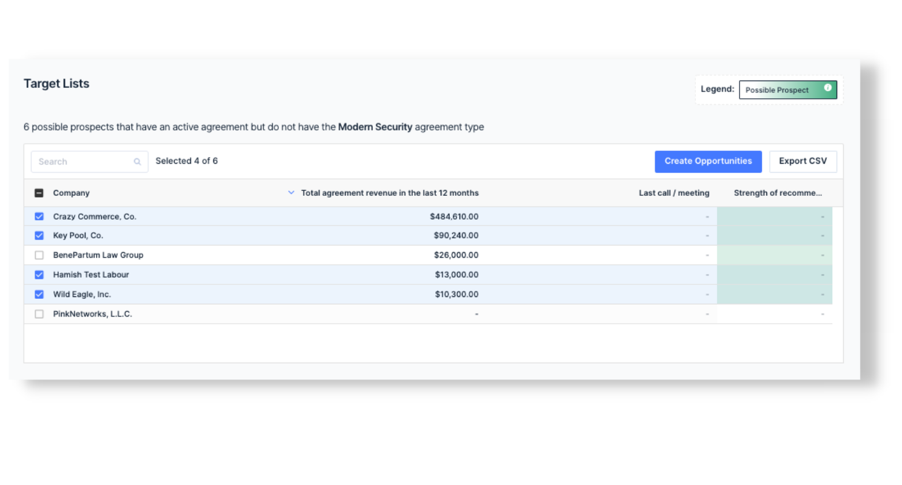

For MSPs using ConnectWise our Whitespace analysis tool is here. Fully automated and syncing in real-time with ConnectWise, whitespace reports allow you to identify the best opportunities for growth easily and accurately in your existing accounts.

## Identify opportunities in existing accounts

With two views to analyse both your agreement and product sets, account managers and sales leaders get full visibility of existing accounts, fully automated.

The two new real time reports include:

- [Agreement Type Whitespace](https://app.beecastle.com/whitespace/agreement-type-whitespace)- visualise what agreements you’re invoicing your customers, aswell as churned agreements and any gaps.
- [Product Additions Whitespace](https://app.beecastle.com/whitespace/product-additions-whitespace) - analyse which additions and products your accounts have purchased and where their revenue is coming from.
- [Recommender system](https://app.beecastle.com/whitespace/agreement-type-whitespace) - not only can you visualise at-a-glance any gaps in your customer’s agreement and product sets, BeeCastle’s intelligent recommender system also automatically uncovers the best prospects for cross-sell and upsell.

## Push opportunities to ConnectWise

As well as the raw, filterable data and the BeeCastle recommender system, you will also get access to the [Prospecting tool.](https://app.beecastle.com/whitespace/prospecting-report)

Account managers can select what they want to sell, define a segment to sell to and BeeCastle will produce a prospect list to [push into ConnectWise as opportunities.](/)

## For account managers and sales leaders

Whitespace analysis helps **account managers** focus their next conversation on what the customer is actually likely to purchase next. Saving your reps time by concentrating on real opportunities, and giving them data to have personalised conversations to make customer feel more valued.

Whitespace analysis gives **sales leaders** the data to map areas for growth, making it easier to more effectively scale revenue. You can also measure your team’s sales behaviour – compare product penetration and revenue for each of your sales reps so you can determine which offerings they should focus on.

## New for ConnectWise customers…personalise your dashboards

In addition to ConnectWise territories, BeeCastle now also syncs ConnectWise team members. Syncing Account Manager, Sales Rep and Technical Manager allows you to customise BeeCastle dashboards to focus on a specific patch.

## Want to know more?

[Check out this article](/blog/how-to-grow-your-msp-through-whitespace-opportunities/) to learn more about growing your MSP through Whitespace opportunities.

If you’re interested in WhiteSpace analysis for your MSP email [sales@beecastle.com](mailto:sales@beecastle.com) for a FREE revenue analysis.

