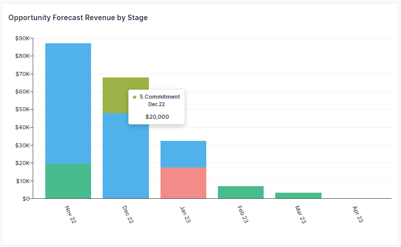
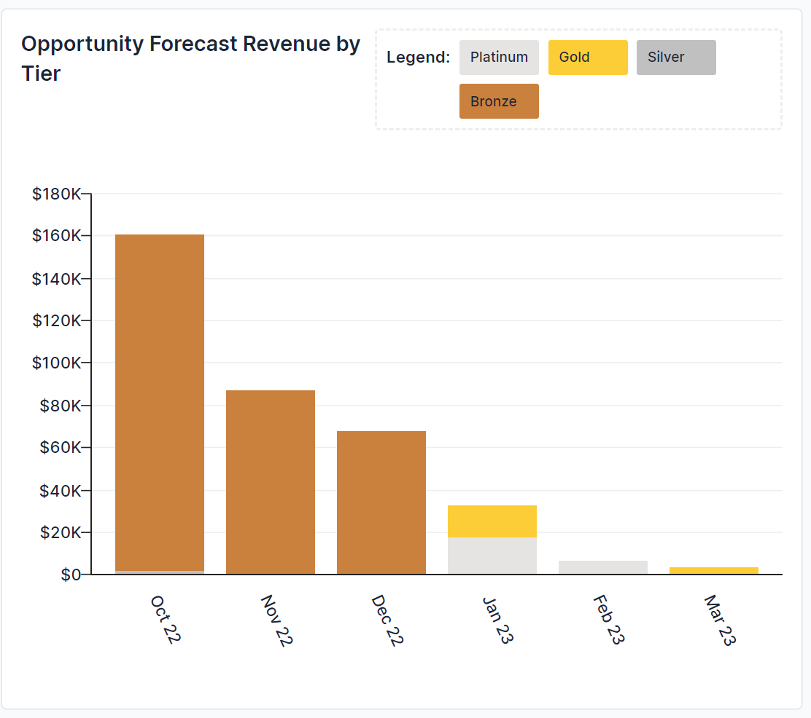
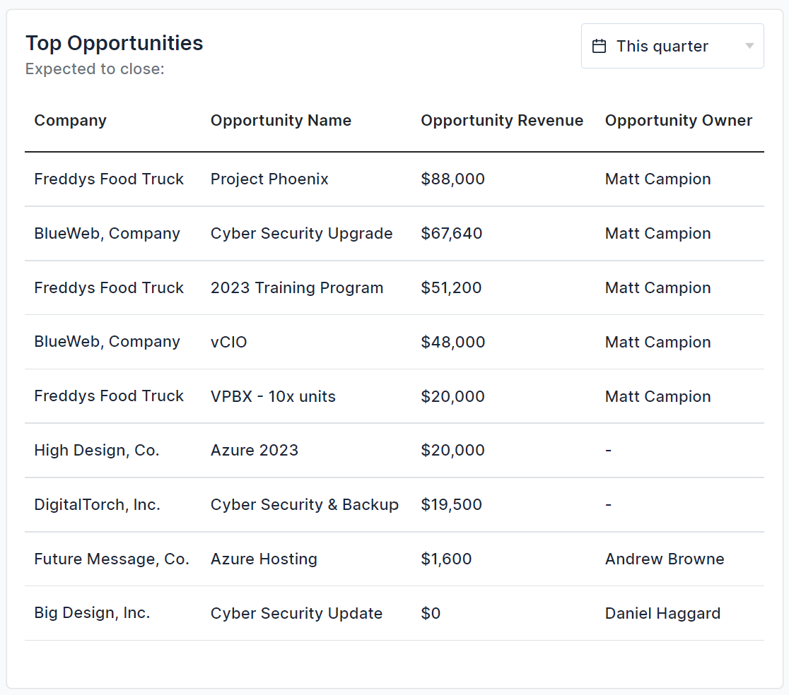

## Pipeline Management: More Science Less Art

There is an old sales adage that says, “sales is more art than science.” Sure, personal relationships and influential sales pitches are important. However, the modern sales team in any organisation today relies on far more science than art. And a huge part of that “science” is data. Pipeline data is one of the critical leading indicators for the health of any business. It’s with this background that we are excited to introduce BeeCastle’s latest feature, “Sales Dashboard.”

## A Picture Says a Thousand Words: Visualise Your Pipeline

Pipeline management is such an important process, that time needs to be spent focusing on how to increase the pipeline and closing opportunities instead of formatting excel spreadsheets. That’s why we’ve made it easy for you, so you can focus on the important things. Our Pipeline by Stage by Month graph shows you the total amount of each Opportunity Stage that is forecasted to close in each month. This allows account management teams to visualise where additional pipeline is needed, or actions required to progress opportunities through the stages by a certain month to hit the required sales targets. By hovering over each stage, you can see the stage name and the amount for that month.

## The Days of Guessing Are Gone

Professional account managers not only know their customers, but they also know their numbers. Inside and out. They don’t guess. Successful account managers use data as a competitive advantage.

Now in BeeCastle, account managers can have pipeline numbers at their fingertips. The following chart shows the pipeline by customer tier. This chart enables account managers to see if their pipeline is balanced or if it reflects a specific strategy to focus on a specific tier for a certain time period.

## Prioritise Your Pipeline With Top Opportunities

Often in account management, there are always competing priorities for your time. With our new “Top Opportunities”, you can save time and quickly focus on your most important opportunities.

You can quickly change the timeframe focus from “this quarter”, to “this month” or “this week.” Additionally, you can plan ahead and change dynamically change the list to “next quarter”, “next month” or “next week.”

Focus your time and energies in the right places at the right time.

## Want to Know More?

If you would like to learn more about the Sales Dashboard, please see the “[how to use guide](https://help.beecastle.com/en/articles/6692121-sales-dashboard-how-to-use-guide)” with videos.

Also, as part of the opportunity management in BeeCastle, please see [this blog article](/blog/open-opportunities-pipeline-with-activity-context-to-help-you-close-more-deals/) and “[how to use guide](https://help.beecastle.com/en/articles/6617808-open-opportunities-how-to-use-guide)” for Open Opportunities.

If you have any questions at all, please don’t hesitate to email [help@beecastle.com](mailto:help@beecastle.com) and we will be happy to help.

[Log in to BeeCastle](https://app.beecastle.com/login) to get going!
