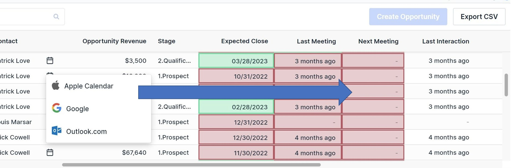
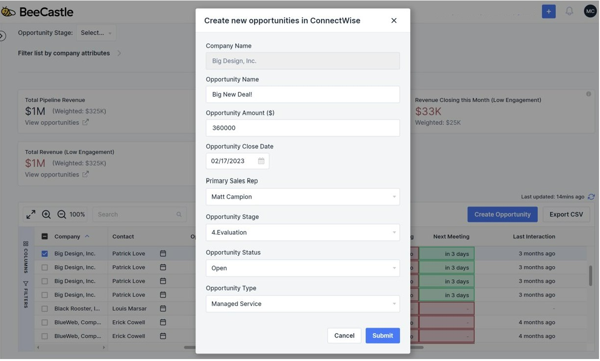
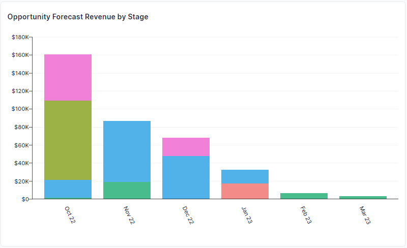
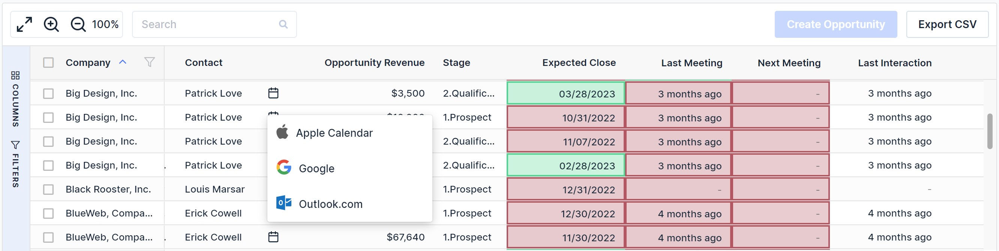

**Context is King - Create Opportunities & Meetings in the Moment**

Staying on top of everything as an account manager is hard. You are wearing multiple hats. All the time. Having your meetings scheduled for your opportunities is important, but also can take time.

With our new “Create Meeting” feature from the Open Opportunities screen, you can create meetings, right in the moment when you are reviewing opportunities and have rich context.

This will be helpful in the following use cases:

- Sales teams meetings
- One on one meetings with colleagues or managers
- Even during sales calls with customers

**Create Meetings, Leads to New Opportunities**

Through extensive data analysis, we have found a correlation between meeting activity and increase revenues. Put simply: more meetings, more understanding of your customers leads to more opportunities.

**Get Your Next Meetings Sorted**

How many times do we all write down a task list and then life gets in the way?

Now, during your sales meetings you can create the next meeting while you are discussing your opportunities.

**Create Opportunities, Leads to Increased Pipeline**

Now that you are managing your meetings effectively and scheduling them in a more efficient way, you can focus on the things that matter: understanding your customer’s needs and converting these into Opportunities.

Right from the Open Opportunities manager you can also select a company and click on “create opportunity” (which will push it back to your PSA).

These opportunities will flow back into your sales dashboard and increase you pipeline graph - increased pipeline, “you’re on fire!” ;)

**Opportunity Management, All in One Place**

Now with create meeting, you have Opportunity Management all in once place which shows you insights that you can take actions from:

- Key Pipeline Numbers
- Opportunity Activity Indicators (traffic lights)
- Create Opportunities
- Create Meetings

We are here to help you go out there and crush your sales targets!

**Want to Know More?**

If you would like to learn more about the Sales Dashboard, please see the [“how to use guide."](https://help.beecastle.com/en/articles/6898499-create-meetings-from-open-opportunities)

Also, as part of the opportunity management in BeeCastle, please see this [blog article](/blog/open-opportunities-pipeline-with-activity-context-to-help-you-close-more-deals/) and “[how to use guide](https://help.beecastle.com/en/articles/6617808-open-opportunities-how-to-use-guide)” for Open Opportunities.

If you have any questions at all, please don’t hesitate to email [help@beecastle.com](mailto:help@beecastle.com) and we will be happy to help.

Log in to BeeCastle to get going!
