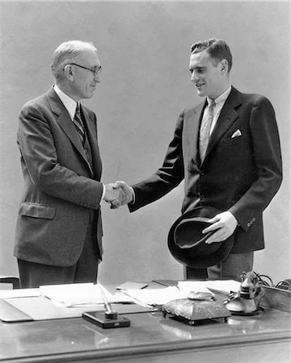
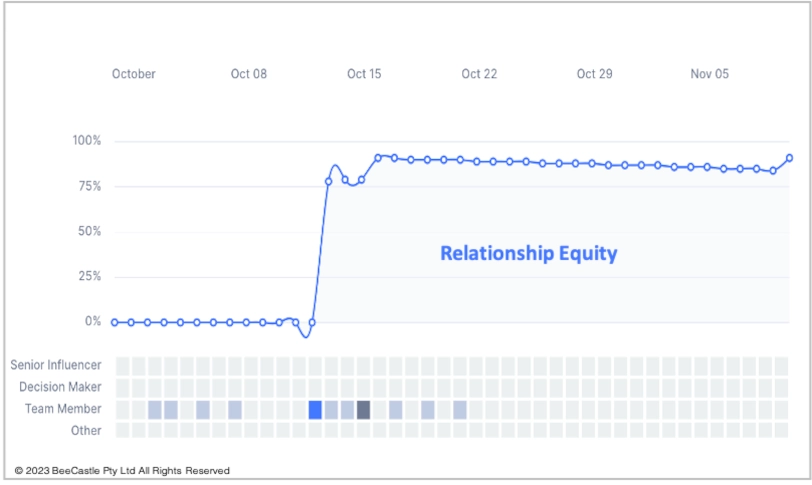
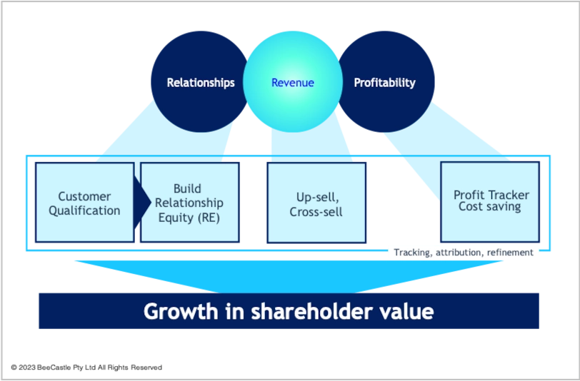

Did you know that the theory of reciprocity dates back to the dawn of commerce, was first documented in the 1960’s but was made famous in Dr Cialdini’s seminal book “*Influence: The Psychology of Persuasion”* who rated 6 principals of persuasion - and the number 1? **Reciprocity!**

****

## Reciprocity builds Relationship Equity

The theory of reciprocity is one of the foundation principles of BeeCastle where our mission is to help you achieve **excellence in account management.**

The first step in the journey is to build **Relationship Equity** into your client relationships, like this:

As you invest in your client relationships, BeeCastle intelligently calculates your relationship equity, allows you to visualise this data and take appropriate action to drive value.

## BeeCastle Value-add Methodology

BeeCastle has been working with MSPs and refining its value add methodology over several years. We start by qualifying relationships, and use reciprocity to build up relationship equity.

We then look to monetise that investment in relationship equity, for example, by using our whitespace tool, which allows you to identify where cross-sell and up-sell is possible based on our data.

We then close the loop and track all actions, asses KPI performance and use data automation to reduce your costs and drive efficiencies to add value to your business.

We will talk more about our methodology in future emails or request a copy of our free e-book “*The Art and Science of Enhanced Account Management*” [here](mailto:david@beecastle.com).

Thank you for reading and we hope you join us to be part of the data revolution for MSPs!

---------------------

### BeeCastle Credentials

BeeCastle is a Platinum sponsor of ConnectWise’s Evolve program in APAC, a Silver Sponsor of IT Nation and a Silver Sponsor of DattoCon APAC.

Find this interesting? Please forward to other MSPs who might appreciate this.

### What is BeeCastle?

BeeCastle is a secure cloud-based data analytics software platform designed specifically for Managed Service Providers that operates in 7 countries and supports integrations with M365, ConnectWise, AutoTask, Xero and HaloPSA. BeeCastle specialises in helping MSPs drive efficiency and revenue through its 6 key data analytics.
