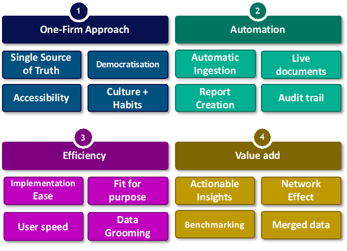

In today’s data-driven world, Managed Service Providers (MSPs) are continuously seeking ways to transform copious amounts of data into actionable insights. BeeCastle’s proprietary methodology not only streamlines this process but also amplifies the value derived from every byte of data.

**Efficiency in D&A Solutions: Simplicity Meets Sophistication**

Efficiency is at the heart of BeeCastle’s approach to D&A solutions. By emphasizing the ease of implementation and minimizing the time spent on data grooming, the focus is on achieving quick, fit-for-purpose results. This begins with intuitive PSA integrations that  optimize data ingestion and reduce configuration costs.

But BeeCastle’s efficiency drive doesn’t end there. By eliminating redundant and manual data entry through automation, accuracy is improved, and valuable human resources are freed up to engage in more strategic, rewarding activities. This shift not only saves time but also ensures a dynamic, ever-relevant dataset, an asset that grows with your business.

**The Value Add: From Data to Decisions**

Beyond efficiency, BeeCastle’s Data Matrix culminates in the tangible value added to an MSP’s operations. It starts with transforming data into actionable insights that spur immediate decision-making. For example, understanding the potential value of an [up-sell](/products/whitespace-prospecting/ "Whitespace Prospecting") before engaging allows for better prioritization and resource allocation.

As more MSPs ‘join the hive,’ the collective power of the network effect comes into play, enhancing the precision and value of the recommendations provided. [Benchmarking](/products/revenue-analytics/#business-benchmarking) against this growing dataset enables MSPs to set realistic performance goals, fostering a competitive yet collaborative environment.

Furthermore, by merging datasets, BeeCastle doesn’t just add value; it multiplies it. Insights become deeper, patterns more discernible, and opportunities clearer. This is data synergy at its finest, where the sum is indeed greater than its parts.

**A Culture of Data-Driven Excellence**

At the crux of this methodology is a culture shift, a move towards making data the cornerstone of every business decision. For BeeCastle, it’s about democratizing data, making it accessible, and ensuring that every team member can leverage it to contribute to the MSP’s success.

This cultural transformation requires regular engagements, such as weekly meetings centered around data insights and the use of evidence-based language. BeeCastle’s solutions are designed to facilitate these shifts, fostering an environment where data is not just present but actively utilized to drive progress.

**Closing Thoughts**

Adopting BeeCastle’s efficient and value-driven D&A solutions doesn’t just mean better data management; it represents a strategic shift towards a more agile, responsive, and intelligent business model. It’s about making every piece of data work for you, maximizing its potential to unlock new levels of growth and profitability.

By integrating these principles, MSPs can step confidently into a future where data doesn’t overwhelm but empowers, where every decision is informed, every strategy is optimized, and every investment yields its maximum return.

If you want to learn more about how BeeCastle can help you in your D&A journey, [book a demo](https://meetings.hubspot.com/hamish-rickerby) today and we will take you through it step by step.
