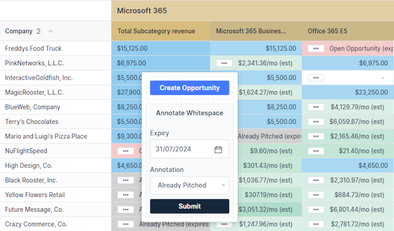

At BeeCastle, we understand the dynamic landscape of sales and the importance of efficient, seamless integration of sales activities and opportunities. That’s why we’re excited to announce our latest feature that revolutionizes how sales teams interact with whitespace opportunity tables.

## Intuitive Visualization of Sales Potential

Our new annotation feature offers a visual representation of all your sales opportunities directly within the whitespace tables of our platform. With just a few clicks, you can now mark cells with opportunities that are automatically synced with your PSA, coloring them pink for immediate recognition. This means no more flipping between tabs or missing out on potential sales due to oversight.

## Streamlined Sales Process

This innovative tool simplifies the process of identifying and acting on sales opportunities. Here’s how it works:

1. Identify potential in your whitespace table.
2. Click to create a new opportunity directly from the cell.
3. Watch as the system auto-populates the opportunity details, syncs it with your PSA, and shades the cell pink.
4. For cells representing opportunities that have been pitched and declined, you can manually annotate them to keep your team updated.

## Keep Your Team in the Loop

Manual annotations ensure that every team member is on the same page about which products or services have already been offered, eliminating redundant pitches and aligning your sales strategy.

## Benefits at a Glance:

- **Visual Tracking**: Instantly see which opportunities are in play.
- **PSA Integration**: Opportunities are seamlessly added to your PSA.
- **Manual Annotations**: Note which pitches didn’t land, improving your approach.
- **Efficiency**: Save time with integrated opportunity creation and tracking.
- **Collaboration**: Enhance team coordination and strategy with shared insights.

## Join the Sales Revolution

Don’t let another opportunity slip through the cracks. Take control of your sales process with BeeCastle’s new annotation feature and turn potential into profit. Contact us to see BeeCastle’s annotation feature in action or to schedule a demo. Embrace the future of sales visualization and coordination with BeeCastle. [Sign up](/sign-up) or [schedule your demo today!](https://meetings.hubspot.com/david4567)
