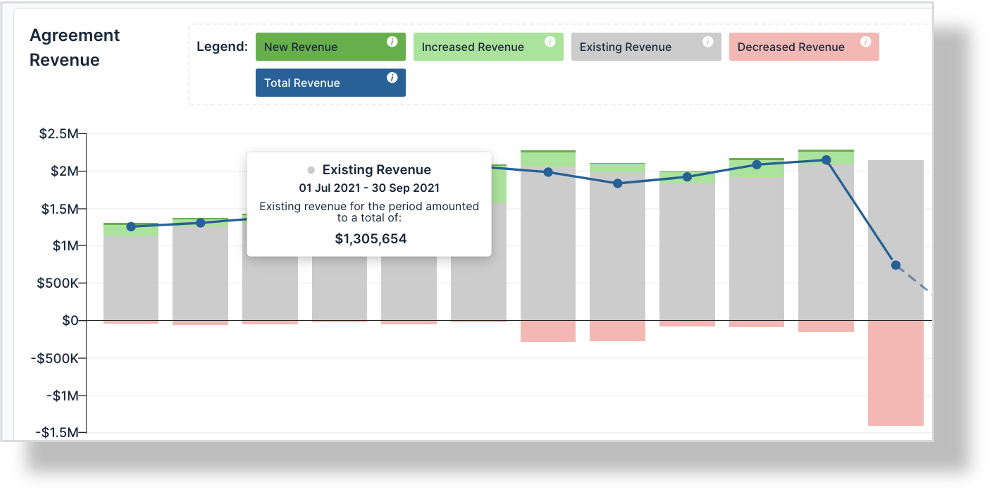
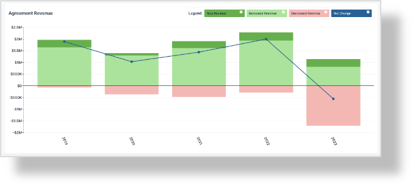
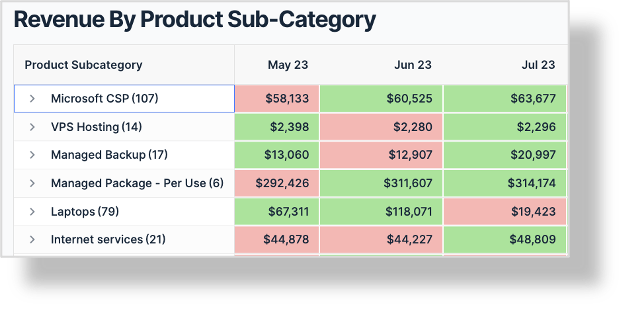
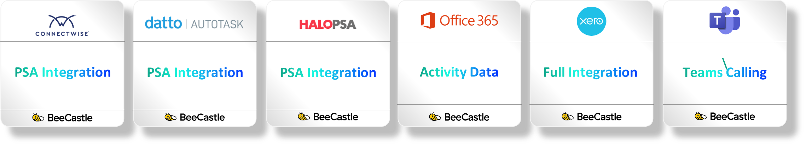

## Great news.  There is quite a lot you can get for free in BeeCastle

Keep your finger on the pulse of your business with accurate, accessible revenue reporting for MSPs and companies using Xero - completely free.  Below is a brief summary of what you can access for no charge.

## First of all - how do I access the free products in BeeCastle?
1. Create a free account on [beecastle.com](/)
2. Integrate your PSA (ConnectWise, AutoTask or HaloPSA)
3. Voila – you’re all set!

## What do you get?
## 1. Revenue trends, growth and churn indicators.
---

View your revenue trends over time and track increased revenue against existing revenue.  Stay alert to revenue reductions and take action to ensure steady growth.

## 2. Changes in revenue trends

View your changes in revenue trends over time and track the delta of what is driving growth.  Track the increases or churn over time.

## 3. Deep dive into product growth
---

Dive into your revenue by product to see what products are selling well, growing and where there are opportunities to grow or change products.  Consider what part of your stack is performing well and with which clients.

## 4. and More!
---

We provide a range of additional data services on a free basis to MSPs.  You just need to check them out.

## Works seamlessly with your existing PSA and data inputs
BeeCastle effortlessly integrates with your existing PSA stack in just one click.  Get your historical and current data, visible in your dashboards, all in real–time.

## Connect your data to let the insights flow.  Once integrated, you’ll be able to start using the out-of-the-box features to track your growth

Find out more at [beecastle.com](/)
