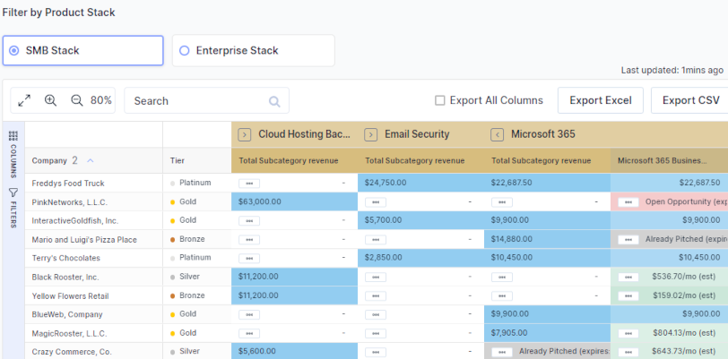

In the dynamic field of Managed Service Providers (MSPs), staying ahead of the curve is not just about acquiring new clients but also about maximizing the value provided to existing ones. White space analysis emerges as a critical strategy in this endeavor, offering a roadmap for MSPs to uncover hidden opportunities within their current client base. This approach goes beyond mere sales tactics, embedding itself into the core of strategic account management and service innovation.

**The Essence of White Space Analysis**

At its heart, white space analysis is about identifying unexplored areas within client accounts where additional services could be introduced. This not only involves a deep dive into clients’ current and future needs but also requires an understanding of their business trajectory and potential challenges they face. By leveraging this analysis, MSPs can tailor their offerings to fit perfectly into the gaps of current client setups, ensuring a more integrated and comprehensive service provision.

**White Space Analysis - the BeeCastle Way**

BeeCastle’s white space analysis tool makes it easy to identify potential opportunities within your existing customer base. Products and customers are imported from your PSA giving you a bird’s eye view. Opportunities created from the dashboard are pushed back to your PSA and displayed as annotations so you can track the work you have already done. You can define different product stacks that allow you to focus only on the products you are interested in that day. This is great for tracking a migration of customers to a new product offering.

**Strategic Implementation for MSPs**

To effectively leverage white space analysis, MSPs should consider the following multi-faceted approach:

1. **Data-Driven Insights**: Utilizing sophisticated data analytics tools to mine client data for usage patterns, satisfaction levels, and potential service gaps. This step forms the foundation of a targeted white space strategy, highlighting where MSPs can add value.
2. **Segmentation and Personalization**: Classifying clients into distinct segments based on criteria like industry, size, and technology stack. This allows for a more personalized approach to service offerings, making white space opportunities more apparent.
3. **Engagement and Relationship Building**: [Strengthening client relationships](/products/enhanced-account-management/) through regular engagement and strategic meetings. Tools like BeeCastle’s Meeting Planner and Engagement Summary dashboards support this by tracking client interactions and identifying areas for deeper engagement​​.
4. **KPI Tracking and Performance Management**: Implementing robust Key Performance Indicator (KPI) tracking mechanisms to measure the success of white space initiatives. [Activity KPIs and team performance dashboards](/products/enhanced-account-management/#team-activityhttps://beecastle.com/products/enhanced-account-management/#team-activity) can offer real-time insights into client engagement levels and the effectiveness of account management strategies​​.

**Real-World Benefits and Outcomes**

Adopting white space analysis can transform how MSPs operate and engage with their clients, leading to:

- **Enhanced Client Retention**: By proactively addressing clients’ evolving needs, MSPs can solidify their client relationships, reducing churn and fostering loyalty.
- **Revenue Growth**: Identifying and capitalizing on upselling and cross-selling opportunities directly contributes to revenue expansion.
- **Operational Efficiency**: Streamlining service offerings to match client needs more closely leads to operational efficiencies and better resource allocation.
- **Competitive Advantage**: MSPs that effectively utilize white space analysis can differentiate themselves in a crowded market, offering more value to their clients compared to competitors.

White space analysis represents a significant opportunity for MSPs to not only grow their businesses but also to deepen their client relationships. By adopting a strategic approach to identifying and filling the gaps in service offerings, MSPs can unlock new revenue streams while ensuring their clients receive the most comprehensive and tailored services available. As the MSP landscape continues to evolve, those who embrace data-driven strategies like white space analysis will find themselves well-positioned to lead the market. 
  
We are keen to show you more about using white space analysis to grow your business.  [Book a demo](https://meetings.hubspot.com/david4567) today and we will take you through it step by step.  Or read more about our [white space analysis](/products/whitespace-prospecting/) tool.
