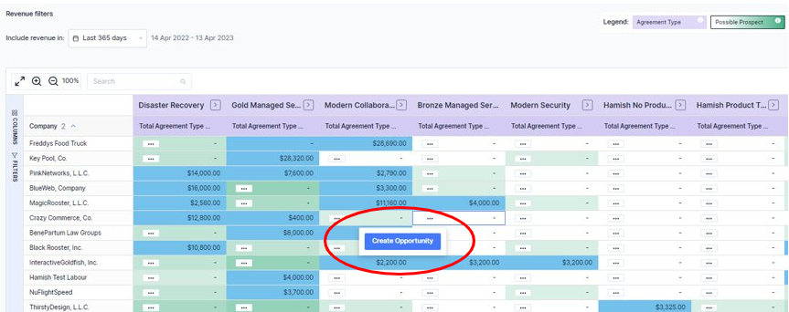

Growing revenue from your existing customers is critical for MSPs, and doing so is cheaper and easier than finding new ones. Upselling is a super booster to your top-line growth. But where to start?

You know your customers best, there’s no doubt about that. But sometimes, it’s easy to miss what you have and have NOT sold to them…

“Do they have the latest version of the security software?”

“We haven’t sold cloud back-up to this customer…”

These are real opportunities with your existing customers.

Now, you can **directly create opportunities from the Whitespace Finder in BeeCastle.**

*Data insights turned into meaningful action.*

Once created, the opportunity will automatically sync back to your PSA and then back to BeeCastle in Opportunity Assist.

The screenshot below shows you how – all whitespace squares, including those that are recommended (green), now have the three dots and the create opportunity button. 

By finding the opportunities within your existing customers, Account Managers will quickly grow the pipeline and revenue as shown by the following screenshot which shows the create opportunity screen for the specific customer and product or service selected. 

So, what are you waiting for…

Start creating new opportunities now and grow your business!

Need help or want a walk through? Contact us at [help@beecastle.com](mailto:help@beecastle.com) or book a demo with us from the “book a demo” button [here](/) from our website.
