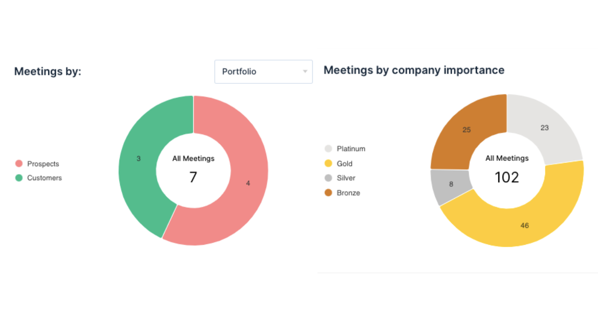
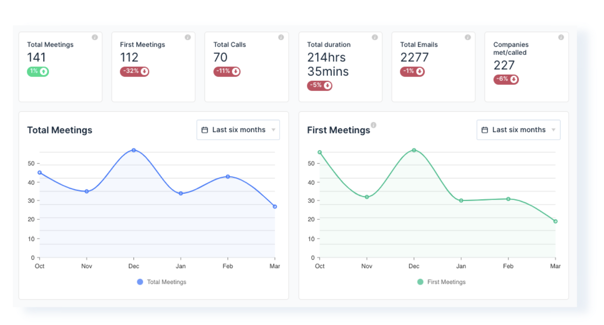

An often-repeated phrase for sales managers is that you should only manage or coach through results. No one can dispute the fact that landed sales, hitting targets and pipeline size matter. However, they should not be the whole story.

## Measuring both leading and lagging indicators

If you’re just looking at sales results, by definition, you are only measuring lagging indicators. While results matter they do not tell you the *why* behind the numbers. Specifically, what parts of the sales process are responsible for your results?

Lagging indicators don’t give you the chance to immediately identify gaps or even measure improvement until the sales cycle is over. That’s why MSP sales managers should take advantage of leading indicators. In particular the key sales activities that lead to results.

## What leading indicators should you be measuring?

Ultimately, measuring sales activity is based on the principle of working on the right things. Understanding which activities are key to your sales process and if your team are completing these activities can help you identify gaps, replicate successes, and coach your team.

For MSPs, typically sales are not just about acquisition. Instead, your sales team will generate new revenue by splitting their time between ‘farming’ through cross sell to existing clients and ‘hunting’ for new clients. The key activities you measure should capture this split.

So, as an MSP what are the ‘right things’ to measure? Here are some examples we see from our most successful MSP customers:

***1. Total number of client and prospect meetings*** - a good high-level measure of productivity that can be used as a KPI. Are your team regularly getting in front of your customers and prospects?

***2. % of external meetings with prospects vs with existing clients -*** an indication of whether your rep is focusing their time farming your customer base or hunting for new leads.

***3. Key ‘hunting’ metrics***

i. Number of first meetings or calls - how many meaningful new introductions with prospects are your reps having?

ii. % conversion from first meeting to second - how effective is your team in generating momentum from that first conversation?

***4. Key ‘farming’ metrics***

ii. % of your clients who have had a call or meeting in the last 3 months - opportunities arise from conversation. Are your sales reps having those conversations?

## How measurement helps you coach

Once these leading indicators are defined and tracked, they can be used as an important coaching tool for sales managers. In particular they allow you to:

- **Set clear expectations around what activities drive success -** you now have the data to explain what activities you believe are required to drive success. You can set the benchmark for what ‘good’ looks like by setting goals on activity KPIs.
- **Review activity KPIs to align behaviour to strategy -** is your strategy to promote growth through cross sell? Use activity data to measure if your team have pivoted their approach and coach them towards that goal.
- **Be proactive about risks** - activity metrics act as an early warning system. Identify quickly if your team’s performance is off and rectify it before it shows up in your sales results two months down the line.

## I’d love to, but it’s too much work

We get it. Many MSPs have long recognised the value of sales activity management but it has traditionally taken hours of weekly effort in ConnectWise to get the data. Even then, as data entry is manual its often unreliable or incomplete.

That is why we built BeeCastle - a way to automatically capture, track and measure the activity of your MSP sales and account management teams. Simply plug BeeCastle into your ConnectWise and Microsoft 365 tenant and visualise real-time dashboards that same day.

***For your sales team:*** they’ll no longer face the choice of not being recognised for their performance or spending hours weekly inputting activity reports. Spend more time selling, less time doing admin. They can spend more time selling and less time logging activities.

***For your sales leadership:*** they get out of the box measurement of their key sales activity without any additional overhead. Have the rich data at hand required for productive coaching conversations.

## Want to know more?

If you are an MSP looking to measure more of your leading indicators, please visit [BeeCastle.com](/ "https://beecastle.com") to signup for a free trial.

